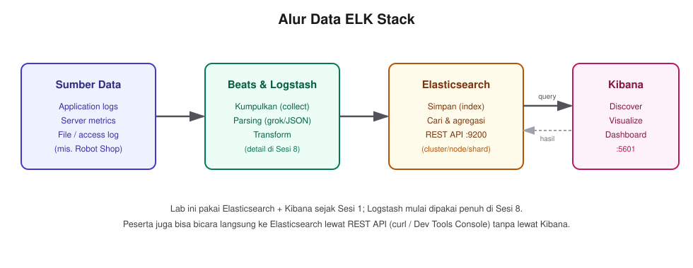

# Sesi 1 — Introduction to Elasticsearch & ELK Stack

## a. Tujuan Sesi

Setelah sesi ini, kamu memahami apa itu Elasticsearch dan bagaimana
posisinya di dalam ELK Stack (Elasticsearch, Logstash, Kibana), mengenal
istilah-istilah dasar (cluster, node, index, shard, replikasi), dan
berhasil menjalankan environment lab (ketiga komponen ELK) di laptopmu sendiri.

## b. Output yang Diharapkan

Sesi ini selesai kalau:
- `docker compose ps` menunjukkan 3 container (`elk-lab-elasticsearch`,
  `elk-lab-kibana`, `elk-lab-logstash`) berstatus `Up`/`healthy`.
- `curl http://localhost:9200` mengembalikan info cluster Elasticsearch (bukan error koneksi).
- `curl http://localhost:5601/api/status` mengembalikan `level: available`.
- Kamu bisa menjelaskan dengan kata-katamu sendiri apa bedanya index, shard, dan replika.

## c. Teori & Struktur Sistem

**Apa itu Elasticsearch?** Mesin pencari & analitik terdistribusi, dibangun
di atas Apache Lucene. Data disimpan sebagai dokumen JSON, bukan baris
tabel seperti database relasional — cocok untuk pencarian teks, log,
metrik, dan data semi-terstruktur dalam volume besar.

Tiga kasus pemakaian yang paling umum di lapangan (dan yang akan kamu
sentuh langsung di lab ini):
- **Log & event analytics** — kumpulkan log aplikasi/server, cari pola,
  hitung frekuensi error (Sesi 8).
- **Full-text search** — pencarian produk/dokumen yang relevan, bukan
  cuma cocok persis (Sesi 3-4).
- **Observability & monitoring** — metrik performa, deteksi anomali
  traffic (Sesi 5-7).

Bedanya dengan database relasional (RDBMS) yang mungkin sudah kamu kenal:

| | RDBMS (MySQL/PostgreSQL) | Elasticsearch |
|---|---|---|
| Unit data | baris (row) dalam tabel dengan skema tetap | dokumen JSON, skema fleksibel per index |
| Bahasa query | SQL | REST API + JSON (Query DSL, lihat di bawah) |
| Kekuatan utama | transaksi konsisten (ACID), relasi antar tabel | pencarian teks & agregasi cepat di volume besar |
| Skema | wajib didefinisikan di awal (`CREATE TABLE`) | bisa longgar (dynamic mapping) atau ketat (lihat Sesi 2) |

**ELK Stack** adalah tiga komponen yang biasa dipakai bersama:
- **Elasticsearch** — penyimpanan & mesin pencari.
- **Logstash** — pipeline untuk menarik, memproses (parsing/transform), dan
  mengirim data ke Elasticsearch.
- **Kibana** — antarmuka web untuk eksplorasi, visualisasi, dan administrasi
  data di Elasticsearch.



*Alur data ELK Stack secara umum. Data mentah masuk lewat Beats/Logstash,
disimpan & diindeks di Elasticsearch, lalu dieksplorasi lewat Kibana —
tapi kamu juga bisa bicara langsung ke Elasticsearch lewat REST API tanpa
lewat Kibana sama sekali (lihat bagian "Struktur REST API" di bawah).*

**Istilah dasar :**
- **Cluster** — kumpulan satu atau lebih node Elasticsearch yang berbagi
  nama cluster dan menyimpan data secara terdistribusi. Lab ini pakai
  **single-node** (1 anggota saja), tapi konsep cluster tetap berlaku.
- **Node** — satu instance Elasticsearch yang berjalan.
- **Index** — kumpulan dokumen dengan struktur/skema serupa (mirip "tabel"
  di database relasional, tapi jauh lebih fleksibel skemanya).
- **Shard** — index dipecah jadi beberapa bagian (shard) supaya data & beban
  bisa didistribusikan ke banyak node. Tiap shard punya 1 **primary** + 0
  atau lebih **replica**.
- **Replikasi** — salinan shard (replica) untuk ketahanan kalau sebuah node
  gagal. Di single-node, replica **tidak bisa** ditempatkan di node lain
  (karena cuma ada 1 node) — makanya status cluster **normalnya `yellow`**,
  bukan `green`, di lab ini (baru `green` kalau ada node lain untuk
  menampung replica-nya).

Elasticsearch expose REST API-nya di port **9200**, Kibana (antarmuka web)
di port **5601**.

**Struktur REST API Elasticsearch.** Semua interaksi dengan Elasticsearch —
lewat `curl` di terminal atau lewat Dev Tools Console di Kibana :

```
<METHOD> http://<host>:9200/<index>/_<endpoint>
```

| Method | Kegunaan | Contoh |
|---|---|---|
| `GET` | baca/cari data, tidak mengubah apa pun | `GET /_cluster/health` |
| `PUT` | buat/replace resource dengan ID yang kamu tentukan sendiri | `PUT /myindex/_doc/1` |
| `POST` | buat resource (ID di-generate otomatis) atau jalankan aksi | `POST /myindex/_search` |
| `DELETE` | hapus resource | `DELETE /myindex` |

Endpoint yang akan digunakan pada lab ini:

| Endpoint | Fungsi |
|---|---|
| `GET /_cluster/health` | status kesehatan cluster (dipakai di bawah) |
| `GET /_cat/indices?v` | daftar semua index dalam bentuk tabel ringkas |
| `PUT /<index>/_doc/<id>` | simpan satu dokumen dengan ID tertentu |
| `GET /<index>/_search` | cari dokumen (pakai Query DSL, JSON di body — detail Sesi 3) |
| `POST /<index>/_bulk` | kirim banyak dokumen sekaligus dalam satu request (dipakai di exercise sesi ini) |

Response **JSON**, dan HTTP status code mengikuti konvensi umum
(`200` sukses, `404` index/dokumen tidak ada, `400` request salah format).
`curl` di terminal dan Dev Tools Console di Kibana memanggil API yang
**persis sama** — Console cuma menyingkat penulisannya (host/port
otomatis, format `GET index/_search` tanpa perlu `curl -X GET
"http://localhost:9200/index/_search"` lengkap). Kamu akan pakai kedua
caranya bergantian sepanjang lab: `curl` untuk hal yang perlu dijalankan
dari terminal/script (termasuk exercise sesi ini), Dev Tools Console untuk
eksplorasi interaktif.

**Penjelasan sidebar Kibana** menu utama ada di ikon ☰ pojok kiri
atas:
- **Discover** — jelajahi dokumen mentah per index, filter & search bebas.
- **Dashboard** & **Visualize Library** — susun dan buat chart/grafik dari data.
- **Dev Tools** — Console untuk menjalankan request Elasticsearch langsung dari browser.
- **Stack Management** — administrasi: index, ILM policy, snapshot, dll.
- **Observability** — APM, log monitoring.
- Menu lain (Security, Integrations, dst.).

## d. Praktik: Instalasi & Konfigurasi

```bash
cd lab/day-1-fundamentals/sesi-1-intro-elk
docker compose up -d
```

Kibana baru mulai setelah Elasticsearch berstatus `healthy` (diatur lewat
`depends_on: condition: service_healthy` di `docker-compose.yml`), 
tunggu sampai response `healthy`/`running`.

**Cek status container:**
```bash
docker compose ps
```
Expected Output (ringkasan kolom yang penting — output aslimu juga akan
punya kolom `COMMAND`/`SERVICE`/`CREATED`/`PORTS`, itu normal, fokus ke
`STATUS`):
```
NAME                    IMAGE                                                 STATUS
elk-lab-elasticsearch   docker.elastic.co/elasticsearch/elasticsearch:9.5.2  Up (healthy)
elk-lab-kibana          docker.elastic.co/kibana/kibana:9.5.2                Up
elk-lab-logstash        docker.elastic.co/logstash/logstash:9.5.2            Up
```

**Verifikasi Elasticsearch (port 9200):**
```bash
curl http://localhost:9200
```
Expected Output:
```json
{
  "name" : "ec388c5aafb6",
  "cluster_name" : "docker-cluster",
  "cluster_uuid" : "GGMebYUJTSOyI4rbY8qstA",
  "version" : { "number" : "9.5.2", "build_flavor" : "default", "..." : "..." },
  "tagline" : "You Know, for Search"
}
```
(`name` dan `cluster_uuid` di layarmu akan beda

**Verifikasi Kibana (port 5601):**
```bash
curl http://localhost:5601/api/status
```
Expected Output: `{"status":{"overall":{"level":"available"}}}`

Kalau belum `available`, tunggu ~20-30 detik lagi (Kibana butuh waktu
inisialisasi setelah container start) lalu coba ulang.

**Cek status cluster:**
```bash
curl "http://localhost:9200/_cluster/health?pretty"
```
Expected Output:
```json
{
  "cluster_name" : "docker-cluster",
  "status" : "yellow",
  "number_of_nodes" : 1,
  "active_primary_shards" : 49,
  "unassigned_primary_shards" : 0,
  "active_shards_percent_as_number" : 96.07843137254902
}
```
Angka `active_primary_shards` dan `active_shards_percent_as_number` di
tampilan **akan berbeda** — jumlahnya tergantung index sistem internal Kibana
yang dibuat otomatis. Status **`yellow`** itu
**normal** untuk single-node. Yang harus SAMA dan WAJIB diperhatikan:
**`unassigned_primary_shards` harus 0**. Kalau bukan nol, baru itu tanda
ada masalah nyata.

## e. Contoh Implementasi

Buka Kibana di browser: `http://localhost:5601`. Ini yang akan kamu pakai
sepanjang lab untuk eksplorasi data (Discover), membuat visualisasi, dan
administrasi cluster.


*Tampilan Kibana Home kalau instalasi berhasil — kartu Elasticsearch,
Observability, Security, Analytics, dan tombol "Add integrations" di
sidebar kiri bawah.*

**Round-trip API sederhana** — praktikkan langsung tabel method/endpoint
di atas, lewat terminal (Dev Tools Console baru dikenalkan Sesi 2):

```bash
# PUT -- simpan satu dokumen dengan ID yang kita tentukan sendiri ("1")
curl -X PUT "http://localhost:9200/lab-intro-demo/_doc/1" \
  -H 'Content-Type: application/json' -d '{"pesan": "halo elasticsearch", "sesi": 1}'
```
Expected Output: `{"_index":"lab-intro-demo","_id":"1","result":"created", ...}`

```bash
# GET -- ambil kembali dokumen yang barusan disimpan, pakai ID yang sama
curl "http://localhost:9200/lab-intro-demo/_doc/1?pretty"
```
Expected Output: `"_source" : { "pesan" : "halo elasticsearch", "sesi" : 1 }`

```bash
# DELETE -- bersihkan index demo, tidak dipakai lagi setelah ini
curl -X DELETE "http://localhost:9200/lab-intro-demo"
```
Expected Output: `{"acknowledged":true}`

Tiga command di atas persis mengikuti pola `<METHOD>
http://host:9200/<index>/_<endpoint>` yang dijelaskan di bagian (c)

## f. Referensi Exercise

Lanjutkan latihan mandiri di [`exercise/sesi-1/README.md`](../../../exercise/sesi-1/README.md).
