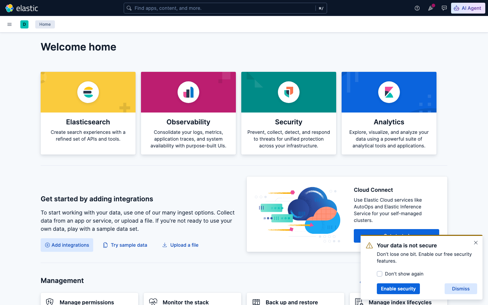
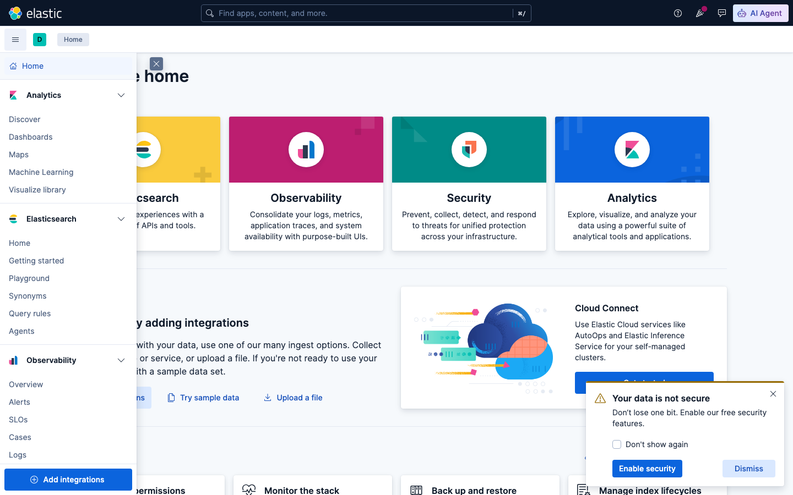
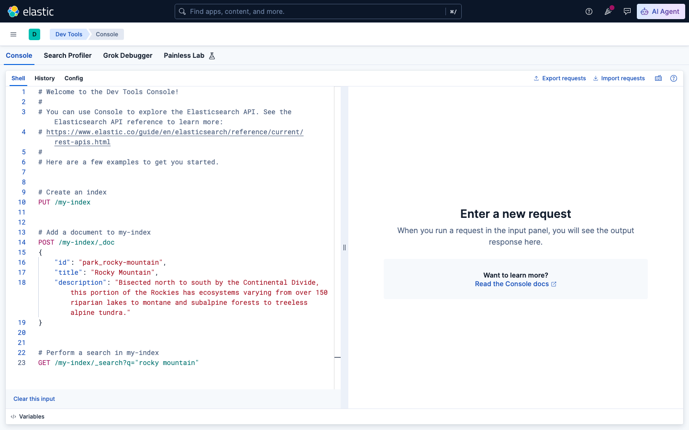
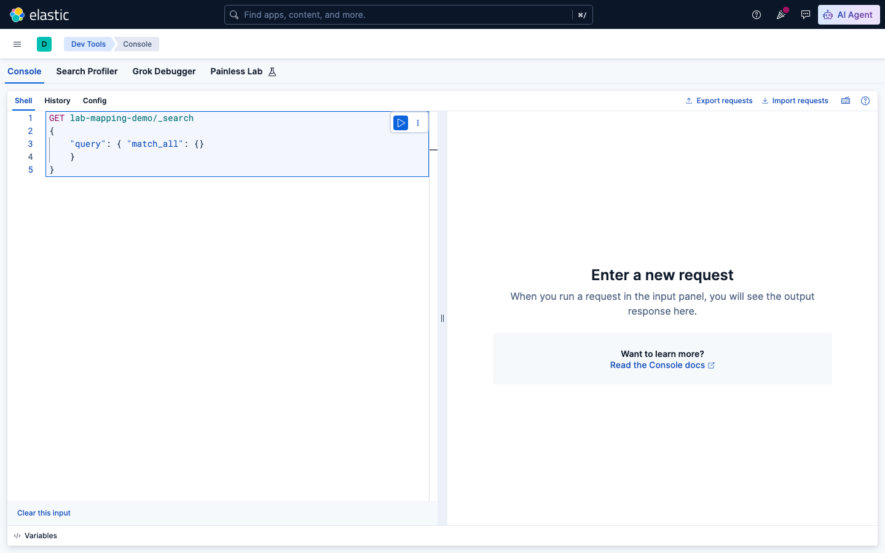
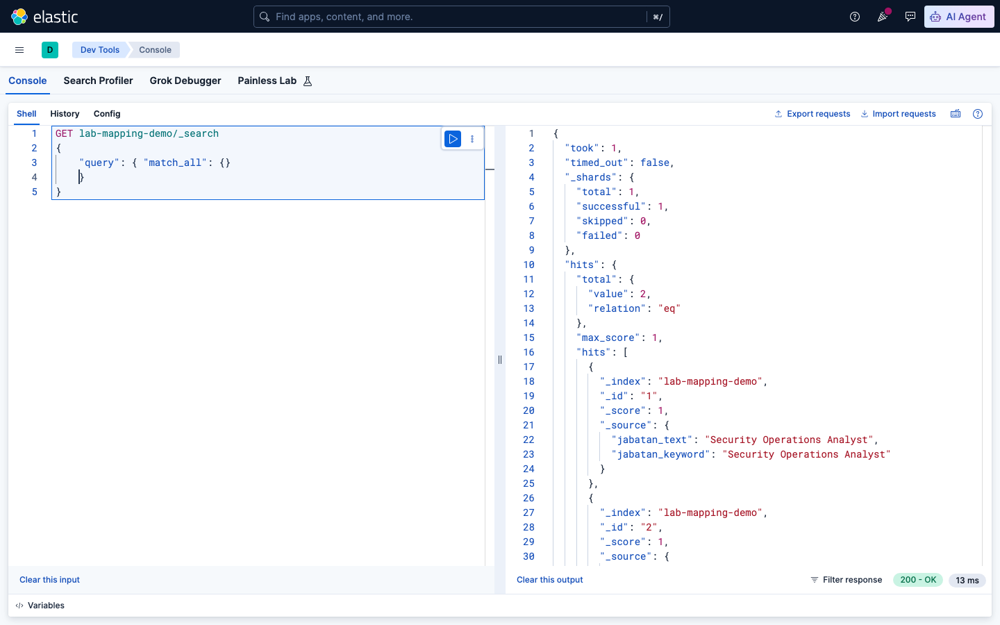
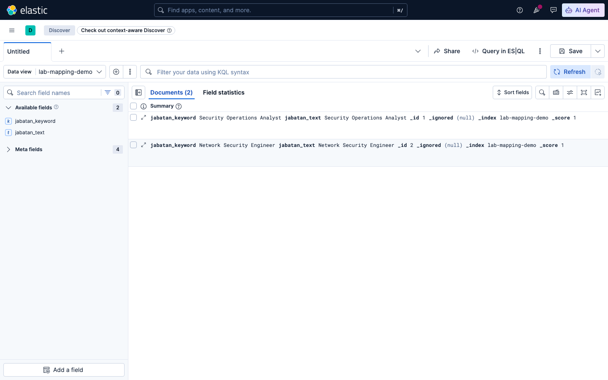
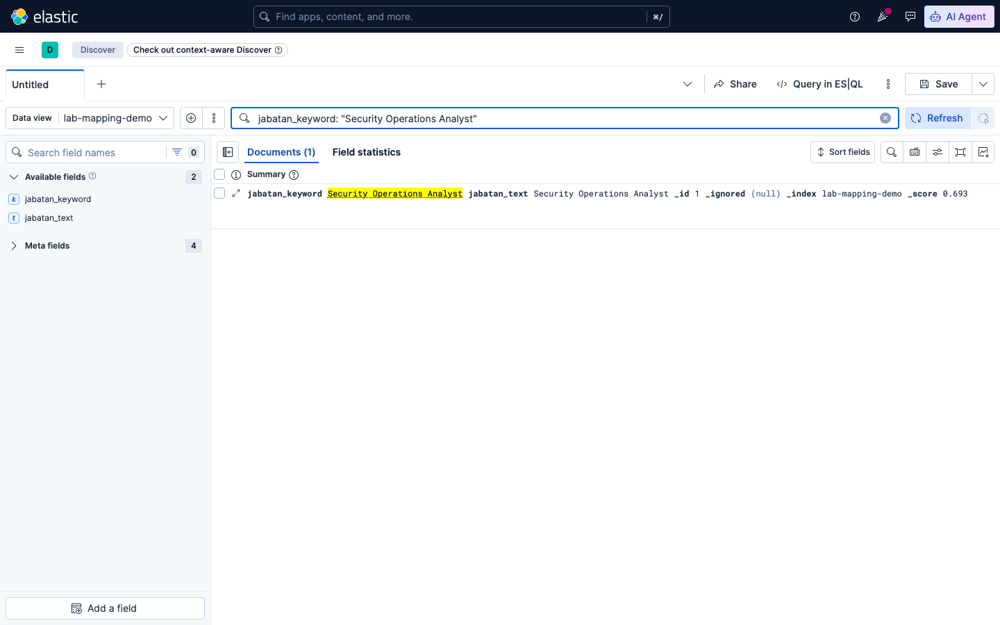
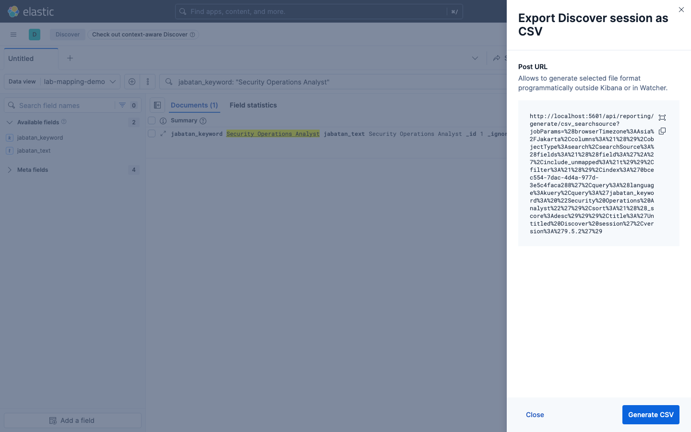
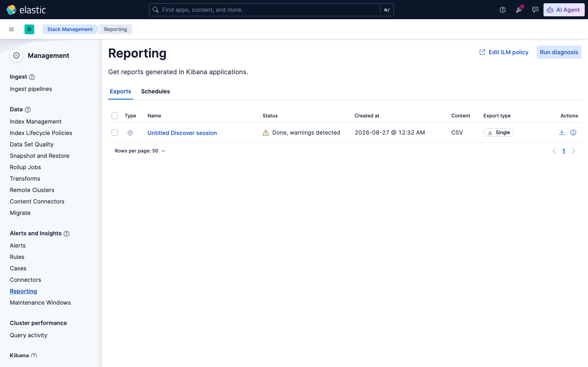

# Sesi 2 — Document Management & Data Model

## a. Tujuan Sesi

Setelah sesi ini, kamu memahami struktur data Elasticsearch (index/document/
field/mapping), tahu perbedaan tipe field `text` vs `keyword` dan kapan
memakai yang mana, serta mampu melakukan operasi CRUD (Create, Read,
Update, Delete) dokumen lewat Kibana Dev Tools Console.

## b. Output yang Diharapkan

Sesi ini selesai kalau:
- Index `lab-mapping-demo` berhasil dibuat dengan mapping eksplisit (field
  `text` dan `keyword`), dan kamu bisa jelaskan kenapa hasil query terhadap
  keduanya berbeda.
- Kamu berhasil INDEX, GET, UPDATE, dan DELETE satu dokumen di index
  `lab-demo`, dan mengerti arti `_version` yang naik tiap kali dokumen berubah.

## c. Teori & Struktur Sistem

**Index, Document, Field.** Satu *index* berisi banyak *document* (setara 1
baris data), dan tiap document tersusun dari beberapa *field* (setara 1
kolom). Beda dengan database relasional: document dalam 1 index tidak
wajib punya field yang sama persis (skema fleksibel), meski praktiknya
biasanya diseragamkan.

**Mapping** adalah definisi tipe data tiap field dalam sebuah index (mirip
skema tabel). Kalau tidak didefinisikan eksplisit, Elasticsearch menebak
tipe field secara otomatis (*dynamic mapping*) saat dokumen pertama masuk.

**`text` vs `keyword` — dua tipe field paling sering dipakai:**
- `text` di-*tokenize* (dipecah jadi kata-kata, lowercase, dst.) supaya
  bisa di-*full-text search* sebagian kata.
- `keyword` disimpan utuh apa adanya, hanya bisa dicari dengan nilai yang
  **PERSIS** sama — makanya field seperti status, kategori, ID, atau field
  yang dipakai untuk agregasi/sorting sebaiknya bertipe `keyword`.

**Cara menjalankan query di lab ini — Kibana Dev Tools Console.**



*1. Buka Kibana, klik ikon ☰ (menu) di kiri atas.*



*2. Menu sidebar terbuka — Dev Tools ada di bagian bawah menu Elasticsearch/Management (scroll kalau perlu).*



*3. Halaman Dev Tools Console — panel kiri untuk menulis query, panel kanan untuk hasil.*

Mulai sesi ini, kamu akan melihat blok seperti:
```
GET lab-mapping-demo/_search
{ "query": { ... } }
```
Ini **BUKAN** perintah bash/curl — ini syntax khusus **Kibana Dev Tools
Console** (menu ☰ → Dev Tools → Console, atau buka langsung
`http://localhost:5601/app/dev_tools#/console`). Baris pertama adalah
method + path, badan JSON di bawahnya adalah request body. **Kalau di-paste
ke terminal biasa akan error** (`GET: command not found`) — buka Dev Tools
Console dulu, paste ke sana, lalu jalankan (klik ikon ▶ di sebelah kiri
baris, atau `Cmd+Enter`/`Ctrl+Enter`).

## d. Praktik: Instalasi & Konfigurasi

*(Prasyarat: stack Sesi 1 masih jalan — `docker compose up -d` di
`lab/day-1-fundamentals/sesi-1-intro-elk/` kalau belum.)*

**Buat index dengan mapping eksplisit** (2 field berisi teks yang sama, tipe berbeda):
```
PUT lab-mapping-demo
{
  "mappings": {
    "properties": {
      "jabatan_text": { "type": "text" },
      "jabatan_keyword": { "type": "keyword" }
    }
  }
}
```
Expected Output (aktual): `{"acknowledged":true,"shards_acknowledged":true,"index":"lab-mapping-demo"}`

**Index 2 dokumen contoh:**
```
POST lab-mapping-demo/_doc/1
{ "jabatan_text": "Security Operations Analyst", "jabatan_keyword": "Security Operations Analyst" }

POST lab-mapping-demo/_doc/2?refresh=true
{ "jabatan_text": "Network Security Engineer", "jabatan_keyword": "Network Security Engineer" }
```

**Coba dulu query paling sederhana** (`match_all`, tampilkan semua dokumen)
supaya kamu terbiasa dengan alur ketik-jalankan-baca hasil di Console:



*4. Ketik query di panel kiri (perhatikan tombol ▶ biru muncul di ujung baris pertama).*



*5. Klik ▶ (atau `Cmd+Enter`/`Ctrl+Enter`) — hasil muncul di panel kanan: 2 dokumen `lab-mapping-demo` yang barusan kamu index.*

**Query 1** — `match` di field `text` dengan kata `"Security"` (partial match):
```
GET lab-mapping-demo/_search
{ "query": { "match": { "jabatan_text": "Security" } } }
```
Expected Output (aktual): **2 hits** (kedua dokumen match — `match`
men-tokenize "Security" dan mencari token itu, cocok di keduanya).

**Query 2** — `term` di field `keyword` dengan kata `"Security"` saja (bukan nilai lengkap):
```
GET lab-mapping-demo/_search
{ "query": { "term": { "jabatan_keyword": "Security" } } }
```
Expected Output (aktual): **0 hits** — `term` mencari nilai `keyword` yang
PERSIS sama, dan tidak ada dokumen yang nilai `jabatan_keyword`-nya cuma
`"Security"` (nilainya adalah kalimat lengkap).

**Query 3** — `term` di field `keyword` dengan nilai LENGKAP:
```
GET lab-mapping-demo/_search
{ "query": { "term": { "jabatan_keyword": "Security Operations Analyst" } } }
```
Expected Output (aktual): **1 hit** (dokumen `_id: 1`) — sekarang nilainya
persis sama, `term` berhasil match.

## e. Contoh Implementasi

CRUD dokumen lewat Dev Tools Console, pakai index baru `lab-demo`:

**1. INDEX (create):**
```
POST lab-demo/_doc/1
{ "nama": "Budi Santoso", "jabatan": "Security Analyst", "level": "L1" }
```
Expected Output (aktual): `"result":"created"`, `"_version":1`, `"_seq_no":0`, `"_primary_term":1`.

**2. GET:**
```
GET lab-demo/_doc/1
```
Expected Output (aktual): `"found":true`, `_source` berisi data yang barusan di-index.

**3. UPDATE (partial — cuma field `level`):**
```
POST lab-demo/_update/1
{ "doc": { "level": "L2" } }
```
Expected Output (aktual): `"result":"updated"`, `"_version":2` (naik dari 1).
`GET` ulang menunjukkan `"level": "L2"` sementara field lain tidak berubah.

**4. DELETE:**
```
DELETE lab-demo/_doc/1
```
Expected Output (aktual): `"result":"deleted"`, `"_version":3`.

**5. GET setelah delete:** Expected Output (aktual): HTTP 404, `"found":false`.

### Preview: Lihat & Export Data Lewat Discover

Sejauh ini kamu selalu lihat data lewat Dev Tools Console (respons JSON
mentah). Kibana juga punya **Discover** — tampilan tabel untuk menjelajah
dokumen tanpa nulis query JSON (dalamnya dipakai penuh mulai Sesi 3).
Di sini kita coba sekilas pakai data `lab-mapping-demo` yang barusan kamu buat.

**1. Buat Data View** (index custom seperti `lab-mapping-demo` perlu
didaftarkan dulu supaya muncul di Discover — beda dengan sample data
bawaan Kibana yang sudah otomatis terdaftar): buka menu ☰ → Discover,
klik nama data view aktif di kiri atas → **"Create a data view"** → isi
**Name** dan **Index pattern** dengan `lab-mapping-demo` (index ini tidak
punya field tanggal, jadi field **Timestamp** dibiarkan kosong) → **Save
data view to Kibana**.

**2. Filter data pakai KQL** (Kibana Query Language — search bar di atas
tabel, beda syntax dari Query DSL Dev Tools Console):



*Discover dengan data view `lab-mapping-demo` aktif — 2 dokumen yang kamu index di bagian (d) muncul di tabel.*

Ketik di search bar: `jabatan_keyword: "Security Operations Analyst"`, lalu Enter.



*Filter KQL — hanya 1 dokumen yang cocok, kata yang match di-highlight kuning.*

**3. Export hasil filter ke CSV**: klik ikon **⋮** (More, di sebelah
kanan "Query in ES|QL") → **Export tab results** → **CSV**:



*Modal export — klik **Generate CSV** untuk memproses hasil filter jadi file CSV.*

Setelah **Generate CSV**, muncul notifikasi "Queued report for search" —
proses generate-nya **async** (bukan langsung download), buka **Stack
Management → Reporting** untuk ambil hasilnya:



*Status **Done** — klik ikon download di kolom Actions untuk mengunduh file CSV-nya.*

Expected Output (aktual, isi file CSV yang terunduh):
```csv
"_id","_ignored","_index","_score","jabatan_keyword","jabatan_text"
1,"-","lab-mapping-demo",0.693,"Security Operations Analyst","Security Operations Analyst"
```
CSV berisi PERSIS dokumen yang lolos filter (bukan seluruh index) — cara
ini yang dipakai kalau kamu perlu bagikan hasil pencarian ke orang lain
dalam bentuk spreadsheet, tanpa mereka perlu akses Kibana.

## f. Referensi Exercise

Lanjutkan latihan mandiri di [`exercise/sesi-2/README.md`](../../../exercise/sesi-2/README.md).
