# Sesi 3 — Searching with Query DSL

## a. Tujuan Sesi

Setelah sesi ini, kamu mampu menulis query pencarian di Elasticsearch
memakai Query DSL — dari full-text search sederhana sampai kombinasi
kondisi (boolean query) — dan memahami jebakan umum yang sering bikin
hasil query meleset.

## b. Output yang Diharapkan

Sesi ini selesai kalau:
- Sample data `kibana_sample_data_ecommerce` sudah ter-load (4675 dokumen).
- Kamu berhasil menjalankan `match`, `match_phrase`, `term`, dan `bool`
  query, dan bisa jelaskan kapan pakai yang mana.
- Kamu paham kenapa `range` pada field bertipe salah **tidak error**, dan
  kenapa itu berbahaya.

## c. Teori & Struktur Sistem

**Query DSL** (Domain Specific Language) adalah bahasa berbasis JSON yang
dipakai Elasticsearch untuk mendefinisikan query — semua contoh di sesi ini
dijalankan lewat Kibana Dev Tools Console (lihat Sesi 2 kalau belum familiar).

Empat jenis query yang paling sering dipakai:

| Kebutuhan | Query |
|---|---|
| Cari kata di field teks bebas (deskripsi, judul) | `match` |
| Cari frasa persis (urutan kata harus sama) | `match_phrase` |
| Cocok persis nilai kategori/status/ID | `term` (field harus `keyword`) |
| Gabungan banyak kondisi | `bool` (`must`/`filter`/`should`/`must_not`) |

`must` vs `filter` di dalam `bool`: keduanya sama-sama AND, tapi `filter`
tidak ikut menghitung relevance score (`_score`, dibahas mendalam di Sesi
4) dan hasilnya bisa di-cache — pakai `filter` untuk kondisi yang sifatnya
exact/boolean (harga, tanggal, status), pakai `must`/`should` kalau
relevance score memang dibutuhkan.

## d. Praktik: Instalasi & Konfigurasi

*(Prasyarat: stack Sesi 1 masih jalan.)*

**Kibana Sample Data — apa saja yang tersedia.** Sebelum load data,
kenalan dulu dengan katalognya: buka menu ☰ → **Home**, klik **"Try
sample data"** (atau langsung `http://localhost:5601/app/home#/tutorial_directory/sampleData`):

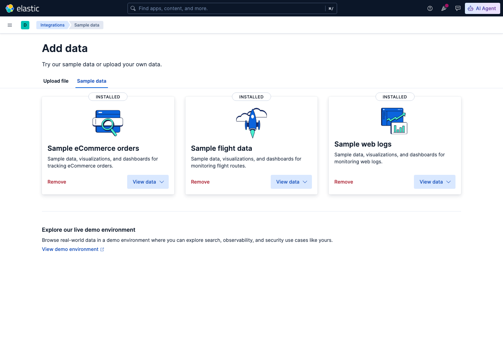

*Tiga dataset bawaan Kibana — **eCommerce orders** (transaksi toko
online, dipakai lab Sesi 3-5), **Flight data** (data penerbangan, dipakai
di exercise sesi ini), dan **Web logs** (log akses web). Ketiganya bisa
di-load lewat halaman ini (klik "View data" pada kartu yang belum
ter-install) ATAU lewat API `POST /api/sample_data/<nama>` seperti
command di bawah — dua-duanya hasilnya sama.*

**Load sample data eCommerce** (dataset transaksi toko online, dipakai
sepanjang Sesi 3-5):
```bash
curl -X POST "http://localhost:5601/api/sample_data/ecommerce" \
  -H "kbn-xsrf: true" -H "x-elastic-internal-origin: kibana"
```
Expected Output (aktual): `{"elasticsearchIndicesCreated":{"kibana_sample_data_ecommerce":4675},"kibanaSavedObjectsLoaded":7}`

Field yang relevan: `category` (text), `customer_gender` (keyword),
`taxful_total_price` (angka), `order_date` (tanggal).

**`match`** — full-text search (tokenized, partial match):
```
GET kibana_sample_data_ecommerce/_search
{ "query": { "match": { "category": "Clothing" } } }
```
Expected Output (aktual): **3927 hits.** `match` tokenize "Clothing" dan
mencocokkan ke field `category` yang juga di-tokenize — cocok dengan
"Women's Clothing", "Men's Clothing", dll., bukan cuma yang persis "Clothing".

**`match_phrase`** — full-text tapi urutan kata harus persis:
```
GET kibana_sample_data_ecommerce/_search
{ "query": { "match_phrase": { "category": "Women's Clothing" } } }
```
Expected Output (aktual): **1903 hits.** Beda dengan `match` biasa —
`match_phrase` mensyaratkan kata-katanya berurutan bersebelahan, jadi
dokumen dengan category "Men's Clothing" TIDAK ikut match.

**`term`** — exact match (field `keyword`, tidak di-tokenize):
```
GET kibana_sample_data_ecommerce/_search
{ "query": { "term": { "customer_gender": "FEMALE" } } }
```
Expected Output (aktual): **2433 hits.** `customer_gender` bertipe
`keyword`, jadi `term` mencari nilai yang PERSIS `"FEMALE"` (case-sensitive,
tidak di-tokenize).

**`bool`** — kombinasi kondisi:
```
GET kibana_sample_data_ecommerce/_search
{
  "query": {
    "bool": {
      "must": [ { "term": { "customer_gender": "FEMALE" } } ],
      "filter": [ { "range": { "taxful_total_price": { "gt": 100 } } } ]
    }
  }
}
```
Expected Output (aktual): **469 hits** — pelanggan FEMALE **dan** total
belanja > 100.

**Query yang sama, lewat UI Discover** (bukan cuma lewat Dev Tools Console
— Discover pakai sintaks KQL, mirip tapi tidak identik dengan Query DSL):

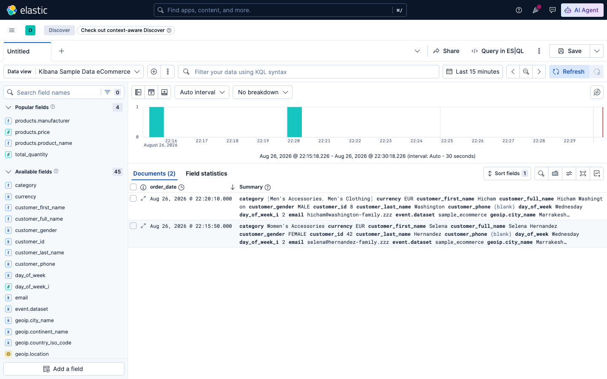

*1. Buka menu ☰ → Analytics → Discover.*

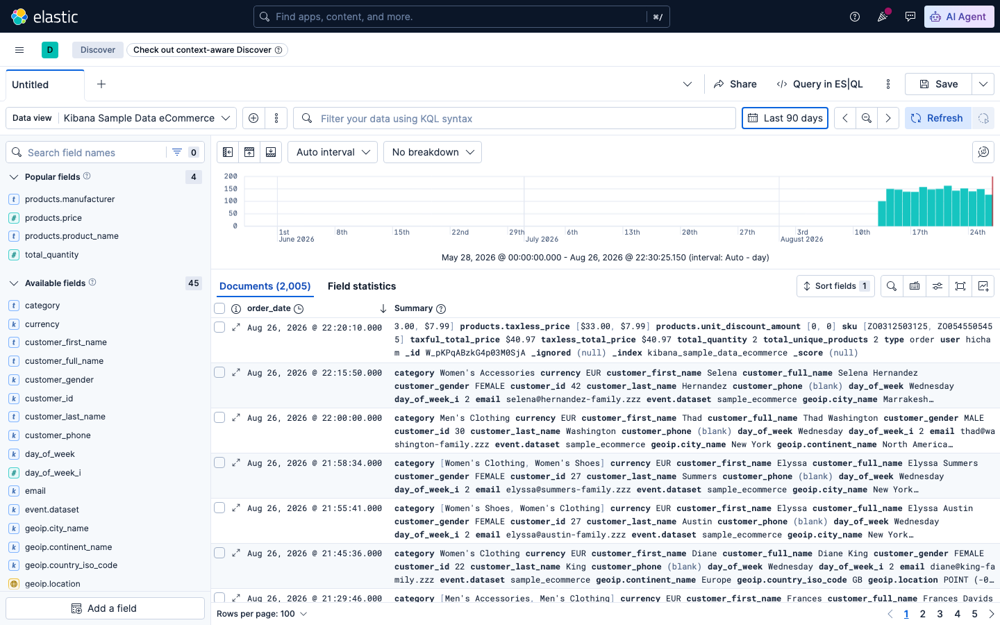

*2. Pilih data view "Kibana Sample Data eCommerce" di pojok kiri atas.*

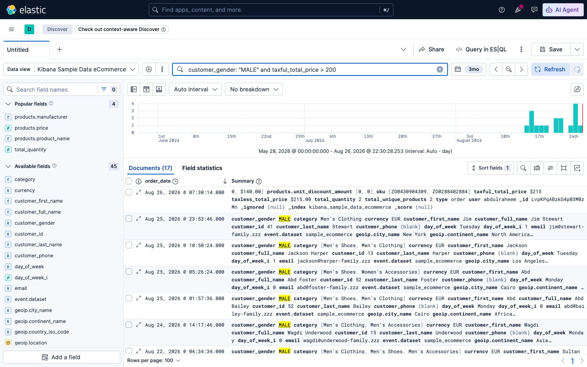

*3. Ketik filter KQL `customer_gender: "MALE" and taxful_total_price > 200`
di search bar, tekan Enter — histogram & daftar dokumen ter-update
otomatis. (Jumlah dokumen di layar bisa beda dari hasil query DSL langsung
ke ES — Discover membatasi hasil sesuai rentang waktu yang dipilih di
kanan atas, sedangkan query lewat Dev Tools Console di atas tidak dibatasi waktu.)*

**Filter TANPA ketik KQL — lewat UI.** Selain ketik KQL manual, Discover
punya beberapa cara "klik saja" untuk filter/atur tampilan data. (Catatan:
jumlah dokumen di semua screenshot di bawah bersifat **time-relative** —
"Last 90 days" bergeser tiap hari, jadi angkamu pasti beda, itu normal.)

**a) Tambah filter lewat form (bukan ketik KQL):** klik **"+ Add filter"**
di sebelah kiri search bar:

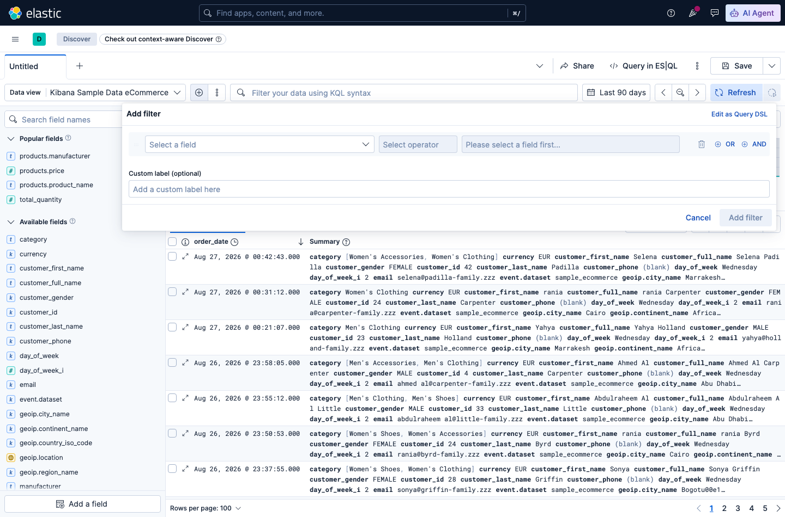

*Form kosong — pilih **Field**, **Operator**, lalu **Value**.*

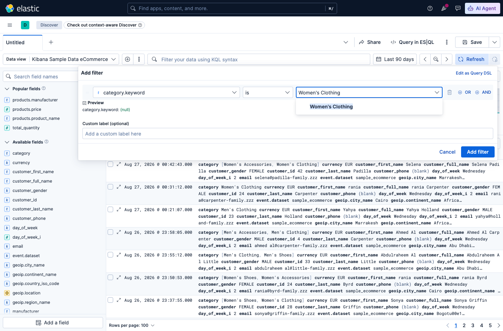

*Field `category.keyword`, operator `is`, value `Women's Clothing` —
klik **Add filter** untuk menerapkan.*

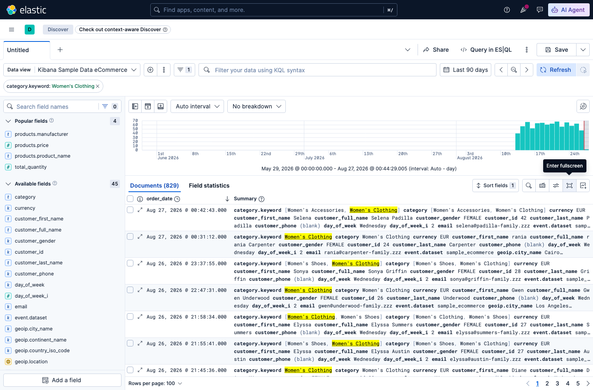

*Filter muncul sebagai "pill" di atas tabel — klik `×` di pill untuk
hapus, atau klik pill-nya untuk edit/nonaktifkan sementara.*

**b) Atur kolom tabel** (default cuma `order_date` + `_source` mentah,
sering kepanjangan): hover field di sidebar kiri, klik ikon **+** yang
muncul untuk jadikan kolom:

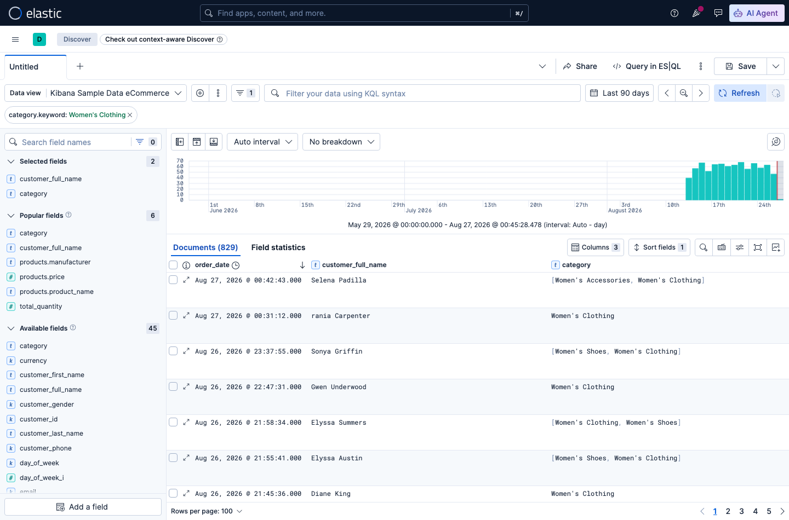

*Setelah `customer_full_name` dan `category` ditambah sebagai kolom,
tabel jadi jauh lebih ringkas dibanding `_source` mentah — field yang
sedang jadi kolom tampil di grup "Selected fields" di sidebar, klik ikon
**–** di situ untuk hapus kolom lagi.*

**c) Filter langsung dari nilai dokumen** ("filter for/out value"): klik
ikon perbesar (⤢) di kiri baris dokumen untuk buka detail, lalu hover nilai
field yang mau di-filter:

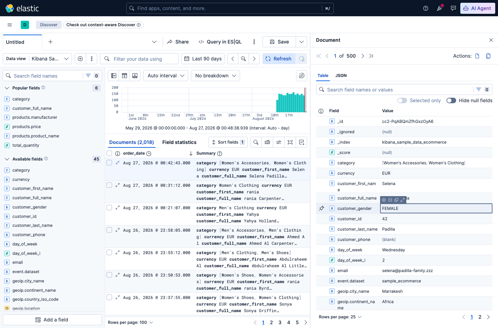

*Hover baris `customer_gender` — muncul ikon **+** (filter for, cuma
tampilkan dokumen dengan nilai ini) dan **–** (filter out, sembunyikan
dokumen dengan nilai ini).*

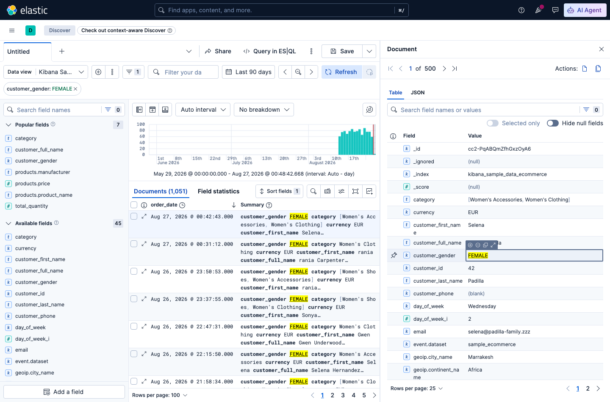

*Klik **+** pada `FEMALE` — filter pill `customer_gender: FEMALE`
langsung terbentuk, tanpa ketik apa pun.*

**d) Simpan filter jadi Saved Search** — supaya bisa dibuka lagi nanti
tanpa setup ulang: klik **Save** di kanan atas, kasih nama:

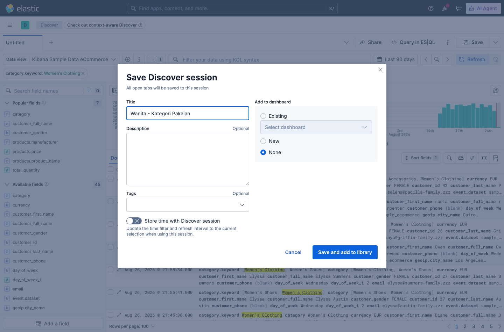

*Isi **Title**, biarkan "Add to dashboard" = **None** kalau belum perlu
dashboard, klik **Save and add to library**.*

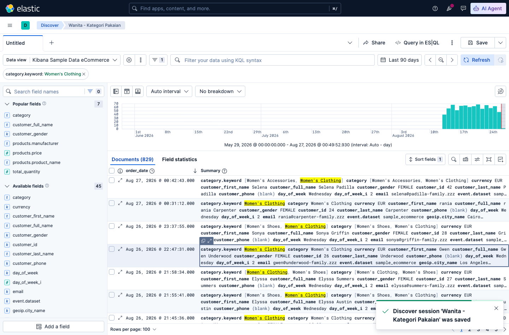

*Tersimpan — breadcrumb di kiri atas sekarang menampilkan nama yang kamu
kasih, dan search ini bisa dibuka lagi lewat menu ☰ → Discover → buka
session tersimpan.*

## e. Contoh Implementasi

**Jebakan: `range` pada field bertipe salah TIDAK error, hasilnya salah diam-diam.**
Beda dengan `term` di atas yang tegas menolak nilai tidak persis, `range`
**tidak pernah error** kalau dipakai pada field `keyword` dengan operand angka:
```
GET kibana_sample_data_ecommerce/_search
{ "query": { "range": { "customer_gender": { "gt": 100 } } } }
```
Expected Output (aktual): **HTTP 200, mengembalikan SEMUA 4675 dokumen** —
bukan error, bukan 0 hits. Elasticsearch membandingkan `100` sebagai
**string** `"100"` secara leksikografis terhadap `"FEMALE"`/`"MALE"`, dan
kebetulan kedua nilai itu > `"100"` secara alfabetis, jadi semua dokumen
"match" walau query-nya tidak masuk akal secara semantik. **Selalu cek
tipe field lewat `_mapping` sebelum pakai `range`**:
```
GET kibana_sample_data_ecommerce/_mapping/field/customer_gender
```

## f. Referensi Exercise

Lanjutkan latihan mandiri di [`exercise/sesi-3/README.md`](../../../exercise/sesi-3/README.md).
