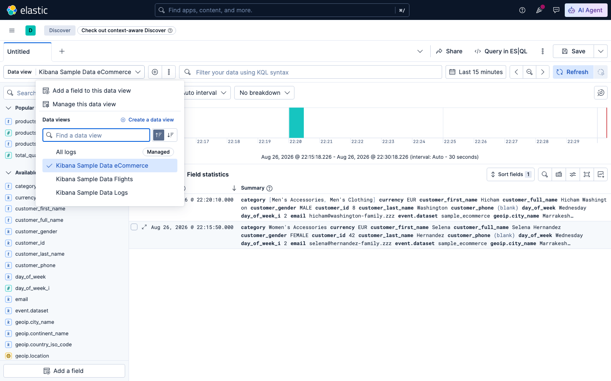

# Sesi 3 — Searching with Query DSL

## a. Tujuan Sesi

Setelah sesi ini, Anda mampu menulis query pencarian di Elasticsearch
memakai Query DSL dari full-text search sederhana sampai kombinasi
kondisi (boolean query) dan memahami jebakan umum yang sering membuat
hasil query meleset.

## b. Output yang Diharapkan

Sesi ini selesai apabila:
- Sample data `kibana_sample_data_ecommerce` sudah ter-load (4675 dokumen).
- Anda berhasil menjalankan `match`, `match_phrase`, `term`, dan `bool`
  query, dan dapat menjelaskan kapan menggunakan yang mana.
- Memahami kenapa `range` pada field bertipe salah **"tidak menghasilkan
  error"**, dan kenapa hal tersebut berbahaya.

## c. Teori & Struktur Sistem

**Query DSL** (Domain Specific Language) adalah bahasa berbasis JSON yang
dipakai Elasticsearch untuk mendefinisikan query — semua contoh di sesi ini
dijalankan lewat Kibana Dev Tools Console.

Empat jenis query yang paling sering dipakai:

| Kebutuhan | Query |
|---|---|
| Cari kata di field teks bebas (deskripsi, judul) | `match` |
| Cari frasa persis (urutan kata harus sama) | `match_phrase` |
| Cocok persis nilai kategori/status/ID | `term` (field harus `keyword`) |
| Gabungan banyak kondisi | `bool` (`must`/`filter`/`should`/`must_not`) |

`must` vs `filter` di dalam `bool`: keduanya sama-sama AND, tapi `filter`
tidak ikut menghitung relevance score (`_score`, dibahas mendalam di Sesi
4) dan hasilnya bisa di-cache — pakai `filter` untuk kondisi yang sifatnya
exact/boolean (harga, tanggal, status), pakai `must`/`should` kalau
relevance score memang dibutuhkan.

## d. Praktik: Instalasi & Konfigurasi

### 1. Empat Jenis Query DSL Dasar (match, match_phrase, term, bool)

**Kibana Sample Data yang tersedia.** Sebelum load data,
periksa dulu isi katalognya: buka menu ☰ → **Home**, klik **"Try
sample data"** (atau langsung `http://localhost:5601/app/home#/tutorial_directory/sampleData`):


*Tiga dataset bawaan Kibana:
**1. eCommerce orders**,
**2. Flight data**, dan
**3. Web logs** (log akses web).
Ketiganya bisa dimuat lewat halaman ini atau lewat API `POST /api/sample_data/<nama>` seperti
command di bawah.*

**Load sample data eCommerce**:
```bash
curl -X POST "http://localhost:5601/api/sample_data/ecommerce" \
  -H "kbn-xsrf: true" -H "x-elastic-internal-origin: kibana"
```
Expected Output: `{"elasticsearchIndicesCreated":{"kibana_sample_data_ecommerce":4675},"kibanaSavedObjectsLoaded":7}`

Field yang relevan: `category` (text), `customer_gender` (keyword),
`taxful_total_price` (angka), `order_date` (tanggal).

**Contoh Implementasi — match, match_phrase, term, bool:**

**`match`** full-text search (tokenized, partial match):
```
GET kibana_sample_data_ecommerce/_search
{ "query": { "match": { "category": "Clothing" } } }
```
Expected Output: **3927 hits.** `match` tokenize "Clothing" dan
mencocokkan ke field `category` yang juga di-tokenize menampilkan data
"Women's Clothing", "Men's Clothing", dll., bukan cuma yang persis "Clothing".

**`match_phrase`** full-text tapi urutan kata harus persis:
```
GET kibana_sample_data_ecommerce/_search
{ "query": { "match_phrase": { "category": "Women's Clothing" } } }
```
Expected Output: **1903 hits.** Beda dengan `match` biasa
`match_phrase` mensyaratkan kata-katanya berurutan bersebelahan, jadi
dokumen dengan category "Men's Clothing" tidak match.

**`term`** — exact match (field `keyword`, tidak di-tokenize):
```
GET kibana_sample_data_ecommerce/_search
{ "query": { "term": { "customer_gender": "FEMALE" } } }
```
Expected Output: **2433 hits.** `customer_gender` bertipe
`keyword`, jadi `term` mencari nilai yang PERSIS `"FEMALE"` (case-sensitive,
tidak di-tokenize).

**`bool`** — kombinasi kondisi:
```
GET kibana_sample_data_ecommerce/_search
{
  "query": {
    "bool": {
      "must": [ { "term": { "customer_gender": "FEMALE" } } ],
      "filter": [ { "range": { "taxful_total_price": { "gt": 100 } } } ]
    }
  }
}
```
Expected Output: **469 hits** pelanggan FEMALE **dan** total
belanja > 100.

### 2. Eksplorasi & Filter Data Lewat UI Discover

**Contoh Implementasi — query yang sama, lewat UI Discover:**


*1. Buka menu ☰ → Analytics → Discover.*



*2. Klik nama data view di pojok kiri atas untuk buka dropdown, lalu pilih
"Kibana Sample Data eCommerce".*


*Data view eCommerce aktif — tabel dokumen terupdate sesuai pilihan.*

**Atur rentang waktu (time range) terlebih dahulu.** Klik rentang waktu
di pojok kanan atas dan pilih **"Last 90 days"** sebelum melanjutkan ke
langkah berikutnya — seluruh screenshot pada bagian ini menggunakan
rentang waktu tersebut.

> **INFORMATION:** Kibana Sample Data menempatkan timestamp dokumennya
> relatif terhadap tanggal saat data tersebut dimuat, sehingga tabel
> dapat tampil kosong apabila rentang waktu default ("Last 15 minutes")
> terlalu sempit — inilah sebabnya rentang waktu perlu diperlebar ke
> "Last 90 days" di atas.


*3. Ketik filter KQL `customer_gender: "MALE" and taxful_total_price > 200`
di search bar, tekan Enter — histogram & daftar dokumen ter-update
otomatis.*

> **INFORMATION:** jumlah dokumen di layar bisa berbeda dari hasil query
> DSL langsung ke ES — Discover membatasi hasil sesuai rentang waktu yang
> dipilih di kanan atas, sedangkan query lewat Dev Tools Console di atas
> tidak dibatasi waktu.

**Filter menggunakan UI.** Selain mengetik KQL manual, Discover
memiliki beberapa cara untuk memfilter/mengatur tampilan data.

> **INFORMATION:** jumlah dokumen pada seluruh screenshot di bawah
> bersifat **time-relative** — "Last 90 days" bergeser tiap hari,
> sehingga angka pada layar Anda pasti berbeda, hal ini normal.

**a) Tambah filter lewat form :** klik **"+ Add filter"**
di sebelah kiri search bar:


*Form kosong pilih **Field**, **Operator**, lalu **Value**.*


*Field `category.keyword`, operator `is`, value `Women's Clothing` —
klik **Add filter** untuk menerapkan.*


*Filter muncul sebagai "pill" di atas tabel klik `×` di pill untuk
hapus, atau klik pill-nya untuk edit/nonaktifkan sementara.*

**b) Atur kolom tabel** (default cuma `order_date` + `_source` mentah,
sering kepanjangan): hover field di sidebar kiri, klik ikon **+** yang
muncul untuk jadikan kolom:


*Setelah `customer_full_name` dan `category` ditambah sebagai kolom,
tabel jadi jauh lebih ringkas dibanding `_source` mentah — field yang
sedang jadi kolom tampil di grup "Selected fields" di sidebar, klik ikon
**–** untuk hapus kolom.*

**c) Filter langsung dari nilai dokumen** ("filter for/out value"): klik
ikon perbesar (⤢) di kiri baris dokumen untuk buka detail, lalu pilih nilai
field yang mau difilter:


*Hover baris `customer_gender` menunjukkan ikon **+** dan **–** (filter out, sembunyikan
dokumen dengan nilai ini).*


*Klik **+** pada `FEMALE` filter pill `customer_gender: FEMALE`
langsung terbentuk, tanpa ketik apa pun.*

**d) Simpan filter jadi Saved Search** — supaya bisa dibuka lagi nanti
tanpa setup ulang: klik **Save** di kanan atas, kasih nama:


*Isi **Title**, biarkan "Add to dashboard" = **None** apabila belum
memerlukan dashboard, klik **Save and add to library**.*


*Tersimpan — breadcrumb di kiri atas sekarang menampilkan nama yang Anda
berikan, dan search ini dapat dibuka kembali lewat menu ☰ → Discover →
buka session tersimpan.*

### 3. Jebakan: `range` pada Tipe Field Salah

**Jebakan: `range` pada field bertipe salah bukan error, hasilnya kurang tepat.**
Berbeda dengan `term` di atas yang tegas menolak nilai yang tidak persis, `range`
**tidak menunjukkan error** apabila digunakan pada field `keyword` dengan operand angka:

**Contoh Implementasi — jebakan `range`:**
```
GET kibana_sample_data_ecommerce/_search
{ "query": { "range": { "customer_gender": { "gt": 100 } } } }
```
Expected Output: **HTTP 200, mengembalikan sebanyak 4675 dokumen** —
bukan error, bukan 0 hits. Penyebabnya: field `customer_gender` bertipe
`keyword` (string), sehingga Elasticsearch membandingkan `100` sebagai
**teks** `"100"` dengan aturan urutan alfabet (seperti menyusun kata di
kamus, huruf demi huruf) terhadap `"FEMALE"`/`"MALE"` — BUKAN sebagai
angka. Secara alfabet, huruf memang selalu dianggap "lebih besar" dari
angka, sehingga `"FEMALE"` dan `"MALE"` sama-sama dianggap `> "100"`, dan
seluruh dokumen "match" walau query-nya tidak masuk akal secara makna.
**Selalu periksa tipe field lewat `_mapping` sebelum menggunakan
`range`**:
```
GET kibana_sample_data_ecommerce/_mapping/field/customer_gender
```

## e. Referensi Exercise

Lanjutkan latihan mandiri di [`exercise/sesi-3/README.md`](../../../exercise/sesi-3/README.md).

---

**Mau praktik lebih jauh dengan data live streaming?** Lihat
[`iso8583-bonus/`](iso8583-bonus/) — praktik opsional Query DSL yang sama
pakai data transaksi kartu ISO 8583 yang mengalir live (bukan sample data statis).
