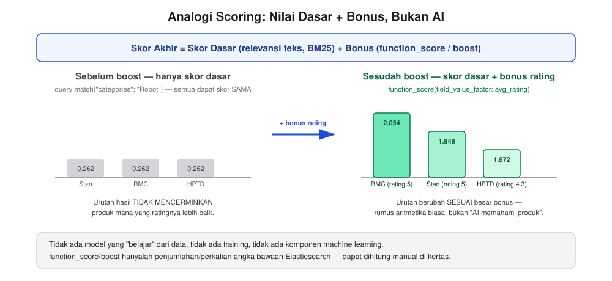
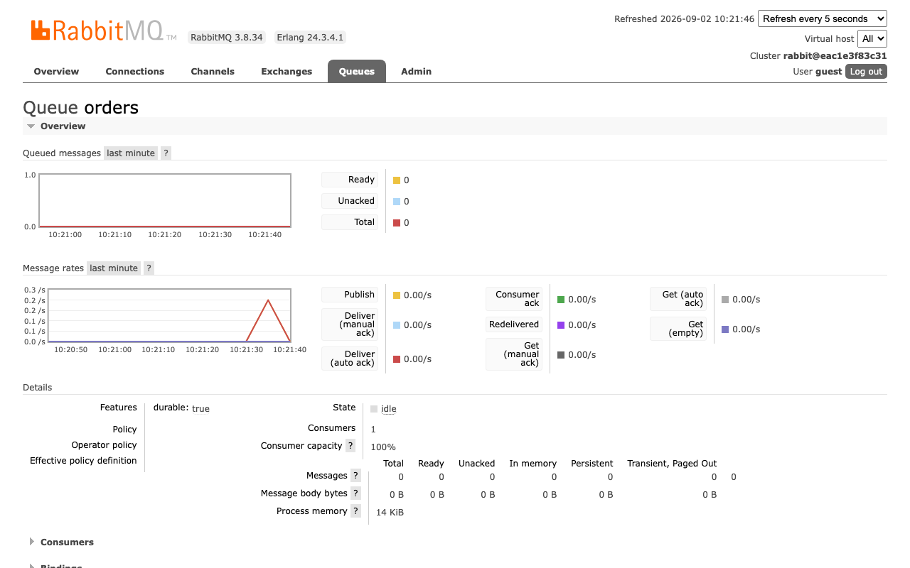
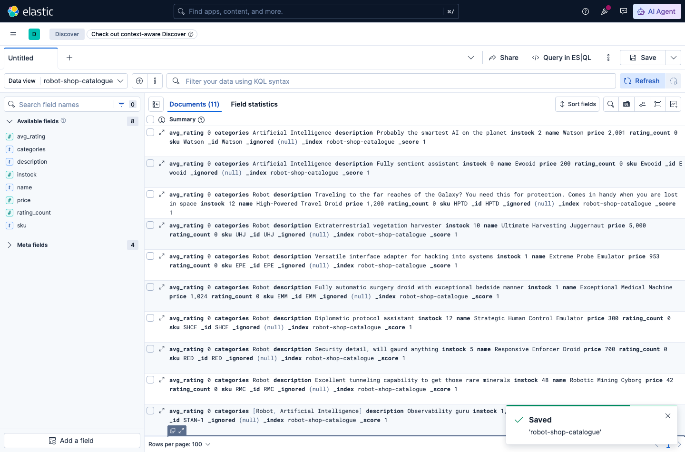
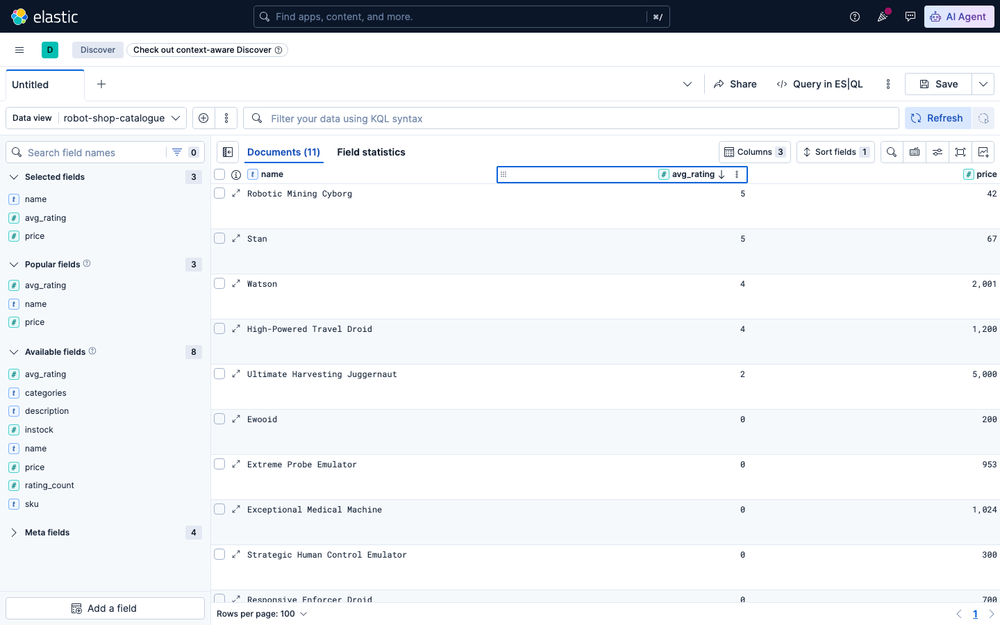
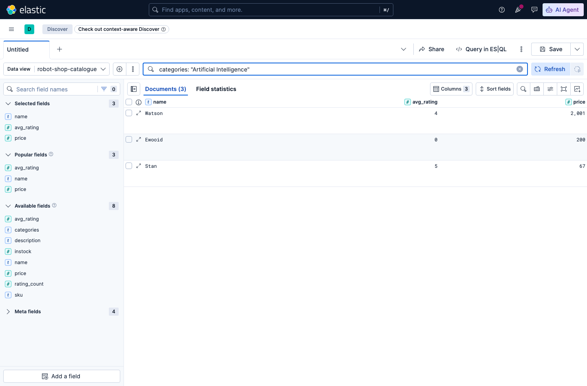

# Sesi 4 — Relevance Scoring & Search Ranking

## a. Tujuan Sesi

Setelah sesi ini, Anda memahami bagaimana Elasticsearch menentukan urutan
hasil pencarian (`_score`), dan mampu menyesuaikan urutan tersebut supaya
mencerminkan prioritas bisnis nyata (mis. produk rating tinggi tampil
lebih dahulu) menggunakan `function_score` dan `boost`.

## b. Output yang Diharapkan

Sesi ini selesai apabila:
- Robot Shop berjalan dengan 7 servis yang memiliki healthcheck
  (`catalogue`, `user`, `cart`, `shipping`, `ratings`, `payment`, `web`)
  berstatus `healthy` pada `docker compose ps` (6 servis pendukung
  `mongodb`, `redis`, `rabbitmq`, `mysql`, `dispatch`, `payment-gateway`
  tidak memiliki healthcheck sendiri, cukup pastikan statusnya `Up`) dan
  index `robot-shop-catalogue` di Elasticsearch sudah berisi data produk
  asli.
- Anda berhasil menjalankan alur checkout end-to-end (cart → shipping →
  payment) dan melihat queue `orders` di RabbitMQ management UI
  memproses pesan tersebut.
- Anda berhasil menjalankan query pencarian yang hasilnya berubah urutan
  setelah ditambahkan `function_score`/`boost`, dan dapat menjelaskan
  penyebabnya.

## c. Teori & Struktur Sistem

Baca [`robot-shop-structure.md`](robot-shop-structure.md) terlebih dahulu
untuk memahami sistem yang akan Anda observasi pada sesi ini.

**Relevance & `_score`.** Tiap hasil pencarian Elasticsearch punya `_score`
— angka yang menentukan urutan tampil (semakin tinggi, semakin relevan
menurut Elasticsearch). Secara default, `_score` dihitung dari algoritma
BM25 (seberapa sering & langka kata yang dicari muncul di dokumen). Ini
bagus untuk relevansi TEKS, tetapi sering kali urutan juga perlu
mempertimbangkan sinyal bisnis lain berupa rating produk, popularitas, stok,
dst. Dua cara utama:

- **`function_score`** — modifikasi `_score` pakai fungsi matematis
  berdasarkan NILAI FIELD lain (mis. `field_value_factor` mengalikan/
  menambah score berdasarkan `avg_rating`).
- **`boost`** — angka pengali pada bagian query tertentu (mis. dalam
  `bool.should`), membuat dokumen yang match bagian itu naik skornya
  lebih tinggi dibanding yang cuma match bagian lain.

**Cara kerjanya: rumus aritmetika sederhana di atas skor dasar.**
`function_score` dan `boost` menghitung skor akhir dengan
menjumlahkan/mengalikan `_score` dasar (dari BM25) dengan nilai
tambahan berdasarkan field lain. Analoginya seperti nilai ujian sekolah
yang diberi **poin tambahan (bonus)**: nilai dasar tetap berasal dari
jawaban (skor relevansi teks BM25), lalu ditambahkan bonus untuk faktor
lain (mis. keaktifan di kelas = rating produk). Semakin besar bonusnya,
semakin tinggi posisi akhirnya — tanpa mengubah cara jawaban ujian itu
sendiri dinilai.



*Skor akhir = skor dasar (relevansi teks BM25, dari query `match`) +
bonus (dari `function_score`/`boost` berdasarkan field bisnis seperti
`avg_rating`). Urutan hasil berubah karena bonusnya berbeda tiap
dokumen.*

## d. Praktik: Instalasi & Konfigurasi

*(Prasyarat: stack Sesi 1 masih jalan untuk Elasticsearch/Kibana.)*

> **Ke mana setiap perintah di bawah dijalankan?** Sesi ini menggabungkan
> dua tempat — **Terminal** (semua yang diawali `$`/blok berlabel `bash`:
> `docker compose`, `curl`, `python3`) untuk operasi di luar Elasticsearch
> seperti menjalankan Robot Shop, memanggil API Robot Shop, dan transfer
> data, dan **Kibana Dev Tools Console** (blok `GET`/`POST` TANPA `curl`
> di depannya) khusus untuk query ke Elasticsearch.
> Tiap blok di bawah diberi label eksplisit.

**[Terminal] Jalankan Robot Shop** (lihat [`robot-shop-structure.md`](robot-shop-structure.md) untuk detail arsitektur):
```bash
cd lab/day-2-query-relevance/sesi-4-relevance-scoring
docker compose up -d
```
**Apabila perangkat Anda ARM (Apple Silicon)** — periksa terlebih dahulu
lewat `docker info --format '{{.Architecture}}'` (lihat
`prerequisites.md`). Apabila hasilnya `arm64`, gunakan perintah berikut
sebagai pengganti perintah di atas:
```bash
docker compose -f docker-compose.yml -f docker-compose.arm64-override.yml up -d
```

> **INFORMATION:** tanpa override di atas, `mysql` akan berjalan lewat
> emulasi dengan warning platform-mismatch — tetap berjalan, tetapi lebih
> lambat & membingungkan apabila tidak diberi tahu terlebih dahulu.

Tunggu servis yang punya healthcheck jadi `healthy` (`docker compose ps`).

> **INFORMATION:** `catalogue`/`user`/`cart`/`payment`/`web` biasanya
> cepat, sementara `shipping`/`ratings` butuh waktu lebih lama saat MySQL
> inisialisasi pertama kali. `mongodb`/`redis`/`rabbitmq`/`mysql`/`dispatch`
> tidak punya healthcheck sendiri dan akan selalu tampil tanpa status
> `healthy` di `docker compose ps` — itu normal, cukup pastikan statusnya
> `Up`.

**[Terminal] Coba alur checkout end-to-end** — sebelum masuk ke bagian
relevance scoring, verifikasi dulu seluruh servis Robot Shop benar-benar
terhubung satu sama lain (bukan cuma `Up` sendiri-sendiri), sekaligus
melihat peran `rabbitmq` yang TIDAK terlihat lewat `docker compose ps`
biasa (statusnya cuma `Up`, tanpa info apa isinya):
```bash
curl -s "http://localhost:8080/api/cart/add/checkout-demo/STAN-1/1" -o /dev/null
curl -s -X POST "http://localhost:8080/api/cart/shipping/checkout-demo" \
  -H 'Content-Type: application/json' \
  -d '{"distance":10,"cost":5,"location":"Jakarta"}' -o /dev/null
CART=$(curl -s "http://localhost:8080/api/cart/cart/checkout-demo")
curl -s -X POST "http://localhost:8080/api/payment/pay/checkout-demo" \
  -H 'Content-Type: application/json' -d "$CART"
```
Expected Output: `{"orderid":"<uuid acak>"}` — transaksi berhasil.

> **INFORMATION:** urutan panggilan di atas meniru alur checkout Robot
> Shop yang sesungguhnya: `cart` (isi keranjang) → `cart` lagi (tambah
> biaya kirim) → `payment` (proses bayar). `payment` TIDAK memproses
> pesanan secara langsung — ia hanya mempublikasikan pesan ke `rabbitmq`
> (queue `orders`), dan `dispatch` (consumer asinkron, lihat
> `robot-shop-structure.md`) yang benar-benar mengambil pesan itu untuk
> diproses. Inilah peran `rabbitmq`: perantara ANTARA `payment` dan
> `dispatch`, bukan servis yang Anda panggil langsung lewat `web`.

**[Browser] Lihat antrean pesan secara visual** — buka
`http://localhost:15672` (login `guest`/`guest`, kredensial default
RabbitMQ), klik tab **Queues**, klik queue `orders`.



*Queue `orders` — grafik "Message rates" menunjukkan lonjakan
publish/deliver tepat saat perintah `curl` di atas dijalankan (kembali ke
0 dalam hitungan detik karena `dispatch` memprosesnya nyaris seketika).
`Consumers: 1` membuktikan `dispatch` benar-benar terhubung dan siap
menerima pesan dari queue ini.*

**[Terminal] Lakukan hal ini terlebih dahulu untuk isi rating awal** —
jalankan perintah berikut:
```bash
curl -s -X PUT "http://localhost:8080/api/ratings/api/rate/Watson/5" -o /dev/null
curl -s -X PUT "http://localhost:8080/api/ratings/api/rate/Watson/4" -o /dev/null
curl -s -X PUT "http://localhost:8080/api/ratings/api/rate/HPTD/5" -o /dev/null
curl -s -X PUT "http://localhost:8080/api/ratings/api/rate/HPTD/5" -o /dev/null
curl -s -X PUT "http://localhost:8080/api/ratings/api/rate/HPTD/3" -o /dev/null
curl -s -X PUT "http://localhost:8080/api/ratings/api/rate/UHJ/2" -o /dev/null
curl -s -X PUT "http://localhost:8080/api/ratings/api/rate/RMC/5" -o /dev/null
curl -s -X PUT "http://localhost:8080/api/ratings/api/rate/RMC/5" -o /dev/null
curl -s -X PUT "http://localhost:8080/api/ratings/api/rate/STAN-1/5" -o /dev/null
```
(SKU: `Watson`, `HPTD`=High-Powered Travel Droid, `UHJ`=Ultimate
Harvesting Juggernaut, `RMC`=Robotic Mining Cyborg, `STAN-1`=Stan — lihat
daftar lengkap lewat `GET /api/catalogue/products`.)

> **INFORMATION:** Robot Shop yang BARU pertama kali dijalankan punya
> `avg_rating: 0` untuk semua produk. Apabila langsung lanjut ke contoh
> `function_score` di bawah tanpa langkah ini, query-nya akan tetap
> berjalan tanpa error, namun urutan hasilnya tidak berubah (boost dari
> rating 0 selalu 0), bertentangan dengan Expected Output yang diharapkan
> dalam modul ini.

**[Terminal] Ambil data produk asli dari Robot Shop, gabung dengan data rating, index ke Elasticsearch:**
```bash
python3 << 'PYEOF'
import json, urllib.request

products = json.loads(urllib.request.urlopen("http://localhost:8080/api/catalogue/products").read())

bulk_lines = []
for p in products:
    rating = json.loads(urllib.request.urlopen(f"http://localhost:8080/api/ratings/api/fetch/{p['sku']}").read())
    doc = {
        "sku": p["sku"], "name": p["name"], "description": p["description"],
        "price": p["price"], "instock": p["instock"], "categories": p["categories"],
        "avg_rating": rating["avg_rating"], "rating_count": rating["rating_count"],
    }
    bulk_lines.append(json.dumps({"index": {"_index": "robot-shop-catalogue", "_id": p["sku"]}}))
    bulk_lines.append(json.dumps(doc))

with open("/tmp/catalogue_bulk.ndjson", "w") as f:
    f.write("\n".join(bulk_lines) + "\n")
print(f"Wrote {len(products)} products")
PYEOF

curl -s -X POST "http://localhost:9200/robot-shop-catalogue/_bulk?refresh=true" \
  -H 'Content-Type: application/x-ndjson' --data-binary @/tmp/catalogue_bulk.ndjson
```
Expected Output: `"errors":false`, 11 item
Robot Shop (nama, deskripsi, harga, stok, kategori, rating) sekarang ada di
index `robot-shop-catalogue`.

> **INFORMATION:** Robot Shop sendiri menyimpan produknya di MongoDB
> (dipakai oleh service `catalogue`), bukan di Elasticsearch. Langkah di
> atas menyalin data itu ke Elasticsearch supaya dapat digunakan untuk
> Query DSL/relevance — pola ini mirip proses **ETL
> (Extract-Transform-Load)** sederhana.

**[Dev Tools Console] Coba search dulu tanpa scoring khusus** — buka
`http://localhost:5601/app/dev_tools#/console`, cari produk kategori "Robot":
```
GET robot-shop-catalogue/_search
{ "query": { "match": { "categories": "Robot" } } }
```
Expected Output: **9 hits**, tapi perhatikan `_score`-nya —
hampir semua dokumen dapat skor **SAMA** (`0.262`), karena `match` cuma
menilai relevansi teks "Robot" di field `categories`, tidak tahu mana
produk yang sebenarnya lebih baik/populer.

## e. Contoh Implementasi

**[Dev Tools Console] Boost berdasarkan rating** (`function_score` + `field_value_factor`):
```
GET robot-shop-catalogue/_search
{
  "query": {
    "function_score": {
      "query": { "match": { "categories": "Robot" } },
      "field_value_factor": {
        "field": "avg_rating",
        "modifier": "ln1p",
        "missing": 0
      },
      "boost_mode": "sum"
    }
  }
}
```
Expected Output — urutan sekarang berubah total, produk rating
tinggi naik ke atas:
```
2.054  Robotic Mining Cyborg     (rating 5)
1.948  Stan                      (rating 5)
1.872  High-Powered Travel Droid (rating 4.33)
1.361  Ultimate Harvesting Juggernaut (rating 2)
0.262  ... (sisanya, rating 0 — skor tidak berubah dari baseline)
```
> **INFORMATION:** angka desimal ke-2/3 di belakang koma bisa sedikit
> berbeda tiap kali index dibangun ulang — bagian `match` dari skor ikut
> bergantung pada statistik korpus (jumlah dokumen, panjang field
> rata-rata), bukan cuma `avg_rating`. Urutan dan pola naik/turunnya tetap
> konsisten.

`modifier: "ln1p"` (log(1+x)) dipakai supaya rating 5 tidak melebihi batasnya
dibanding rating 4 pola umum untuk field yang skalanya kecil (1-5).
`missing: 0` menangani produk yang belum punya rating sama sekali.

**[Dev Tools Console] Boosting kategori tertentu** (`bool.should` dengan `boost`):
```
GET robot-shop-catalogue/_search
{
  "query": {
    "bool": {
      "must": { "match_all": {} },
      "should": [
        { "match": { "categories": { "query": "Artificial Intelligence", "boost": 3 } } }
      ]
    }
  }
}
```
Expected Output : semua produk tetap muncul (`must: match_all`),
tapi yang kategorinya "Artificial Intelligence" melonjak ke atas:
```
7.208  Watson   (kategori: Artificial Intelligence)
7.208  Ewooid   (kategori: Artificial Intelligence)
5.959  Stan     (kategori: Robot + Artificial Intelligence, dapat boost parsial)
1.000  ... (sisanya, cuma kategori Robot, skor dasar match_all)
```
Ini pola umum e-commerce nyata: "tampilkan semua produk, tapi utamakan
kategori promosi/prioritas di atas."

**[Kibana UI] Eksplorasi yang sama, lewat Discover** (tanpa menulis
Query DSL sama sekali):

**1. Buat Data View** untuk `robot-shop-catalogue` (index custom, sama
seperti langkah di Sesi 2 untuk `lab-mapping-demo`): buka menu ☰ →
Discover, klik data view aktif → **Create a data view** → Name & Index
pattern isi `robot-shop-catalogue` → **Save data view to Kibana**.



*Data view `robot-shop-catalogue` aktif — 11 produk Robot Shop yang
di-index pada bagian (d) muncul di tabel.*

**2. Tambahkan kolom `name`, `avg_rating`, `price`** (hover field di
sidebar kiri, klik ikon **+**).

**3. "Boost" rating lewat UI — urutkan kolom `avg_rating` menurun**:
klik nama kolom `avg_rating` pada header tabel, klik ikon panah untuk
mengurutkan dari besar ke kecil.

> **INFORMATION:** perhatikan urutannya — produk dengan rating tertinggi
> kini tampil paling atas, **efek yang sama persis** dengan hasil
> `function_score` pada Dev Tools Console di atas, dicapai tanpa menulis
> satu baris query pun. Ini yang secara visual paling menjelaskan analogi
> "skor dasar + bonus": Discover tidak menghitung bonus dalam bentuk angka
> `_score`, tetapi hasil akhirnya (urutan produk) identik.



*Urutan menurun berdasarkan `avg_rating` — Robotic Mining Cyborg dan
Stan (rating 5) tampil di atas, sama seperti hasil `function_score`
pada Dev Tools Console.*

**4. Filter kategori promosi lewat KQL**: ketik filter yang setara
dengan query `bool.should` di atas pada search bar:
`categories: "Artificial Intelligence"`



*3 produk kategori "Artificial Intelligence" — Watson, Ewooid, Stan —
persis sama dengan yang lolos filter pada query Dev Tools Console di
atas.*

> **INFORMATION:** kapan tetap perlu Query DSL, bukan cukup Discover?
> Discover sangat cocok untuk eksplorasi cepat dan kasus
> sort-by-satu-field seperti di atas — namun untuk RANKING yang
> menggabungkan BEBERAPA sinyal sekaligus dengan bobot berbeda (mis. 70%
> relevansi teks + 30% rating + bonus kategori promosi dalam satu skor
> gabungan, seperti mesin pencari e-commerce sungguhan), KQL tidak
> memiliki konsep `_score`/`boost` numerik gabungan — kombinasi semacam
> itu tetap memerlukan Query DSL lewat Dev Tools Console atau lewat API
> dari aplikasi.

**[Terminal] Nyalakan traffic berkelanjutan (load generator)** — semua
contoh di atas memakai panggilan manual satu-per-satu. Robot Shop
sebenarnya menyediakan load generator (Locust) yang mensimulasikan banyak
pengguna sekaligus, secara terus-menerus, menyentuh SEMUA servis yang
sudah Anda instal (termasuk `rabbitmq`/`dispatch` lewat checkout otomatis):
```bash
docker compose -f docker-compose.yml -f docker-compose.arm64-override.yml -f docker-compose.load.yml up -d load
```
*(Tanpa ARM override, cukup `-f docker-compose.yml -f docker-compose.load.yml`.)*

Expected Output (dari `docker compose logs -f load` setelah ~30 detik):
tabel statistik Locust bertambah baris terus (`GET /api/catalogue/...`,
`POST /api/payment/pay/...`, dst.), kolom `# Fails` tetap `0(0.00%)`.

> **INFORMATION:** load generator ini SENGAJA baru dinyalakan SEKARANG,
> di akhir sesi — bukan di awal. Salah satu task-nya mengirim RATING ACAK
> ke produk secara terus-menerus, yang akan MENGUBAH `avg_rating` yang
> sudah Anda atur manual di bagian (d). Kalau Anda jalankan ulang query
> `function_score` di atas SETELAH load generator ini menyala beberapa
> saat, urutannya bisa sedikit berbeda dari Expected Output — itu NORMAL
> (bukti nyata sistem sekarang menerima traffic sungguhan), tapi jangan
> nyalakan load generator SEBELUM menyelesaikan bagian (d)/(e) kalau
> ingin mereproduksi angka Expected Output persis seperti di modul ini.
> Pengaturan yang sama (`NUM_CLIENTS: 6`) dipakai lagi di Sesi 6 lewat
> `docker-compose.load.yml` MILIK sesi itu sendiri — BUKAN load generator
> yang sama persis yang terus jalan (ingat, Sesi 6 punya stack Robot Shop
> terpisah, Sesi 4 harus `docker compose down` dulu sebelum masuk Sesi 6).

## f. Referensi Exercise

Lanjutkan latihan mandiri di [`exercise/sesi-4/README.md`](../../../exercise/sesi-4/README.md).
