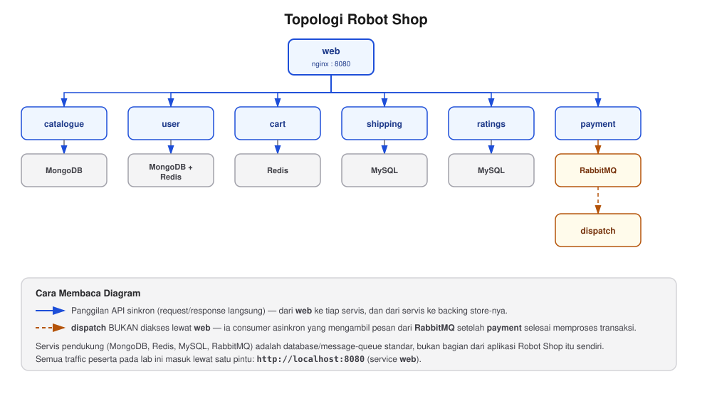

# Robot Shop — Struktur Sistem

Mulai sesi ini, Anda akan menggunakan **Robot Shop**, aplikasi e-commerce
berbasis microservice, sebagai studi kasus data nyata untuk sesi-sesi
berikutnya (Sesi 4, 6, dan 7). Anda tidak perlu mengetahui bagaimana
sistem ini dibangun — cukup pahami strukturnya, supaya mengetahui sistem
apa yang sedang Anda observasi lewat Elasticsearch/Kibana.

> **INFORMATION:** kenapa semua service di bawah ini perlu diinstal
> sekaligus, padahal query lab ini sendiri cuma menyentuh
> `robot-shop-catalogue`? Karena Robot Shop adalah SATU aplikasi utuh —
> `catalogue` bergantung pada `mongodb`, `shipping`/`ratings` bergantung
> pada `mysql`, dst. (lihat kolom "Backing Store"), tidak bisa dijalankan
> sebagian. Supaya seluruh service ini benar-benar TERPAKAI (bukan cuma
> `Up` tanpa traffic), bagian (d) di README lab menyalakan load
> generator di akhir sesi — traffic nyata yang menyentuh semua service
> sekaligus, termasuk `rabbitmq`/`dispatch` lewat checkout otomatis.

## Topologi



*Semua servis pada baris tengah (`catalogue`, `user`, `cart`, `shipping`,
`ratings`, `payment`) diakses lewat `web` — satu pintu masuk untuk semua
request. `dispatch` berbeda: ia bukan API yang diakses lewat `web`,
melainkan consumer asinkron yang mengambil pesan dari `rabbitmq` setelah
`payment` selesai memproses transaksi (lihat legenda pada diagram untuk
perbedaan panggilan sinkron vs asinkron).*

## Daftar Service

| Service | Fungsi | Bahasa | Backing Store |
|---|---|---|---|
| `web` | Reverse proxy / entry point (port 8080) | Nginx | — |
| `catalogue` | Data produk (nama, harga, stok, kategori) | Node.js | MongoDB |
| `user` | Akun & sesi pengguna | Node.js | MongoDB + Redis |
| `cart` | Keranjang belanja | Node.js | Redis |
| `shipping` | Kalkulasi & konfirmasi pengiriman | Java | MySQL |
| `ratings` | Rating & ulasan produk | PHP | MySQL |
| `payment` | Proses pembayaran | Python | RabbitMQ |
| `dispatch` | Pemrosesan order setelah bayar | Go | RabbitMQ (consumer) |

Service pendukung (`mongodb`, `redis`, `mysql`, `rabbitmq`) adalah database/
message-queue standar, bukan bagian dari aplikasi Robot Shop sendiri.
Ditambah satu service pendukung buatan modul ini sendiri (bukan bagian
Robot Shop asli): `payment-gateway`, dummy HTTP server yang menggantikan
pemanggilan nyata ke situs eksternal (default Robot Shop memanggil
`https://paypal.com/`) — `payment` diarahkan ke sini lewat env var
`PAYMENT_GATEWAY`, supaya lab ini tidak pernah menghubungi internet
sungguhan untuk mensimulasikan payment gateway pihak ketiga.

Selain itu, `docker-compose.yml` sesi ini juga menyalakan 4 servis
observability yang membaca/menerima data dari servis-servis di atas:

| Service | Fungsi |
|---|---|
| `apm-server` | Menerima data trace APM dari `cart`/`payment`/`catalogue`/`user`/`shipping`/`ratings`/`dispatch` (image `:v2-apm`), menyimpannya ke Elasticsearch. |
| `metricbeat` | Mengumpulkan metrik `mongodb`, `mysql`, `redis`, `rabbitmq` secara berkala. |
| `logstash-rs` | Mem-parsing log `payment`/`cart`/`web` (grok/JSON) yang dikirim `filebeat-rs`. |
| `filebeat-rs` | Membaca log seluruh container Robot Shop, mengirimkannya ke `logstash-rs`. |

## API yang Dipakai di Lab Ini

Semua lewat `http://localhost:8080` (service `web`):

- `GET /api/catalogue/products` — daftar semua produk.
- `GET /api/catalogue/product/<sku>` — detail satu produk.
- `GET /api/ratings/api/fetch/<sku>` — rating rata-rata & jumlah rating produk.
- `PUT /api/ratings/api/rate/<sku>/<1-5>` — kirim rating baru.
- `GET /api/cart/add/<id>/<sku>/<qty>` — tambah item ke keranjang.
- `GET /api/cart/cart/<id>` — lihat isi keranjang.
- `POST /api/cart/shipping/<id>` — tambah biaya kirim ke keranjang (body:
  `{"distance", "cost", "location"}`).
- `POST /api/payment/pay/<id>` — proses pembayaran (body: isi keranjang
  lengkap dari `GET /api/cart/cart/<id>`) — inilah yang memicu pesan ke
  `rabbitmq`, diproses `dispatch`.

## Menjalankan

```bash
cd lab/day-2-query-relevance/sesi-4-relevance-scoring
docker compose up -d
```

**Apabila perangkat Anda ARM (Apple Silicon)** — tambahkan file override
(lihat [`docker-compose.arm64-override.yml`](docker-compose.arm64-override.yml)
untuk penjelasannya):
```bash
docker compose -f docker-compose.yml -f docker-compose.arm64-override.yml up -d
```

Semua image sudah pre-built (multi-arch untuk 9 dari 10 service) — Anda
cukup pull & jalankan, tidak ada proses build/compile.

> **Catatan startup:** `shipping` dan `ratings` connect ke MySQL saat
> startup. MySQL butuh waktu (~1-2 menit di volume baru) untuk selesai
> import data awal — kedua service itu bisa terlihat `unhealthy` sesaat,
> tapi **akan pulih sendiri otomatis** tanpa perlu restart manual begitu
> MySQL selesai. Tunggu saja.
