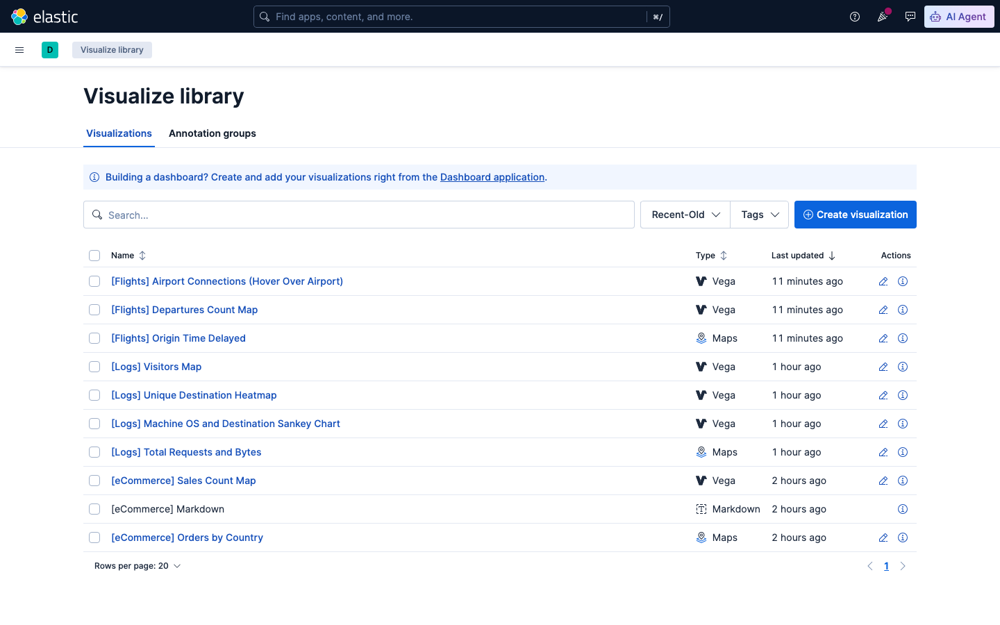
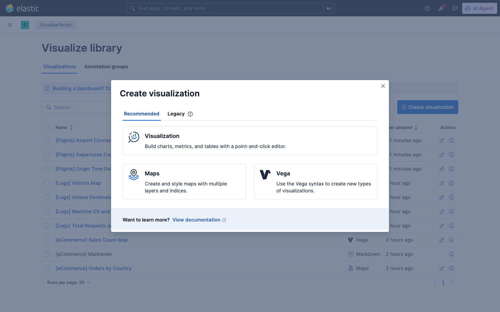
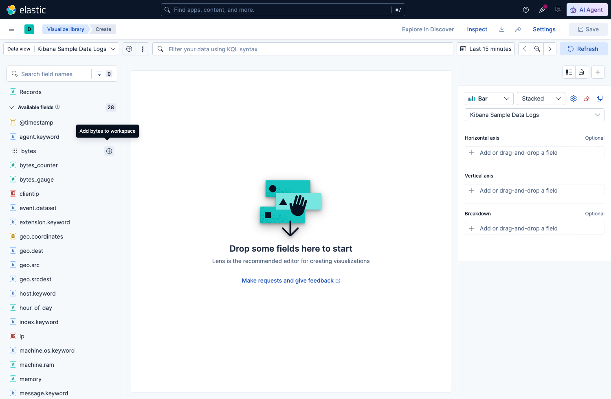
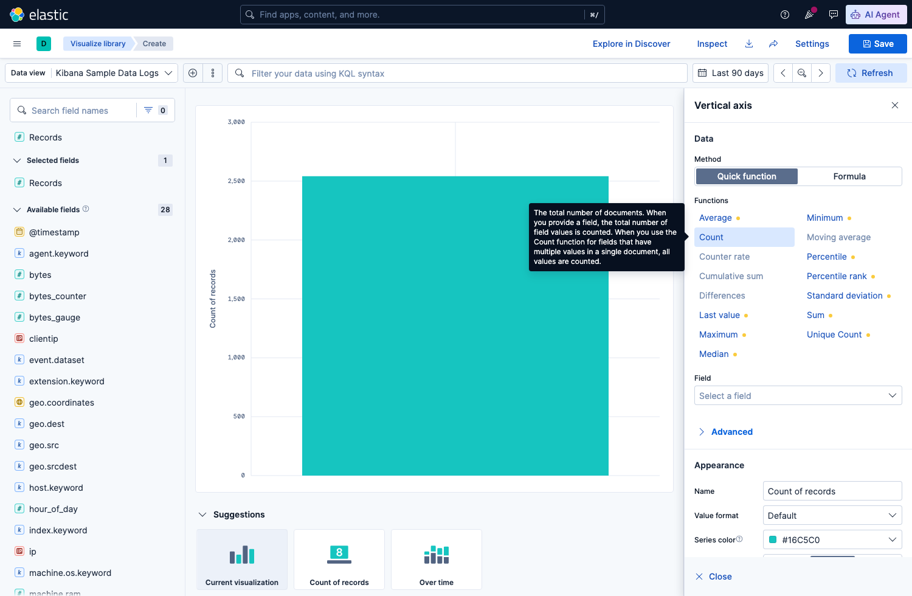
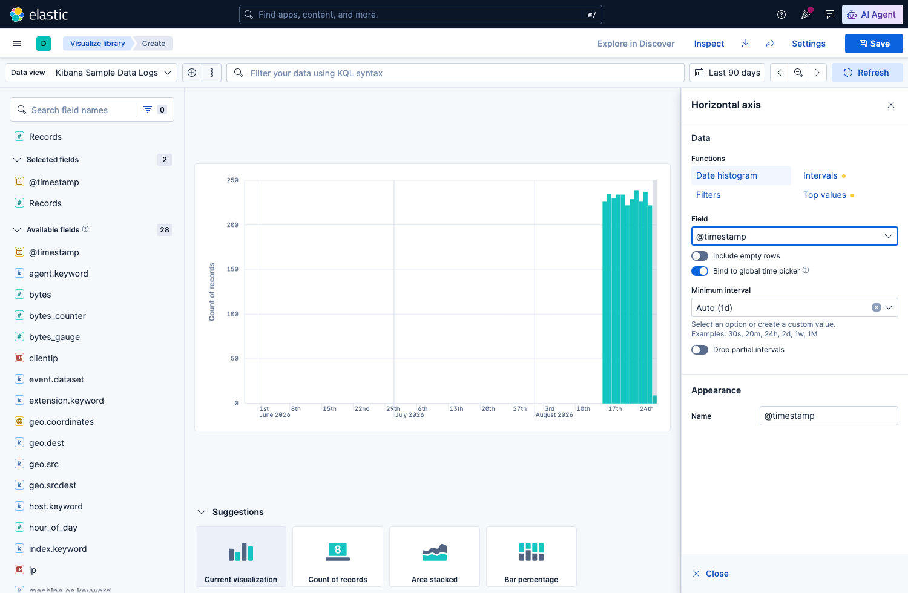
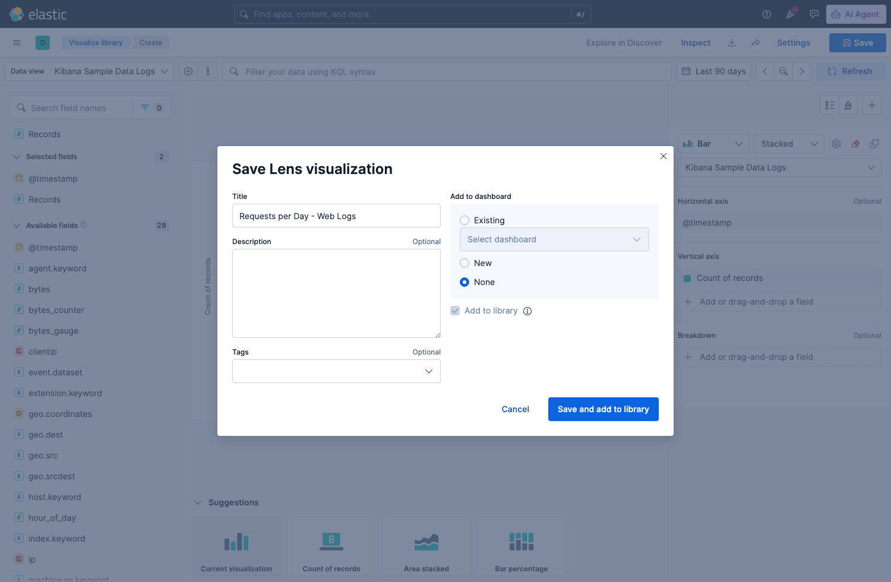
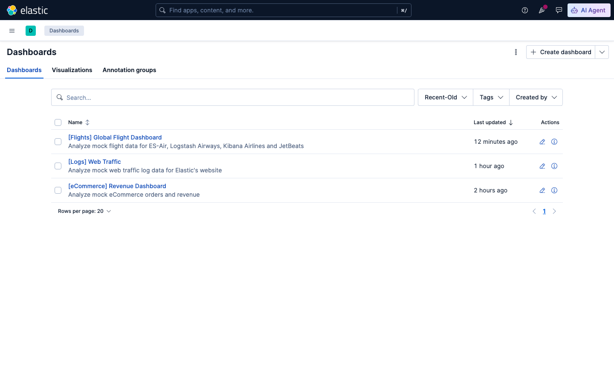
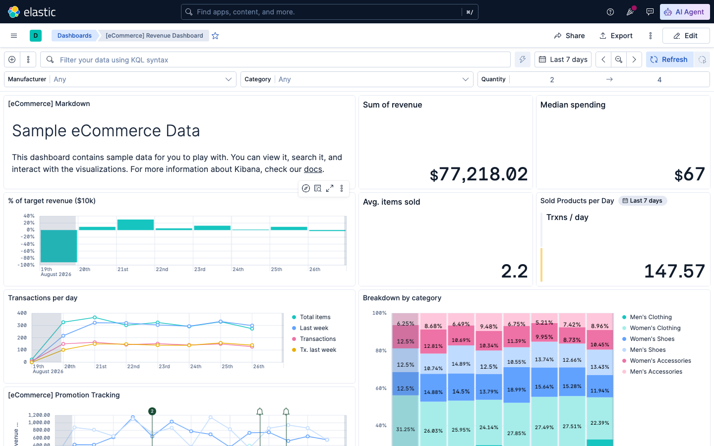

# Sesi 5 — Data Aggregations and Analytics

## a. Tujuan Sesi

Setelah sesi ini, kamu mampu melakukan analisis data agregat di
Elasticsearch. mulai dari agregasi dasar (rata-rata, grup per kategori),
agregasi bertingkat (pipeline), sampai agregasi berbasis lokasi geografis
(geo) serta memahami bagaimana hasilnya bisa divisualisasikan di Kibana.

## b. Output yang Diharapkan

Sesi ini selesai kalau kamu berhasil menjalankan dan menjelaskan hasil dari
4 jenis agregasi: metric+bucket dasar, `terms`+`avg` bertingkat, pipeline
aggregation (`avg_bucket`), dan geo aggregation (`geohash_grid`).

## c. Teori & Struktur Sistem

**Aggregation** adalah cara Elasticsearch merangkum banyak dokumen jadi
statistik (mirip `GROUP BY` di SQL, tapi jauh lebih fleksibel — bisa
bertingkat/nested). Dua kategori utama:
- **Metric aggregation** — hitung satu angka dari sekumpulan dokumen
  (`avg`, `sum`, `min`, `max`, `cardinality`, dst.).
- **Bucket aggregation** — kelompokkan dokumen jadi beberapa "ember"
  berdasarkan kriteria (`terms` per nilai field, `date_histogram` per
  rentang waktu, `geohash_grid` per area geografis).

Bucket dan metric bisa **digabung bertingkat** — mis. "rata-rata bytes,
dikumpulkan sesuai response code" (metric di dalam bucket).

**Pipeline aggregation** adalah agregasi yang inputnya bukan dokumen
mentah, tapi HASIL agregasi lain (bucket aggregation lain) — makanya
disebut "pipeline", hasil satu aggregation jadi input aggregation
berikutnya. Contoh: "rata-rata dari total-bytes-per-hari" (`avg_bucket` di
atas `date_histogram`).

**Geo aggregation** mengelompokkan dokumen berdasarkan lokasi geografis
(field bertipe `geo_point`) — `geohash_grid` membagi peta jadi grid
segi-enam/kotak, tiap dokumen masuk ke grid sesuai koordinatnya.

## d. Praktik: Instalasi & Konfigurasi

*(Prasyarat: stack Sesi 1 masih jalan.)*

**Load sample data logs** (dataset access-log web server, punya field waktu & geo):
```bash
curl -X POST "http://localhost:5601/api/sample_data/logs" \
  -H "kbn-xsrf: true" -H "x-elastic-internal-origin: kibana"
```
Expected Output: `{"elasticsearchIndicesCreated":{"kibana_sample_data_logs":14074},"kibanaSavedObjectsLoaded":8}`

**Agregasi dasar bertingkat** — breakdown response code + rata-rata ukuran response:
```
GET kibana_sample_data_logs/_search
{
  "size": 0,
  "aggs": {
    "by_response": {
      "terms": { "field": "response.keyword" },
      "aggs": { "avg_bytes": { "avg": { "field": "bytes" } } }
    }
  }
}
```
Expected Output:
```
200: count=12832, avg_bytes=5897.9
404: count=801,   avg_bytes=5049.2
503: count=441,   avg_bytes=0.0
```
`avg_bytes` untuk response `503` wajar bernilai `0.0` — response error
biasanya tidak mengirim body, jadi `bytes`-nya memang nol, bukan bug.

## e. Contoh Implementasi

**Pipeline aggregation** — rata-rata total bytes PER HARI (agregasi di
atas hasil `date_histogram`, bukan dokumen mentah):
```
GET kibana_sample_data_logs/_search
{
  "size": 0,
  "aggs": {
    "requests_per_day": {
      "date_histogram": { "field": "@timestamp", "calendar_interval": "day" },
      "aggs": { "total_bytes": { "sum": { "field": "bytes" } } }
    },
    "avg_daily_bytes": {
      "avg_bucket": { "buckets_path": "requests_per_day>total_bytes" }
    }
  }
}
```
Expected Output:
```
requests_per_day: 61 bucket harian (mis. "2026-08-16": 1,531,493 bytes)
avg_daily_bytes:  1,306,978.5
```
`avg_daily_bytes` adalah rata-rata dari SEMUA total harian di
`requests_per_day`, dihitung oleh `avg_bucket` tanpa perlu ambil data
mentah lagi — perhatikan `buckets_path: "requests_per_day>total_bytes"`,
sintaksnya berarti "ambil hasil agregasi `total_bytes` di dalam tiap
bucket `requests_per_day`".

**Tanggal & angka persis di layarmu akan beda** — `kibana_sample_data_logs`
itu data time-relative, Kibana generate ulang rentang tanggalnya relatif
ke kapan kamu load datanya, bukan tanggal tetap. Jumlah bucket ~61 dan
pola angkanya akan konsisten, cuma tanggal & totalnya bergeser.

**Geo aggregation** — kelompokkan traffic berdasarkan lokasi (grid geografis):
```
GET kibana_sample_data_logs/_search
{
  "size": 0,
  "aggs": {
    "grid": {
      "geohash_grid": { "field": "geo.coordinates", "precision": 3 }
    }
  }
}
```
Expected Output:
```
595 grid cell terisi
grid terpadat: "c1c" -> 135 dokumen
```
`precision: 3` mengatur seberapa detail grid-nya — angka lebih besar
berarti grid lebih kecil/detail, cocok untuk zoom level peta yang berbeda.

**Visualisasi di Kibana.** Hasil agregasi seperti ini adalah dasar dari
visualisasi Kibana — `geohash_grid` misalnya langsung dipetakan ke
visualisasi **Maps**, `date_histogram` ke bar chart/line chart time-series.



*1. Buka menu ☰ → Analytics → Visualize Library.*



*2. Klik "Create visualization" — pilih tipe "Visualization" (editor
Lens, point-and-click).*

**Bikin bar chart "Count per day" dari nol** (X-axis: `@timestamp` date
histogram, Y-axis: Count) hasilnya nanti langsung mencerminkan angka
`requests_per_day` yang barusan kamu hitung lewat query pipeline
aggregation di atas:

**3. Ganti Data view** ke "Kibana Sample Data Logs" (klik data view aktif
di kiri atas, pilih dari daftar) editor mulai kosong, siap diisi:



*Panel kanan ada 3 slot: **Horizontal axis**, **Vertical axis**,
**Breakdown** (opsional) — klik "Add or drag-and-drop a field" di tiap
slot untuk mengisi, TANPA perlu drag-and-drop manual.*

**4. Isi Vertical axis** — klik slot-nya, pilih fungsi **Count**:



*Baru diisi Vertical axis = Count → hasilnya 1 bar tunggal (total semua
dokumen), belum ada breakdown waktu.*

**5. Isi Horizontal axis** — klik slot-nya, pilih fungsi **Date
histogram**, lalu pilih field `@timestamp` di dropdown "Field" yang muncul:



*Sekarang bar tunggal tadi otomatis pecah jadi bar chart per hari
persis pola yang sama dengan `requests_per_day` di query pipeline
aggregation, cuma sekarang dalam bentuk visual.*

**6. Hasil akhir** (tutup panel config dengan **Close**):


**7. Simpan ke Visualize Library** klik **Save** di kanan atas, isi
Title, pilih **Add to dashboard: None** (kalau belum mau taruh di
dashboard manapun) "Add to library" otomatis tercentang:



*Klik **Save and add to library** — visualisasi ini sekarang bisa dipakai
lagi di dashboard mana pun tanpa bikin ulang dari nol.*

**Referensi — dashboard eCommerce bawaan Kibana** (contoh dashboard
lengkap dengan banyak visualisasi digabung, ship otomatis bareng Kibana
Sample Data eCommerce):



*Buka menu ☰ → Analytics → Dashboards — daftar dashboard bawaan muncul,
termasuk **"[eCommerce] Revenue Dashboard"**. Klik untuk membukanya:*



## f. Referensi Exercise

Lanjutkan latihan mandiri di [`exercise/sesi-5/README.md`](../../../exercise/sesi-5/README.md).
