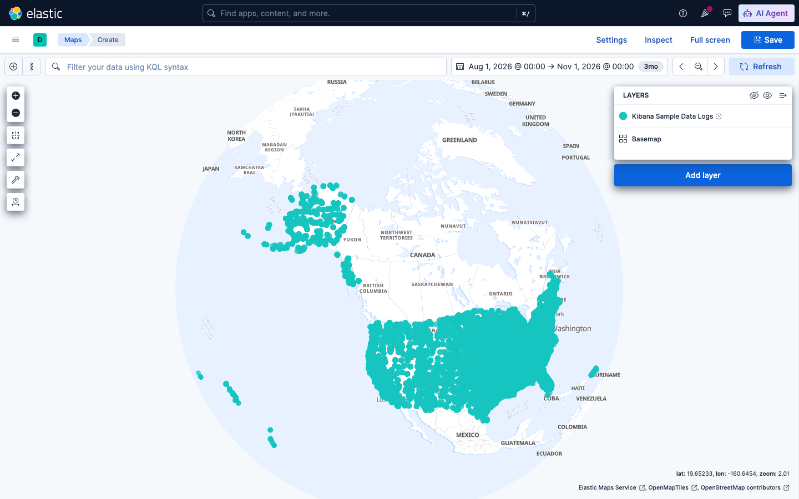
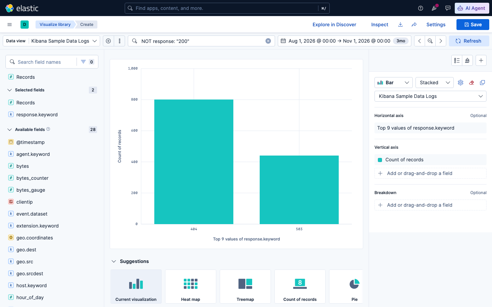

# Sesi 5 — Data Aggregations and Analytics

## a. Tujuan Sesi

Setelah sesi ini, Anda mampu melakukan analisis data agregat di
Elasticsearch, mulai dari agregasi dasar (rata-rata, pengelompokan per
kategori), agregasi bertingkat (pipeline), hingga agregasi berbasis lokasi
geografis (geo), serta memahami bagaimana hasilnya dapat divisualisasikan
di Kibana.

## b. Output yang Diharapkan

Sesi ini dinyatakan selesai apabila Anda berhasil menjalankan dan
menjelaskan hasil dari 4 jenis agregasi: metric+bucket dasar, `terms`+`avg`
bertingkat, pipeline aggregation (`avg_bucket`), dan geo aggregation
(`geohash_grid`) — serta berhasil memvisualisasikan hasil geo aggregation
lewat Kibana Maps dan membuat satu visualisasi Lens dengan filter KQL
diterapkan sebelum breakdown-nya.

## c. Teori & Struktur Sistem

**Aggregation** adalah cara Elasticsearch merangkum banyak dokumen menjadi
statistik (mirip `GROUP BY` pada SQL, tetapi jauh lebih fleksibel karena
dapat bertingkat/nested). Dua kategori utama:
- **Metric aggregation** — menghitung satu angka dari sekumpulan dokumen
  (`avg`, `sum`, `min`, `max`, `cardinality`, dst.).
- **Bucket aggregation** — mengelompokkan dokumen menjadi beberapa "ember"
  berdasarkan kriteria (`terms` per nilai field, `date_histogram` per
  rentang waktu, `geohash_grid` per area geografis).

Bucket dan metric dapat **digabung secara bertingkat**, misalnya:
"rata-rata bytes, dikelompokkan berdasarkan response code" (metric di
dalam bucket).

**Pipeline aggregation** adalah agregasi yang inputnya bukan dokumen
mentah, melainkan HASIL agregasi lain (bucket aggregation lain) — sehingga
disebut "pipeline": hasil satu aggregation menjadi input aggregation
berikutnya. Contoh: "rata-rata dari total-bytes-per-hari" (`avg_bucket` di
atas `date_histogram`).

**Geo aggregation** mengelompokkan dokumen berdasarkan lokasi geografis
(field bertipe `geo_point`) — `geohash_grid` membagi peta jadi grid
segi-enam/kotak, tiap dokumen masuk ke grid sesuai koordinatnya.

## d. Praktik: Instalasi & Konfigurasi

*(Prasyarat: stack Sesi 1 masih berjalan.)*

**Load sample data logs** (dataset access-log web server, memiliki field waktu & geo):
```bash
curl -X POST "http://localhost:5601/api/sample_data/logs" \
  -H "kbn-xsrf: true" -H "x-elastic-internal-origin: kibana"
```
Expected Output: `{"elasticsearchIndicesCreated":{"kibana_sample_data_logs":14074},"kibanaSavedObjectsLoaded":8}`

**Agregasi dasar bertingkat** — breakdown response code beserta rata-rata ukuran response:
```
GET kibana_sample_data_logs/_search
{
  "size": 0,
  "aggs": {
    "by_response": {
      "terms": { "field": "response.keyword" },
      "aggs": { "avg_bytes": { "avg": { "field": "bytes" } } }
    }
  }
}
```
Expected Output:
```
200: count=12832, avg_bytes=5897.9
404: count=801,   avg_bytes=5049.2
503: count=441,   avg_bytes=0.0
```
> **INFORMATION:** `avg_bytes` untuk response `503` wajar bernilai `0.0`
> — response error biasanya tidak mengirim body, sehingga `bytes`-nya
> memang bernilai nol, bukan bug.

## e. Contoh Implementasi

**Pipeline aggregation** — rata-rata total bytes PER HARI (agregasi di
atas hasil `date_histogram`, bukan dokumen mentah):
```
GET kibana_sample_data_logs/_search
{
  "size": 0,
  "aggs": {
    "requests_per_day": {
      "date_histogram": { "field": "@timestamp", "calendar_interval": "day" },
      "aggs": { "total_bytes": { "sum": { "field": "bytes" } } }
    },
    "avg_daily_bytes": {
      "avg_bucket": { "buckets_path": "requests_per_day>total_bytes" }
    }
  }
}
```
Expected Output:
```
requests_per_day: 61 bucket harian (mis. "2026-08-16": 1,531,493 bytes)
avg_daily_bytes:  1,306,978.5
```
`avg_daily_bytes` adalah rata-rata dari SEMUA total harian di
`requests_per_day`, dihitung oleh `avg_bucket` tanpa perlu mengambil data
mentah lagi — perhatikan `buckets_path: "requests_per_day>total_bytes"`,
sintaks tersebut berarti "ambil hasil agregasi `total_bytes` di dalam tiap
bucket `requests_per_day`".

> **INFORMATION:** tanggal dan angka persis pada layar Anda **dapat
> berbeda** — `kibana_sample_data_logs` merupakan data time-relative;
> Kibana men-generate ulang rentang tanggalnya relatif terhadap kapan Anda
> memuat datanya, bukan tanggal tetap. Jumlah bucket ~61 dan pola angkanya
> akan tetap konsisten, hanya tanggal dan totalnya yang bergeser.

**Geo aggregation** — mengelompokkan traffic berdasarkan lokasi (grid geografis):
```
GET kibana_sample_data_logs/_search
{
  "size": 0,
  "aggs": {
    "grid": {
      "geohash_grid": { "field": "geo.coordinates", "precision": 3 }
    }
  }
}
```
Expected Output:
```
595 grid cell terisi
grid terpadat: "c1c" -> 135 dokumen
```
`precision: 3` mengatur seberapa detail grid yang dihasilkan — semakin
besar angkanya, semakin kecil/detail grid tersebut, cocok untuk level zoom
peta yang berbeda.

**Visualisasi di Kibana.** Hasil agregasi seperti ini adalah dasar dari
visualisasi Kibana — `geohash_grid` misalnya langsung dipetakan ke
visualisasi **Maps**, `date_histogram` ke bar chart/line chart time-series.


*1. Buka menu ☰ → Analytics → Visualize Library.*


*2. Klik "Create visualization", lalu pilih tipe "Visualization" (editor
Lens, point-and-click).*

**Membuat bar chart "Count per day" dari nol** (X-axis: `@timestamp` date
histogram, Y-axis: Count) — hasilnya nanti langsung mencerminkan angka
`requests_per_day` yang baru saja Anda hitung melalui query pipeline
aggregation di atas:

**3. Ganti Data view** ke "Kibana Sample Data Logs" (klik data view aktif
di kiri atas, pilih dari daftar) — editor mulai kosong dan siap diisi:


*Panel kanan memiliki 3 slot: **Horizontal axis**, **Vertical axis**,
**Breakdown** (opsional) — klik "Add or drag-and-drop a field" pada tiap
slot untuk mengisinya, TANPA perlu drag-and-drop manual.*

**4. Isi Vertical axis** — klik slot-nya, lalu pilih fungsi **Count**:


*Baru diisi Vertical axis = Count → hasilnya 1 bar tunggal (total semua
dokumen), belum ada breakdown waktu.*

**5. Isi Horizontal axis** — klik slot-nya, pilih fungsi **Date
histogram**, lalu pilih field `@timestamp` pada dropdown "Field" yang muncul:


*Sekarang bar tunggal tadi otomatis terpecah menjadi bar chart per hari —
pola yang sama persis dengan `requests_per_day` pada query pipeline
aggregation, hanya saja kini dalam bentuk visual.*

**6. Hasil akhir** (tutup panel config dengan **Close**):


**7. Simpan ke Visualize Library** — klik **Save** di kanan atas, isi
Title, lalu pilih **Add to dashboard: None** (apabila belum ingin
menempatkannya di dashboard mana pun); "Add to library" akan otomatis
tercentang:


*Klik **Save and add to library** — visualisasi ini sekarang dapat dipakai
kembali di dashboard mana pun tanpa perlu dibuat ulang dari nol.*

**Memvisualisasikan geo aggregation lewat Kibana Maps** — hasil
`geohash_grid` yang baru saja Anda hitung lewat query dapat divisualisasikan
langsung di peta:

**1. Buka Maps** (menu ☰ → Analytics → Maps → **Create map**), klik
**Add layer** → pilih tipe **Documents**, lalu pilih data view "Kibana
Sample Data Logs" — Kibana otomatis mendeteksi field bertipe `geo_point`
(`geo.coordinates`) sebagai geospatial field:

**2. Atur rentang waktu** agar mencakup seluruh data (data ini
time-relative — lihat catatan sebelumnya), lalu klik ikon **"Fit to data
bounds"** pada toolbar kiri agar peta otomatis berpusat pada lokasi data:



*Tiap titik mewakili satu dokumen pada koordinat `geo.coordinates`-nya —
konsentrasi titik paling padat terlihat di Amerika Serikat, konsisten
dengan asal traffic pada dataset contoh ini. Pada tingkat zoom yang lebih
jauh dan volume dokumen lebih besar, titik-titik yang berdekatan akan
otomatis dirender sebagai kumpulan padat — versi visual dari konsep
`geohash_grid` yang sudah Anda hitung lewat query.*

**Visualisasi dengan filter — breakdown response error.** Selain
breakdown biasa (seperti bar chart per hari di atas), Kibana Lens juga
dapat memfilter data SEBELUM membuat breakdown-nya — berguna untuk fokus
hanya pada subset tertentu (mis. hanya transaksi error, bukan seluruh
traffic):

**1. Buat visualisasi baru** (Visualize Library → Create visualization →
Visualization), atur rentang waktu agar mencakup seluruh data seperti
sebelumnya.

**2. Ketik filter KQL** `NOT response: "200"` pada search bar — ini
mengecualikan seluruh traffic normal, menyisakan HANYA response error.

**3. Isi Vertical axis = Count**, dan **Horizontal axis = Top values**
pada field `response.keyword`:



*Hasilnya HANYA menampilkan kode `404` dan `503` (angka pada layar Anda
mengikuti hasil query breakdown response code pada bagian d di atas) —
`200` tidak muncul sama sekali karena sudah difilter di awal. Pola ini
(filter dahulu, baru breakdown) berguna untuk visualisasi semacam
"berapa banyak request per response code TERTENTU" atau "berapa banyak
IP unik per HTTP method tertentu" — filter mempersempit populasi data,
breakdown/aggregation baru dihitung dari populasi yang sudah dipersempit
itu.*

> **INFORMATION:** `kibana_sample_data_logs` tidak memiliki field method
> HTTP (`GET`/`POST`) — seluruh datanya mensimulasikan akses baca ke
> situs dokumentasi. Pola filter+breakdown di atas berlaku sama persis
> apabila datanya punya field method (mis. log Robot Shop pada Sesi 6/7),
> tinggal ganti field pada langkah 3 sesuai kebutuhan.

**Referensi — dashboard eCommerce bawaan Kibana** (contoh dashboard
lengkap dengan banyak visualisasi tergabung, ikut ter-ship otomatis
bersama Kibana Sample Data eCommerce):


*Buka menu ☰ → Analytics → Dashboards — daftar dashboard bawaan muncul,
termasuk **"[eCommerce] Revenue Dashboard"**. Klik untuk membukanya:*


*Contoh dashboard yang sudah jadi — gabungan metric, bar chart, dan
breakdown kategori, seluruhnya interaktif (klik filter
Manufacturer/Category di bagian atas).*

## f. Referensi Exercise

Lanjutkan latihan mandiri di [`exercise/sesi-5/README.md`](../../../exercise/sesi-5/README.md).
