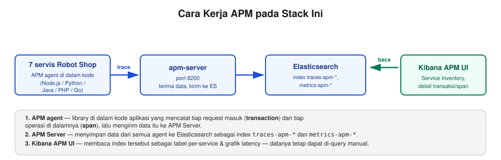
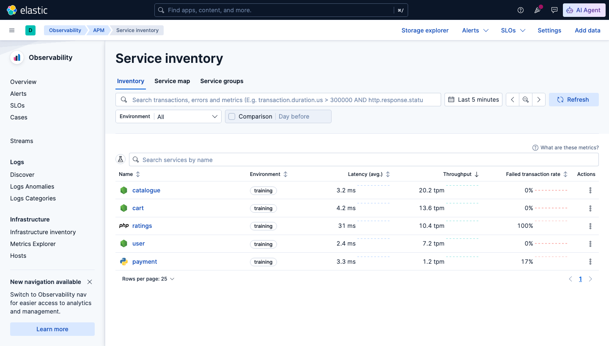
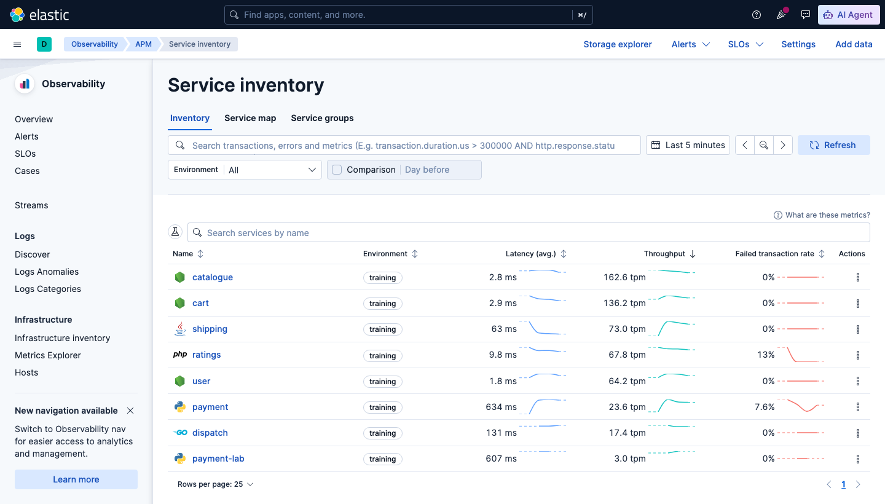
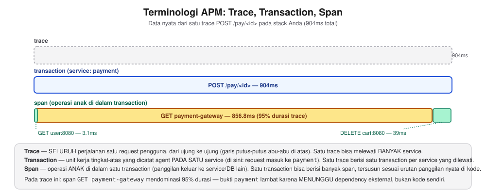
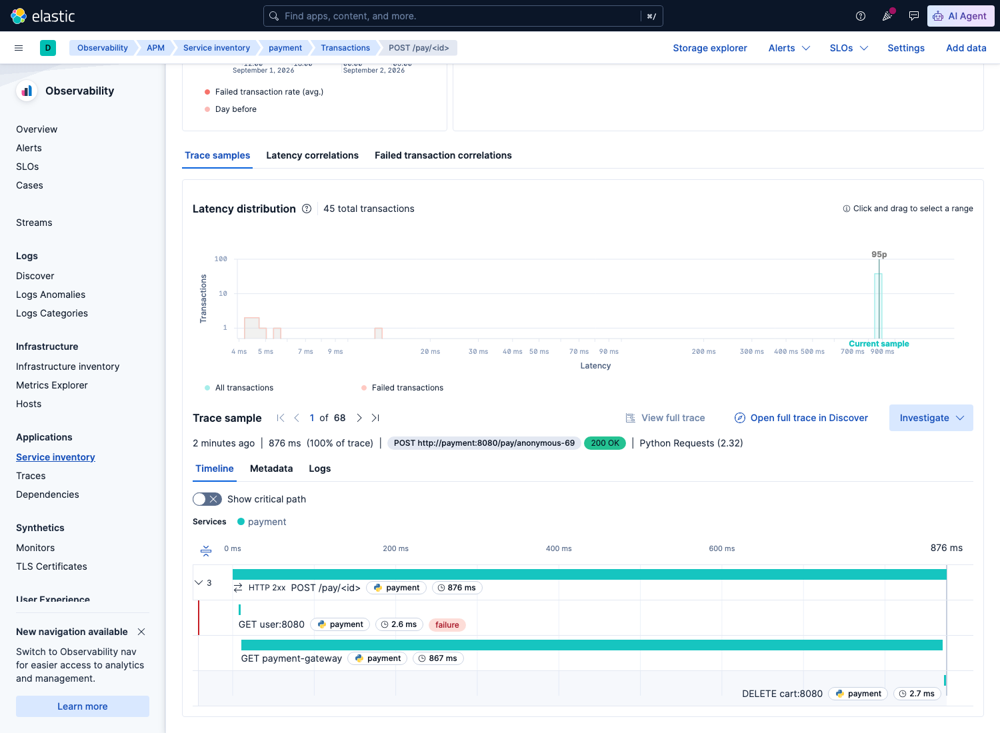

# Sesi 6 — Search Performance Optimization

## a. Tujuan Sesi

Setelah sesi ini, Anda mampu mengukur performa query Elasticsearch secara
langsung (bukan menebak), memahami cara kerja request cache, mengetahui
pengaturan index yang perlu disesuaikan saat bulk-loading data besar, serta
memahami APM (Application Performance Monitoring), yaitu cara melihat
latency setiap microservice secara individual untuk mengetahui secara
pasti service mana yang lambat, bukan sekadar menduga dari gejala di
permukaan.

## b. Output yang Diharapkan

Sesi ini dianggap selesai apabila Anda berhasil: memasang Elastic APM
agent sendiri pada service `payment-lab` (edit kode, build ulang, jalankan
ulang) hingga service itu muncul di Kibana APM **Service Inventory**
(sebelumnya tidak ada sama sekali); mengukur dan membandingkan `took`
(waktu eksekusi) query sebelum/sesudah cache aktif; menjalankan `_profile`
API untuk membedah waktu eksekusi query; mengubah `refresh_interval`
index lalu mengembalikannya ke semula; serta melihat di Service Inventory
yang sama bahwa beberapa service Robot Shop (mis. `payment` dan
`shipping`) tampil dengan angka latency yang jauh berbeda dari service
lain (mis. `cart`, `user`), sehingga Anda dapat menyebutkan service mana
yang lebih lambat dan berapa kira-kira selisihnya.

## c. Teori & Struktur Sistem

Robot Shop pada sesi ini adalah **kelanjutan langsung dari Sesi 4** —
tujuh service (`cart`, `payment`, `catalogue`, `user`, `shipping`,
`ratings`, `dispatch`) sudah disisipi **Elastic APM agent** sejak awal
(image `:v2-apm`), masing-masing dengan cara yang sesuai bahasa/framework-nya
sendiri (lihat bagian d topik 3). Traffic dari load generator (Locust)
yang mengalir ke semuanya kini benar-benar **terpakai**: setiap request
yang diproses menghasilkan data trace yang tersimpan di Elasticsearch dan
dapat Anda analisis, bukan sekadar lewat di log lalu hilang seperti
sebelumnya.

**Apa itu APM?** Application Performance Monitoring adalah cara mengukur
seberapa cepat/lambat aplikasi merespons dari DALAM kode aplikasi itu
sendiri (berbeda dari mengukur dari luar seperti curl timing). Untuk
sistem microservice (seperti Robot Shop, 12 service saling memanggil
lewat HTTP), APM sangat penting karena satu request pengguna bisa
melewati BANYAK service. Tanpa APM, apabila proses checkout terasa
lambat, Anda hanya tahu "checkout lambat" tanpa mengetahui apakah
penyebabnya `cart`, `payment`, `shipping`, atau kombinasi ketiganya.

**Cara kerja APM di stack ini:**



1. **APM agent** — library kecil yang di-install DI DALAM kode aplikasi
   (satu per bahasa pemrograman: Python, Node.js, Java, dst.). Tugasnya
   mencatat setiap request masuk (disebut **transaction**) dan setiap
   operasi di dalamnya (disebut **span** — mis. query database, panggil
   API lain) beserta durasinya, lalu mengirim data itu ke APM Server.
2. **APM Server** — komponen terpisah (container `apm-server` pada sesi
   ini) yang menerima data dari semua agent, lalu menyimpannya ke
   Elasticsearch sebagai index `traces-apm-*` (per transaction/span) dan
   `metrics-apm-*` (metrik teragregasi per menit).
3. **Kibana APM UI** (menu ☰ → Observability → APM) — membaca index-index
   itu, menampilkannya sebagai tabel per-service, grafik latency, dan
   detail per transaksi, tanpa Anda perlu menulis query manual (walaupun
   datanya tetap bisa di-query manual seperti index lain, lihat bagian d topik 3).

**Mengapa BUKAN seluruh 12 servis Robot Shop?** Tujuh service aplikasi
(`cart`, `payment`, `catalogue`, `user`, `shipping`, `ratings`,
`dispatch`) sudah ber-APM — mencakup 5 bahasa/framework berbeda (Node.js,
Python, Java, PHP, Go), jadi Anda tetap bisa membandingkan latency LINTAS
BAHASA, bukan cuma dua titik data. Sisanya SENGAJA tidak diberi APM
agent:
- `web` — reverse proxy Nginx, bukan kode aplikasi yang bisa disisipi
  agent APM (observability untuk Nginx pakai pendekatan lain, mis. modul
  Metricbeat, di luar cakupan sesi ini).
- `mongodb`/`mysql`/`redis`/`rabbitmq` — database/message-queue pihak
  ketiga, sudah dipantau lewat `metricbeat` (Sesi 4) yang mengukur
  metrik server DB-nya sendiri, bukan trace request aplikasi.

**Tiga teknik optimasi lain yang tetap dibahas pada sesi ini** (memakai
`kibana_sample_data_logs`, dataset besar dan deterministik supaya
angkanya konsisten untuk mempelajari konsepnya terlebih dahulu, sebelum
diterapkan pada data trace APM Anda sendiri yang jumlahnya tidak pasti
di bagian d topik 3):
- **Query profiling** (`_profile` API) — membedah SATU query, menunjukkan
  berapa lama tiap bagian internal (matching, scoring, dst.) memakan
  waktu, dipakai untuk mendiagnosis query yang lambat.
- **Request cache** — Elasticsearch otomatis meng-cache hasil query yang
  identik (khususnya `size:0` dengan aggregation) — request kedua dengan
  query yang PERSIS SAMA jauh lebih cepat, sampai ada dokumen baru masuk
  (cache otomatis invalidasi).
- **Index settings saat bulk load** — `refresh_interval` (jarak waktu
  hingga dokumen baru bisa dicari) dan jumlah replica dapat disesuaikan
  sementara untuk mempercepat proses index besar-besaran.

## d. Praktik: Instalasi & Konfigurasi

### 1. Verifikasi Robot Shop & Nyalakan Traffic Anomali

**Prasyarat:** stack Sesi 1 dan Robot Shop Sesi 4 (termasuk
`apm-server`) masih berjalan. Apabila sudah dimatikan, nyalakan kembali
sesuai instruksi Sesi 4 bagian (d) topik 1 sebelum melanjutkan.

**Semua perintah di sesi ini dijalankan dari direktori sesi ini sendiri**
(`lab/day-3-analytics-optimization/sesi-6-performance-optimization`) — Anda
tidak perlu `cd` atau membuka folder sesi lain manapun. Stack Robot Shop
sendiri (image, service, dst.) tetap "milik" Sesi 4 dan sudah berjalan
sejak sesi itu; perintah di bawah ini cuma menunjuk ke file
`docker-compose.yml`-nya lewat path relatif.

**[Terminal] Verifikasi servis masih berjalan:**
```bash
docker compose -f ../../day-2-query-relevance/sesi-4-relevance-scoring/docker-compose.yml \
  -f ../../day-2-query-relevance/sesi-4-relevance-scoring/docker-compose.arm64-override.yml \
  ps
```
Expected Output: seluruh servis Robot Shop + `apm-server` berstatus
`Up`/`healthy` (lihat Sesi 4 bagian (b) untuk daftar lengkapnya).

**[Terminal] Ganti load generator ke mode anomali** (`ERROR=1` —
mengaktifkan transaksi anomali bawaan Robot Shop, bahan latihan Sesi 7 —
menggantikan load generator `ERROR=0` yang sudah berjalan sejak Sesi 4,
BUKAN menambah instance baru):
```bash
docker compose -f ../../day-2-query-relevance/sesi-4-relevance-scoring/docker-compose.yml \
  -f ../../day-2-query-relevance/sesi-4-relevance-scoring/docker-compose.arm64-override.yml \
  -f ./docker-compose.load.yml \
  up -d load
```
*(Tanpa ARM override, cukup hilangkan
`-f ../../day-2-query-relevance/sesi-4-relevance-scoring/docker-compose.arm64-override.yml`
dari perintah di atas. Boleh dijalankan dari direktori manapun selama
ketiga path `-f` di atas tetap benar relatif terhadap direktori Anda saat
itu — Compose meng-Recreate container `load` yang sudah ada, bukan
membuat instance kedua yang terpisah.)*
Expected Output (dari `docker compose logs -f load` setelah
beberapa menit): traffic asli mengalir ke `/api/user/login`,
`/api/catalogue/*`, `/api/shipping/confirm/*`, dst.

> **INFORMATION:** jumlah request yang tampil pada layar Anda akan
> berbeda — traffic Robot Shop bersifat acak (lihat catatan di Sesi 4).

> **INFORMATION:** `NUM_CLIENTS` di `docker-compose.load.yml` sengaja
> diset rendah (6), bukan tinggi, karena `payment` (uwsgi, single worker
> process, lihat `[pid: 6|app: 0|...]` pada log-nya) hanya memiliki
> kapasitas concurrent request yang kecil. Pada host dengan beban Docker
> lain yang berjalan bersamaan, hal ini dapat menyebabkan `payment`
> mengembalikan **HTTP 429** (Too Many Requests) untuk sebagian besar
> request. **Namun hal ini TIDAK selalu terjadi** — pada host yang lebih
> lega (CPU/RAM cukup, tidak banyak proses lain berjalan bersamaan),
> uwsgi mungkin sanggup menangani `NUM_CLIENTS: 6` tanpa masalah sama
> sekali, dan traffic-nya akan 100% `200`. Apabila hal itu yang terjadi
> pada perangkat Anda, itu bukan kegagalan — justru itu bukti sistemnya
> memiliki kapasitas yang cukup untuk beban ini.
>
> Anda baru bisa memverifikasi status code traffic ini secara nyata pada
> **Sesi 7** — index `payment-service-parsed-*` yang berisi field
> `http_status` baru dibuat oleh pipeline Logstash yang Anda bangun pada
> sesi itu, belum tersedia pada titik ini. Catat baik-baik apakah
> traffic Anda tadi lancar (kemungkinan besar semua `200`) atau banyak
> yang gagal — Anda akan memeriksanya kembali secara nyata pada Sesi 7
> setelah pipeline-nya siap.

### 2. Request Cache & Pengukuran `took`

**Contoh Implementasi — ukur query TANPA cache (request pertama):**
```
GET kibana_sample_data_logs/_search
{ "size": 0, "query": { "bool": { "filter": [ { "range": { "bytes": { "gt": 5000 } } } ] } } }
```
Expected Output: `"took": 3` (ms), `"hits":{"total":{"value":7696}}`.

> **INFORMATION:** `hits.total.value` akan selalu persis `7696` (data
> sample bersifat statis, tidak tergantung waktu) — tetapi angka `took`
> sendiri bisa berbeda beberapa ms pada perangkat Anda (tergantung beban
> CPU/proses lain yang berjalan bersamaan), hal ini normal.

**Jalankan query PERSIS SAMA lagi:**
```
GET kibana_sample_data_logs/_search
{ "size": 0, "query": { "bool": { "filter": [ { "range": { "bytes": { "gt": 5000 } } } ] } } }
```
Expected Output: `"took": 0` (ms) — request cache Elasticsearch
langsung mengembalikan hasil tanpa eksekusi ulang. **Query ini memang
sudah sangat cepat sejak awal**, sehingga `took` terkadang TIDAK
terlihat turun banyak (bisa saja masih 1-2ms) — bukti yang lebih
diandalkan adalah statistik cache-nya langsung, bukan sekadar `took`:
```
GET kibana_sample_data_logs/_stats/request_cache
```
Expected Output: `miss_count: 1` (index ini cuma punya 1 shard pada
cluster single-node — angka `miss` mengikuti JUMLAH SHARD, karena tiap
shard punya cache-nya sendiri; kalau index-nya punya N shard, angka ini
akan jadi N), `hit_count` bertambah 1 setiap kali Anda mengulang query
yang PERSIS SAMA (nilainya kumulatif sejak index ini pertama kali
dibuat, jadi tidak selalu mulai dari 0/1 — yang penting `hit_count`
bertambah setelah query kedua di atas, bukan angka absolutnya).

### 3. Memasang APM Sendiri pada Service Baru

**Kenapa bukan `payment` asli Robot Shop?** Seluruh servis Robot Shop
(termasuk `payment`) berjalan dari image jadi (`:v2-apm`) -- source
code-nya tidak ada di repo ini, jadi tidak bisa Anda edit langsung. Supaya
Anda tetap dapat pengalaman memasang APM ke sebuah service dengan tangan
Anda sendiri (bukan cuma membaca teori), sesi ini menyediakan service demo
kecil bernama `payment-lab` -- sengaja dibuat kecil, dan sengaja BELUM
di-build sampai Anda yang melakukannya sendiri.

Semua yang dibutuhkan sudah ada di folder `payment-lab/` di sesi ini:
`app.py` (source code), `requirements.txt` (dependency), `Dockerfile`.
Anda tidak perlu membuka folder sesi lain manapun untuk topik ini.

**Langkah 1 -- Build & jalankan TANPA APM dulu (kondisi awal):**
```bash
docker compose -f docker-compose.payment-lab.yml up -d --build
```
*(Prasyarat: jaringan Docker `robot-shop` harus sudah ada -- otomatis
terbentuk selama stack Sesi 4 masih berjalan, lihat topik 1 di atas.)*

Verifikasi jalan normal:
```bash
curl -X POST http://localhost:8090/pay/1
```
Expected Output: `{"order_id":"1","status":"approved"}` (perlu waktu
~0.6 detik sebelum respons muncul -- simulasi payment gateway yang lambat,
sengaja ditanam di kode, lihat isi `app.py`).

Buka **Kibana -> menu ☰ -> Observability -> APM -> Service inventory**,
atur rentang waktu ke **Last 5 minutes**:



*`payment-lab` TIDAK ada di daftar -- service-nya hidup dan bisa dipanggil
(baru saja Anda buktikan lewat curl di atas), tapi APM Server belum
menerima data apa pun darinya karena memang belum ada satu baris kode
instrumentasi pun di `app.py`.*

**Langkah 2 -- Matikan service, pasang APM pada kodenya:**
```bash
docker compose -f docker-compose.payment-lab.yml stop payment-lab
```

Buka `payment-lab/app.py` dengan editor teks apa pun. Ini isinya SEBELUM
diubah:

```python
import time

from flask import Flask, jsonify

app = Flask(__name__)


@app.route("/pay/<order_id>", methods=["POST"])
def pay(order_id):
    # Simulasi pemanggilan payment gateway pihak ketiga yang lambat.
    time.sleep(0.6)
    return jsonify({"order_id": order_id, "status": "approved"})


@app.route("/health")
def health():
    return "OK"


if __name__ == "__main__":
    app.run(host="0.0.0.0", port=8080)
```

Ubah jadi seperti ini (baris bertanda `+` yang perlu ditambahkan -- pola
instrumentasi Flask ini persis sama seperti servis `payment` asli Robot
Shop: import agent di paling atas file, satu config dict, lalu bungkus
`app` dengan `ElasticAPM()`):

```diff
 import time
+import os

 from flask import Flask, jsonify
+from elasticapm.contrib.flask import ElasticAPM

 app = Flask(__name__)
+app.config["ELASTIC_APM"] = {
+    "SERVICE_NAME": "payment-lab",
+    "SERVER_URL": os.getenv("ELASTIC_APM_SERVER_URL", "http://apm-server:8200"),
+    "ENVIRONMENT": os.getenv("ELASTIC_APM_ENVIRONMENT", "training"),
+}
+apm = ElasticAPM(app)


 @app.route("/pay/<order_id>", methods=["POST"])
 def pay(order_id):
     # Simulasi pemanggilan payment gateway pihak ketiga yang lambat.
     time.sleep(0.6)
     return jsonify({"order_id": order_id, "status": "approved"})
```

Tambahkan juga satu baris ke `payment-lab/requirements.txt`:
```diff
 flask
+elastic-apm[flask]
```

> **INFORMATION:** `ELASTIC_APM_SERVER_URL`/`ELASTIC_APM_ENVIRONMENT` yang
> dibaca lewat `os.getenv(...)` di atas SUDAH ada dari awal di
> `docker-compose.payment-lab.yml` -- sengaja dipasang duluan supaya
> begitu kode Anda membacanya, tidak ada file compose yang perlu diubah
> lagi.

**Langkah 3 -- Build ulang & jalankan lagi:**
```bash
docker compose -f docker-compose.payment-lab.yml up -d --build payment-lab
```
Docker akan build image BARU (kali ini memuat `elastic-apm[flask]` yang
baru ditambahkan) dan menjalankannya. Panggil endpoint-nya beberapa kali
supaya ada data yang terkirim ke APM Server:
```bash
curl -X POST http://localhost:8090/pay/1
curl -X POST http://localhost:8090/pay/2
curl -X POST http://localhost:8090/pay/3
```

**Tunggu 2-3 menit** (APM Server butuh waktu untuk mengagregasi metrik),
lalu refresh halaman Kibana yang sama (tetap **Last 5 minutes**):



*`payment-lab` sekarang MUNCUL di daftar, lengkap dengan ikon Python,
latency (~600ms -- angka ini masuk akal, cocok dengan `time.sleep(0.6)`
yang Anda lihat di kode), throughput, dan failed transaction rate. Tidak
ada konfigurasi tambahan di sisi Kibana/Elasticsearch yang Anda perlu
lakukan -- begitu agent aktif dan mengirim data, service itu otomatis
terdaftar di sini.*

**Bandingkan dengan bahasa lain** -- servis lain di Robot Shop pakai
bahasa berbeda, jadi caranya juga sedikit berbeda (referensi, Anda tidak
perlu mempraktikkannya, sudah terpasang di image `:v2-apm` masing-masing):

| Servis | Bahasa | Pola instrumentasi | Perlu ubah source code? |
|---|---|---|---|
| `cart`/`catalogue`/`user` | Node.js | `require('elastic-apm-node').start({...})` di baris PALING AWAL file | TIDAK -- sekali require di entry point |
| `shipping` | Java (Spring Boot) | `-javaagent:elastic-apm-agent.jar` di flag start JVM (`CMD` pada `Dockerfile`) | TIDAK -- javaagent meng-instrument bytecode saat runtime |
| `ratings` | PHP (Apache) | Extension `.so` resmi Elastic + installer resmi, dimuat via `php.ini` | TIDAK -- extension level, bukan kode aplikasi |
| `dispatch` | Go | Transaction/span dibuat MANUAL lewat `go.elastic.co/apm/v2` di sekitar kode consumer RabbitMQ | YA -- Go tidak punya auto-instrumentation |

> **INFORMATION:** `dispatch` butuh perubahan kode manual karena Go APM
> agent Elastic TIDAK melakukan auto-instrumentation seperti agent
> Node.js/Python/Java/PHP di atas (keterbatasan bahasa Go sendiri, bukan
> keterbatasan Elastic) -- transaction & span harus dibuat eksplisit lewat
> `tracer.StartTransaction()`/`apm.StartSpan()` di titik yang relevan.

**Apa bedanya `trace`, `transaction`, `span`, dan istilah APM lain?**



*Berdasarkan trace nyata `POST /pay/<id>` (904ms) dari stack Anda sendiri
— `trace` adalah SELURUH perjalanan satu request (904ms, garis besar),
`transaction` adalah unit kerja tingkat-atas yang diukur agent PADA SATU
service (di sini: request `payment` itu sendiri), dan `span` adalah
operasi ANAK di dalam transaction itu (di sini: 3 pemanggilan keluar ke
`payment-gateway`/`cart`/`user`). Satu trace berisi TEPAT SATU transaction
per service yang dilewati, tapi bisa berisi BANYAK span.*

**Buka Kibana APM** (menu ☰ → Observability → APM → Service inventory):


*Ketujuh service muncul otomatis, masing-masing dengan ikon bahasa yang
benar (Node.js untuk `cart`/`catalogue`/`user`, PHP untuk `ratings`,
Python untuk `payment`, Java untuk `shipping`, Go untuk `dispatch`) —
kolom **Latency (avg.)** menunjukkan dua pola berbeda: `payment` dan
`dispatch` jauh lebih lambat dari `cart`/`catalogue`/`user` (bedanya bisa
puluhan hingga ratusan kali lipat), sementara `shipping` cuma sedikit
lebih lambat (beberapa kali lipat saja, BUKAN puluhan/ratusan kali —
jangan asumsikan semua service "berat" polanya sama). Perhatikan juga
kolom **Failed transaction rate** pada `ratings` — angka yang jauh dari
0% di kolom itu adalah sinyal masalah yang BERBEDA dari sekadar latency
tinggi, dan patut diselidiki terpisah. Angka pasti pada layar Anda akan
berbeda (tergantung berapa lama load generator sudah berjalan — coba
refresh setelah beberapa menit apabila baru mulai), tapi POLA relatifnya
(servis mana yang menonjol, dan MENGAPA — lambat vs sering gagal) akan
konsisten. Ini PERSIS pertanyaan "servis mana yang bermasalah, dan
bermasalah dengan cara apa" yang tidak bisa dijawab hanya dari log biasa.*

**Klik salah satu service** (mis. `payment`) untuk melihat detail:


*Tab **Overview** menampilkan grafik latency & throughput dari waktu ke
waktu, tab **Transactions** untuk melihat breakdown per-endpoint
(`POST /pay/<id>` dst.), **Dependencies** untuk melihat apa yang
dipanggil service ini ke luar (database, service lain), dan **Errors**
untuk exception yang tertangkap.*


*Klik transaksi tertentu (mis. `POST /pay/<id>`) — panel **"Time spent by
span type"** inilah yang menjawab PERTANYAAN LANJUTAN "mengapa lambat":
apabila mayoritas waktu berada di kategori `app` (kode aplikasi
sendiri), optimasi perlu diarahkan ke kode; apabila mayoritas di
`http`/`db` (panggilan keluar), masalahnya ada pada service/dependency
lain yang dipanggil, bukan pada `payment` itu sendiri.*

**Telusuri SATU trace spesifik — lihat persis service apa saja yang
dilewati.** Panel di atas menampilkan agregat (rata-rata banyak
transaksi) — untuk memahami satu request SECARA UTUH, scroll ke bawah
ke bagian **Trace samples**, lalu klik salah satu sampel untuk membuka
**Timeline**-nya:



*Satu trace nyata (`POST /pay/<id>`, total 876ms) — Timeline ini
menjawab "trace ini menyentuh service/dependency apa saja, dan berapa
lama masing-masing": `GET user:8080` (2.6ms), `GET payment-gateway`
(867ms — bar teal yang membentang hampir sepanjang timeline, **99% dari
total durasi**), `DELETE cart:8080` (2.7ms). Tidak perlu menghitung
manual — panjang bar SUDAH proporsional terhadap durasinya, dan urutan
dari atas ke bawah mengikuti urutan panggilan sebenarnya di dalam kode
`payment`.*

> **INFORMATION:** trace ini membuktikan `payment` LAMBAT bukan karena
> kode `payment` sendiri (panggilan internalnya ke `user`/`cart`
> sama-sama di bawah 3ms, secepat yang diharapkan), melainkan karena
> menunggu respons `payment-gateway` — dependency eksternal (dummy,
> lihat bagian d) yang disengaja lambat untuk mensimulasikan payment
> gateway pihak ketiga sungguhan. Ini pola yang sama dengan latihan
> exercise Sesi 6 (lihat `exercise/sesi-6/README.md` Bagian 2) — bedanya
> di sini Anda melihat SATU trace individual lewat UI, exercise nanti
> meminta Anda membuktikan pola ini lewat AGREGASI banyak trace
> (`span.destination.service.resource`) lewat query.

**(Opsional) Verifikasi Angka Ini Lewat Query** — Service Inventory di
atas sudah cukup untuk menjawab "servis mana yang lambat", bagian ini
HANYA untuk yang penasaran ingin membuktikannya lewat query juga:

> **INFORMATION:** APM Server menyimpan data trace sebagai index
> Elasticsearch biasa — dapat di-query seperti index lain, inilah yang
> membuat traffic load generator akhirnya "terpakai" untuk latihan
> aggregation juga.

```
GET traces-apm-default/_search
{
  "size": 0,
  "aggs": {
    "by_service": {
      "terms": { "field": "service.name" },
      "aggs": {
        "avg_duration_ms": { "avg": { "field": "transaction.duration.us", "script": "_value / 1000" } }
      }
    }
  }
}
```
Expected Output: TUJUH bucket (satu per servis ber-APM) — `cart`/`user`/
`catalogue`/`shipping` dengan `avg_duration_ms` di kisaran satuan
milidetik, `ratings` di kisaran belasan milidetik, `payment` di kisaran
ratusan milidetik, `dispatch` juga di kisaran ratusan milidetik (delay
`time.Sleep` yang sengaja ditanam di kode simulasi pemrosesan order) —
konsisten dengan yang tampil di Service Inventory di atas.

> **INFORMATION:** ini adalah pola yang diharapkan, bukan angka pasti —
> angka aktual Anda tergantung berapa lama load generator sudah berjalan.

### 4. Query Profiling, Refresh Interval, & Index Management

**Contoh Implementasi — `_profile` API** — membedah query yang sama, melihat waktu eksekusi internal:
```
GET kibana_sample_data_logs/_search
{
  "profile": true,
  "size": 0,
  "query": { "bool": { "filter": [ { "range": { "bytes": { "gt": 5000 } } } ] } }
}
```
Expected Output: `profile.shards[0].searches[0].query[0]` berisi
`"type": "ConstantScoreQuery"`, `"time_in_nanos"` di kisaran ratusan ribu
(sub-milidetik — contoh: `299250` ≈ 0.3ms), dan `breakdown` — rincian per
operasi internal (`match_count`, `next_doc`, dst.).

> **INFORMATION:** angka pasti `time_in_nanos` bergantung beban host Anda
> saat itu — yang menjadi patokan adalah satuannya (skala sub-milidetik),
> bukan angka mutlaknya. Query yang kompleks/lambat akan menunjukkan
> operasi mana yang paling banyak memakan waktu lewat breakdown ini.

**Ubah `refresh_interval` sebelum bulk load besar**:
```
PUT kibana_sample_data_logs/_settings
{ "index": { "refresh_interval": "30s" } }
```

> **INFORMATION:** index baru membutuhkan waktu ~1 detik secara default
> sebelum dokumen bisa dicari — apabila Anda hendak melakukan bulk index
> jutaan dokumen, menaikkan `refresh_interval` mengurangi overhead ini.

Expected Output: `{"acknowledged":true}`. **Setelah bulk load
selesai, WAJIB dikembalikan** ke nilai default (atau nilai produksi normal),
supaya data baru kembali cepat muncul di pencarian:
```
PUT kibana_sample_data_logs/_settings
{ "index": { "refresh_interval": "1s" } }
```

**Lihat semua index dari satu tempat** — Kibana **Stack Management → Index
Management** menampilkan seluruh index di cluster sekaligus (health, status,
jumlah dokumen, ukuran storage) — cara cepat untuk memeriksa index mana yang
paling besar/perlu dioptimasi:


*Stack Management → Index Management → Indices — semua index yang sudah
Anda buat sepanjang lab ini (sample data, hasil pipeline, index exercise)
terlihat sekaligus di sini.*

## e. Referensi Exercise

Lanjutkan latihan mandiri di [`exercise/sesi-6/README.md`](../../../exercise/sesi-6/README.md)
— termasuk latihan mendeteksi transaksi anomali dari traffic Robot Shop
yang baru saja Anda jalankan.
