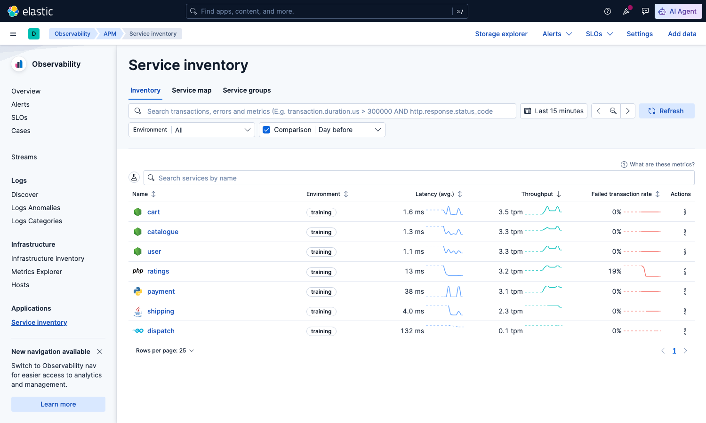
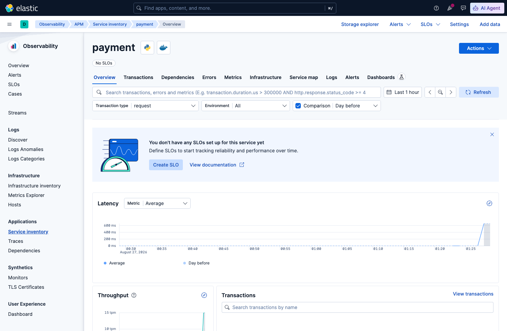
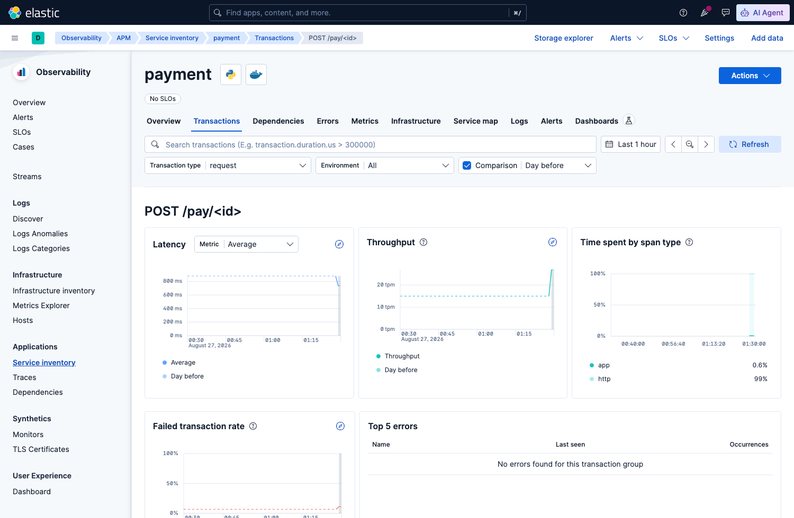
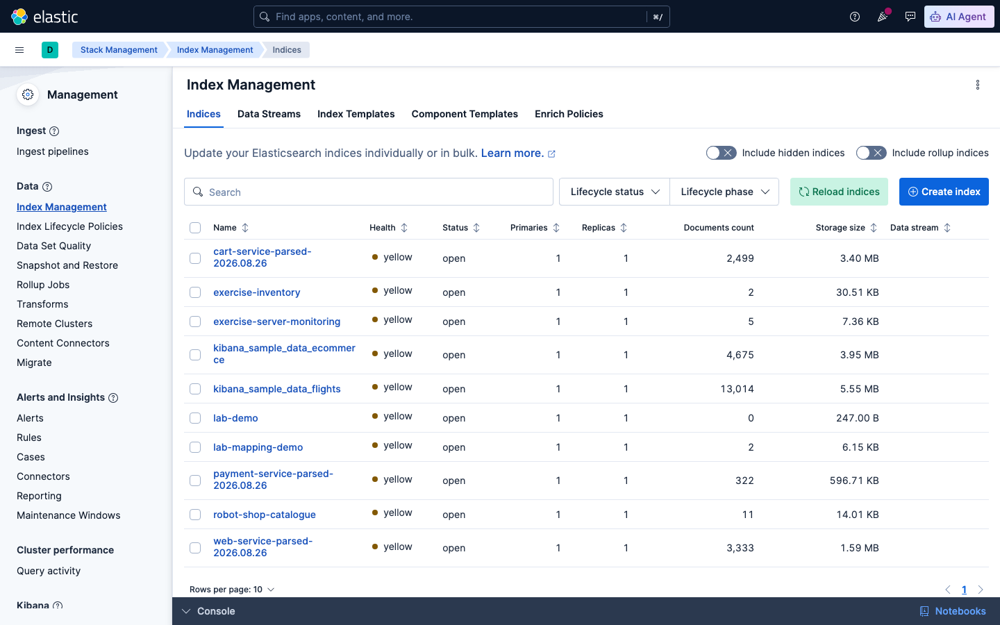

# Sesi 6 — Search Performance Optimization

## a. Tujuan Sesi

Setelah sesi ini, Anda mampu mengukur performa query Elasticsearch secara
langsung (bukan menebak), memahami cara kerja request cache, mengetahui
pengaturan index yang perlu disesuaikan saat bulk-loading data besar, serta
memahami APM (Application Performance Monitoring), yaitu cara melihat
latency setiap microservice secara individual untuk mengetahui secara
pasti service mana yang lambat, bukan sekadar menduga dari gejala di
permukaan.

## b. Output yang Diharapkan

Sesi ini dianggap selesai apabila Anda berhasil mengukur dan
membandingkan `took` (waktu eksekusi) query sebelum/sesudah cache aktif,
menjalankan `_profile` API untuk membedah waktu eksekusi query, mengubah
`refresh_interval` index lalu mengembalikannya ke semula, serta melihat di
Kibana APM **Service Inventory** bahwa service `cart` dan `payment`
tampil dengan angka latency yang jauh berbeda, sehingga Anda dapat
menyebutkan service mana yang lebih lambat dan berapa kira-kira
selisihnya.

## c. Teori & Struktur Sistem

Robot Shop pada sesi ini **BUKAN** reuse dari Sesi 4 — sesi ini memiliki
stack Robot Shop sendiri (lihat bagian d), di mana dua service (`cart`
dan `payment`) sudah disisipi **Elastic APM agent**. Traffic dari load
generator (Locust) yang mengalir ke keduanya kini benar-benar
**terpakai**: setiap request yang diproses menghasilkan data trace yang
tersimpan di Elasticsearch dan dapat Anda analisis, bukan sekadar lewat
di log lalu hilang seperti sebelumnya.

**Apa itu APM?** Application Performance Monitoring adalah cara mengukur
seberapa cepat/lambat aplikasi merespons dari DALAM kode aplikasi itu
sendiri (berbeda dari mengukur dari luar seperti curl timing). Untuk
sistem microservice (seperti Robot Shop, 12 service saling memanggil
lewat HTTP), APM sangat penting karena satu request pengguna bisa
melewati BANYAK service. Tanpa APM, apabila proses checkout terasa
lambat, Anda hanya tahu "checkout lambat" tanpa mengetahui apakah
penyebabnya `cart`, `payment`, `shipping`, atau kombinasi ketiganya.

**Cara kerja APM di stack ini:**
```
[cart / payment]  --trace-->  [apm-server:8200]  -->  [Elasticsearch]  <--  [Kibana APM UI]
  (APM agent                   (terima data,           (index                (baca &
   di dalam kode)                kirim ke ES)            traces-apm-*,         visualisasi)
                                                          metrics-apm-*)
```
1. **APM agent** — library kecil yang di-install DI DALAM kode aplikasi
   (satu per bahasa pemrograman: Python, Node.js, Java, dst.). Tugasnya
   mencatat setiap request masuk (disebut **transaction**) dan setiap
   operasi di dalamnya (disebut **span** — mis. query database, panggil
   API lain) beserta durasinya, lalu mengirim data itu ke APM Server.
2. **APM Server** — komponen terpisah (container `apm-server` pada sesi
   ini) yang menerima data dari semua agent, lalu menyimpannya ke
   Elasticsearch sebagai index `traces-apm-*` (per transaction/span) dan
   `metrics-apm-*` (metrik teragregasi per menit).
3. **Kibana APM UI** (menu ☰ → Observability → APM) — membaca index-index
   itu, menampilkannya sebagai tabel per-service, grafik latency, dan
   detail per transaksi, tanpa Anda perlu menulis query manual (walaupun
   datanya tetap bisa di-query manual seperti index lain, lihat bagian e).

**Mengapa hanya `cart` dan `payment`** (bukan seluruh 12 service)? Supaya
sesi ini tetap fokus dan cepat — dua service ini representatif: `cart`
(Node.js, operasi ringan ke Redis) berbanding `payment` (Python, operasi
lebih berat termasuk panggilan HTTP keluar). Perbandingan keduanya sudah
cukup untuk menunjukkan konsep "per-service latency" dengan jelas.

**Tiga teknik optimasi lain yang tetap dibahas pada sesi ini** (memakai
`kibana_sample_data_logs`, dataset besar dan deterministik supaya
angkanya konsisten untuk mempelajari konsepnya terlebih dahulu, sebelum
diterapkan pada data trace APM Anda sendiri yang jumlahnya tidak pasti
di bagian e):
- **Query profiling** (`_profile` API) — membedah SATU query, menunjukkan
  berapa lama tiap bagian internal (matching, scoring, dst.) memakan
  waktu, dipakai untuk mendiagnosis query yang lambat.
- **Request cache** — Elasticsearch otomatis meng-cache hasil query yang
  identik (khususnya `size:0` dengan aggregation) — request kedua dengan
  query yang PERSIS SAMA jauh lebih cepat, sampai ada dokumen baru masuk
  (cache otomatis invalidasi).
- **Index settings saat bulk load** — `refresh_interval` (jarak waktu
  hingga dokumen baru bisa dicari) dan jumlah replica dapat disesuaikan
  sementara untuk mempercepat proses index besar-besaran.

## d. Praktik: Instalasi & Konfigurasi

**[Terminal] Matikan terlebih dahulu Robot Shop Sesi 4** (sesi ini
membawa stack Robot Shop sendiri dengan 2 service ber-APM — menjalankan
dua Robot Shop sekaligus hanya membebani resource host tanpa manfaat
tambahan):
```bash
cd lab/day-2-query-relevance/sesi-4-relevance-scoring
docker compose down
```

**[Terminal] Jalankan Robot Shop + APM Server milik sesi ini:**
```bash
cd lab/day-3-analytics-optimization/sesi-6-performance-optimization
docker compose up -d
```
**Apabila perangkat Anda ARM (Apple Silicon)**, gunakan perintah berikut
SEBAGAI GANTI perintah di atas (alasannya sama seperti Sesi 4 — base
image `mysql`):
```bash
docker compose -f docker-compose.yml -f docker-compose.arm64-override.yml up -d
```
Tunggu semua service berstatus `healthy` (`docker compose ps`) —
termasuk `shipping`/`ratings` yang membutuhkan waktu lebih lama saat
inisialisasi MySQL pertama kali (lihat Sesi 4 apabila perlu mengingat
detailnya).

**[Terminal] Jalankan load generator** (traffic nyata ke Robot Shop, ~4%
di antaranya transaksi anomali — bahan latihan Sesi 7 — dan sekarang
sekaligus menjadi sumber data trace APM untuk `cart`/`payment`):
```bash
docker compose -f docker-compose.yml -f docker-compose.load.yml up -d load
```
Expected Output (dari `docker compose logs -f load` setelah
beberapa menit): traffic asli mengalir ke `/api/user/login`,
`/api/catalogue/*`, `/api/shipping/confirm/*`, dst.

> **INFORMATION:** jumlah request yang tampil pada layar Anda akan
> berbeda — traffic Robot Shop bersifat acak (lihat catatan di Sesi 4).

> **INFORMATION:** `NUM_CLIENTS` di `docker-compose.load.yml` sengaja
> diset rendah (6), bukan tinggi, karena `payment` (uwsgi, single worker
> process, lihat `[pid: 6|app: 0|...]` pada log-nya) hanya memiliki
> kapasitas concurrent request yang kecil. Pada host dengan beban Docker
> lain yang berjalan bersamaan, hal ini dapat menyebabkan `payment`
> mengembalikan **HTTP 429** (Too Many Requests) untuk sebagian besar
> request. **Namun hal ini TIDAK selalu terjadi** — pada host yang lebih
> lega (CPU/RAM cukup, tidak banyak proses lain berjalan bersamaan),
> uwsgi mungkin sanggup menangani `NUM_CLIENTS: 6` tanpa masalah sama
> sekali, dan traffic-nya akan 100% `200`. Apabila hal itu yang terjadi
> pada perangkat Anda, itu bukan kegagalan — justru itu bukti sistemnya
> memiliki kapasitas yang cukup untuk beban ini.
>
> Anda baru bisa memverifikasi status code traffic ini secara nyata pada
> **Sesi 7** — index `payment-service-parsed-*` yang berisi field
> `http_status` baru dibuat oleh pipeline Logstash yang Anda bangun pada
> sesi itu, belum tersedia pada titik ini. Catat baik-baik apakah
> traffic Anda tadi lancar (kemungkinan besar semua `200`) atau banyak
> yang gagal — Anda akan memeriksanya kembali secara nyata pada Sesi 7
> setelah pipeline-nya siap.

**[Dev Tools Console] Ukur query TANPA cache (request pertama):**
```
GET kibana_sample_data_logs/_search
{ "size": 0, "query": { "bool": { "filter": [ { "range": { "bytes": { "gt": 5000 } } } ] } } }
```
Expected Output: `"took": 3` (ms), `"hits":{"total":{"value":7696}}`.

> **INFORMATION:** `hits.total.value` akan selalu persis `7696` (data
> sample bersifat statis, tidak tergantung waktu) — tetapi angka `took`
> sendiri bisa berbeda beberapa ms pada perangkat Anda (tergantung beban
> CPU/proses lain yang berjalan bersamaan), hal ini normal.

**Jalankan query PERSIS SAMA lagi:**
```
GET kibana_sample_data_logs/_search
{ "size": 0, "query": { "bool": { "filter": [ { "range": { "bytes": { "gt": 5000 } } } ] } } }
```
Expected Output: `"took": 0` (ms) — request cache Elasticsearch
langsung mengembalikan hasil tanpa eksekusi ulang. **Query ini memang
sudah sangat cepat sejak awal**, sehingga `took` terkadang TIDAK
terlihat turun banyak (bisa saja masih 1-2ms) — bukti yang lebih
diandalkan adalah statistik cache-nya langsung, bukan sekadar `took`:
```
GET kibana_sample_data_logs/_stats/request_cache
```
Expected Output: `hit_count: 1`, `miss_count: 4` (angka `miss`
lebih dari 1 karena tiap shard memiliki cache-nya sendiri).

## e. Contoh Implementasi

### Melihat Latency per Microservice Lewat APM

**Cara install APM agent** (contoh nyata, dua bahasa berbeda):

> **INFORMATION:** Anda TIDAK perlu menjalankan kode ini sendiri —
> `cart`/`payment` pada stack sesi ini sudah disiapkan demikian; ini
> referensi apabila nanti Anda melakukan instrumentasi pada aplikasi Anda
> sendiri. Pola umumnya SAMA di semua bahasa: agent di-`start()` pada
> titik paling awal aplikasi, diberi `serverUrl` APM Server tujuan.

Python (Flask) — `payment`:
```python
from elasticapm.contrib.flask import ElasticAPM

app = Flask(__name__)
app.config['ELASTIC_APM'] = {
    'SERVICE_NAME': 'payment',
    'SERVER_URL': 'http://apm-server:8200',
    'ENVIRONMENT': 'training',
}
apm = ElasticAPM(app)
```

Node.js (Express) — `cart`:
```javascript
// WAJIB baris PALING ATAS file, sebelum require() lain
require('elastic-apm-node').start({
    serviceName: 'cart',
    serverUrl: 'http://apm-server:8200',
    environment: 'training'
});
```

Begitu agent aktif, SETIAP request yang masuk ke `cart`/`payment` otomatis
tercatat sebagai **transaction**, tanpa perlu kode tambahan apa pun di
tiap endpoint.

**Buka Kibana APM** (menu ☰ → Observability → APM → Service inventory):



*Dua service muncul otomatis — `cart` (ikon Node.js) dan `payment` (ikon
Python) — kolom **Latency (avg.)** menunjukkan `payment` jauh lebih
lambat dari `cart` (bedanya bisa puluhan hingga ratusan kali lipat,
tergantung berapa lama load generator sudah berjalan pada perangkat
Anda — coba refresh setelah beberapa menit apabila baru mulai). Ini
PERSIS pertanyaan "servis mana yang lambat" yang tidak bisa dijawab
hanya dari log biasa.*

**Klik salah satu service** (mis. `payment`) untuk melihat detail:



*Tab **Overview** menampilkan grafik latency & throughput dari waktu ke
waktu, tab **Transactions** untuk melihat breakdown per-endpoint
(`POST /pay/<id>` dst.), **Dependencies** untuk melihat apa yang
dipanggil service ini ke luar (database, service lain), dan **Errors**
untuk exception yang tertangkap.*



*Klik transaksi tertentu (mis. `POST /pay/<id>`) — panel **"Time spent by
span type"** inilah yang menjawab PERTANYAAN LANJUTAN "mengapa lambat":
apabila mayoritas waktu berada di kategori `app` (kode aplikasi
sendiri), optimasi perlu diarahkan ke kode; apabila mayoritas di
`http`/`db` (panggilan keluar), masalahnya ada pada service/dependency
lain yang dipanggil, bukan pada `payment` itu sendiri.*

**Query data trace-nya secara langsung**:

> **INFORMATION:** APM Server menyimpan data trace sebagai index
> Elasticsearch biasa — dapat di-query seperti index lain, inilah yang
> membuat traffic load generator akhirnya "terpakai" untuk latihan
> aggregation juga.

```
GET traces-apm-default/_search
{
  "size": 0,
  "aggs": {
    "by_service": {
      "terms": { "field": "service.name" },
      "aggs": {
        "avg_duration_ms": { "avg": { "field": "transaction.duration.us", "script": "_value / 1000" } }
      }
    }
  }
}
```
Expected Output: dua bucket, `cart` dengan `avg_duration_ms` di kisaran
satuan milidetik, `payment` di kisaran ratusan milidetik — konsisten
dengan yang tampil di Service Inventory di atas.

> **INFORMATION:** ini adalah pola yang diharapkan, bukan angka pasti —
> angka aktual Anda tergantung berapa lama load generator sudah berjalan.

### Tiga Teknik Optimasi Query (`kibana_sample_data_logs`)

**[Dev Tools Console] `_profile` API** — membedah query yang sama, melihat waktu eksekusi internal:
```
GET kibana_sample_data_logs/_search
{
  "profile": true,
  "size": 0,
  "query": { "bool": { "filter": [ { "range": { "bytes": { "gt": 5000 } } } ] } }
}
```
Expected Output: `profile.shards[0].searches[0].query[0]` berisi
`"type": "ConstantScoreQuery"`, `"time_in_nanos"` di kisaran ratusan ribu
(sub-milidetik — contoh: `299250` ≈ 0.3ms), dan `breakdown` — rincian per
operasi internal (`match_count`, `next_doc`, dst.).

> **INFORMATION:** angka pasti `time_in_nanos` bergantung beban host Anda
> saat itu — yang menjadi patokan adalah satuannya (skala sub-milidetik),
> bukan angka mutlaknya. Query yang kompleks/lambat akan menunjukkan
> operasi mana yang paling banyak memakan waktu lewat breakdown ini.

**Ubah `refresh_interval` sebelum bulk load besar**:
```
PUT kibana_sample_data_logs/_settings
{ "index": { "refresh_interval": "30s" } }
```

> **INFORMATION:** index baru membutuhkan waktu ~1 detik secara default
> sebelum dokumen bisa dicari — apabila Anda hendak melakukan bulk index
> jutaan dokumen, menaikkan `refresh_interval` mengurangi overhead ini.

Expected Output: `{"acknowledged":true}`. **Setelah bulk load
selesai, WAJIB dikembalikan** ke nilai default (atau nilai produksi normal),
supaya data baru kembali cepat muncul di pencarian:
```
PUT kibana_sample_data_logs/_settings
{ "index": { "refresh_interval": "1s" } }
```

**Lihat semua index dari satu tempat** — Kibana **Stack Management → Index
Management** menampilkan seluruh index di cluster sekaligus (health, status,
jumlah dokumen, ukuran storage) — cara cepat untuk memeriksa index mana yang
paling besar/perlu dioptimasi:



*Stack Management → Index Management → Indices — semua index yang sudah
Anda buat sepanjang lab ini (sample data, hasil pipeline, index exercise)
terlihat sekaligus di sini.*

## f. Referensi Exercise

Lanjutkan latihan mandiri di [`exercise/sesi-6/README.md`](../../../exercise/sesi-6/README.md)
— termasuk latihan mendeteksi transaksi anomali dari traffic Robot Shop
yang baru saja Anda jalankan.
