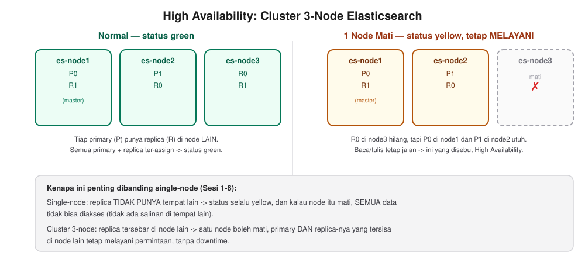

# Sesi 7 — Elasticsearch Administration & Scaling

## a. Tujuan Sesi

Setelah sesi ini, Anda mampu mengelola cluster Elasticsearch multi-node
(bukan hanya single-node seperti sesi-sesi sebelumnya), memahami snapshot
dan restore untuk backup, mengatur Index Lifecycle Management (ILM), dan
melihat langsung bagaimana cluster tetap tersedia (high availability)
walau satu node mati.

## b. Output yang Diharapkan

Sesi ini selesai apabila cluster 3-node Anda berstatus `green`, Anda
berhasil melakukan snapshot dan restore penuh (data identik
sebelum/sesudah), dan berhasil mensimulasikan 1 node mati lalu melihat
cluster tetap tersedia (data tidak hilang, status `yellow` bukan `red`).

## c. Teori & Struktur Sistem

Pada sesi-sesi sebelumnya Anda menggunakan Elasticsearch **single-node**.
Pada sesi ini kita beralih ke **cluster 3-node** untuk melihat konsep
yang tidak dapat didemonstrasikan pada single-node:

- **Scaling** — menambah node ke cluster untuk menampung lebih banyak
  data/traffic. Tiap node menjalankan instance Elasticsearch sendiri,
  saling terhubung lewat `discovery.seed_hosts`.
- **`cluster.initial_master_nodes`** — daftar node yang menjadi kandidat
  master saat cluster PERTAMA KALI dibentuk (hanya dipakai sekali di
  awal, bukan konfigurasi permanen).
- **Kenapa sekarang bisa `green`, bukan `yellow` terus?** — pada Sesi 1
  dijelaskan bahwa replica shard membutuhkan node LAIN untuk ditempati.
  Dengan 3 node, replica akhirnya memiliki tempat, sehingga status dapat
  menjadi `green` (seluruh primary DAN replica ter-assign) — kontras
  langsung dengan single-node yang selalu bertahan pada status `yellow`.
- **High Availability (HA)** — apabila 1 node mati, cluster (dengan
  replica yang tersebar di node lain) tetap dapat melayani baca/tulis
  data, meski statusnya turun ke `yellow` sampai node tersebut kembali
  atau Elasticsearch merealokasi shard ke node yang tersisa.



*Perbandingan langsung: pada kondisi normal (kiri) primary (P) dan
replica (R) tersebar di 3 node berbeda. Apabila `es-node3` mati (kanan),
primary `P0`/`P1` yang tersisa di `es-node1`/`es-node2` tetap utuh —
cluster turun status menjadi `yellow` (bukan `red`) dan TETAP melayani
baca/tulis. Hal ini akan Anda buktikan sendiri pada bagian "Simulasi
Failure" nanti.*

**Data Retention — hubungannya dengan storage.** "Retention" adalah
kebijakan berapa lama data disimpan sebelum dihapus otomatis. Ini bukan
sekadar soal disiplin administratif — terdapat hubungan matematis
langsung ke kapasitas disk:

```
kebutuhan storage ≈ (rata-rata data masuk per hari) × (jumlah hari retensi) × (1 + jumlah replica)
```

Index yang tidak pernah dihapus akan tumbuh TANPA BATAS hingga disk
penuh (lihat catatan `disk_threshold` pada bagian d) — semakin lama
retensi, semakin besar storage yang dibutuhkan, dan faktor replica
(tiap replica adalah salinan penuh data) melipatgandakannya lagi. Inilah
sebabnya `delete` phase pada ILM (dibahas pada bagian e) bukan fitur
opsional untuk data log/metrik/trace bervolume tinggi — tanpa retensi,
cluster produksi umumnya akan kehabisan disk dalam hitungan
minggu/bulan, bukan tahun. Kebijakan retensi yang umum digunakan: log
aplikasi 7-30 hari, metrik 30-90 hari, data compliance/audit dapat
tahunan (biasanya dipindah ke tier storage yang lebih murah, bukan
disimpan penuh pada hot tier — di luar cakupan lab ini).

**Kibana TIDAK dijalankan pada sesi ini.** Untuk menjalankan cluster
3-node yang cukup membebani RAM, Kibana (dan Logstash) dari Sesi 1
sengaja dimatikan sementara — menjalankan keduanya bersamaan berisiko
kehabisan resource pada laptop dengan RAM terbatas. **Konsekuensinya:
seluruh interaksi pada sesi ini dilakukan lewat terminal (`curl`), BUKAN
Dev Tools Console** (Dev Tools Console adalah bagian dari Kibana — tanpa
Kibana berjalan, halaman tersebut tidak dapat diakses). Kibana akan
aktif kembali pada Sesi 8.

## d. Praktik: Instalasi & Konfigurasi

**[Terminal] Matikan dahulu stack single-node Sesi 1** — cluster 3-node
pada sesi ini menggunakan port yang SAMA (`9200`) dengan Elasticsearch
single-node, sehingga keduanya tidak dapat berjalan bersamaan:
```bash
cd lab/day-1-fundamentals/sesi-1-intro-elk
docker compose down
```

**[Terminal] Sebelum memulai — periksa kapasitas host** (dilakukan
PROAKTIF, sebelum `docker compose up`, agar tidak menemukan masalah
storage/memori di tengah sesi seperti catatan `disk_threshold` di
bawah):
```bash
docker system df                                     # periksa disk terpakai Docker
docker info --format '{{.MemTotal}}'                  # periksa RAM total yang dialokasikan ke Docker Desktop
```
Apabila `docker system df` menunjukkan banyak image/build cache
menumpuk dari sesi-sesi sebelumnya, bersihkan TERLEBIH DAHULU:
`docker builder prune -f` (aman, hanya build cache). Apabila RAM Docker
Desktop di bawah 12GB, naikkan dahulu lewat Docker Desktop → Settings →
Resources → Memory (lihat `docs/prerequisites.md` bagian 3), SEBELUM
`docker compose up` — jauh lebih mudah dibanding mendiagnosis cluster
yang gagal `green` di tengah sesi.

```bash
cd lab/day-4-administration-ingestion/sesi-7-administration-scaling
docker compose up -d
```

**[Terminal] Periksa cluster health:**
```bash
curl "http://localhost:9200/_cluster/health?pretty"
```
Expected Output:
```json
{
  "cluster_name" : "elk-lab-cluster",
  "status" : "green",
  "number_of_nodes" : 3,
  "number_of_data_nodes" : 3,
  "unassigned_shards" : 0,
  "active_shards_percent_as_number" : 100.0
}
```
**`green`** — berbeda dari single-node yang selalu `yellow` (lihat
penjelasan di atas).

> **Apabila cluster tetap `yellow` lebih dari ±1 menit** (tidak langsung
> `green`), periksa dahulu penyebabnya sebelum menduga ada yang rusak:
> ```bash
> curl "http://localhost:9200/_cluster/allocation/explain?pretty"
> ```
> Apabila alasannya `disk_threshold`, itu bukan masalah pada cluster,
> melainkan disk Docker Desktop yang penuh (default watermark ES: 85%
> terpakai sudah menahan alokasi shard). Kondisi ini kemungkinan besar
> terjadi apabila Anda sudah mengerjakan banyak sesi sebelumnya pada
> host yang sama (image/volume menumpuk). Solusi: `docker system df`
> untuk memeriksa pemakaian, lalu `docker builder prune -f` (aman,
> hanya build cache) atau `docker system prune` (lebih agresif,
> menghapus image yang tidak dipakai) — cluster akan otomatis
> memeriksa ulang disk dan berpindah ke `green` dalam ±30 detik setelah
> ruang mencukupi.

**[Terminal] Lihat daftar node:**
```bash
curl "http://localhost:9200/_cat/nodes?v"
```
Expected Output: 3 baris (`es-node1`, `es-node2`, `es-node3`), salah
satunya ditandai `*` pada kolom `master` (node yang sedang menjadi
elected master).

## e. Contoh Implementasi

Seluruh contoh pada bagian ini dijalankan lewat **[Terminal]** (`curl`)
— lihat catatan pada bagian c mengenai Kibana yang tidak aktif pada
sesi ini.

### Snapshot & Restore

**Setup repository** (`path.repo` sudah diatur saat startup container
pada `docker-compose.yml`, volume snapshot juga sudah disiapkan otomatis
saat `docker compose up` — tidak ada langkah manual tambahan):
```bash
curl -X PUT "http://localhost:9200/_snapshot/lab-fs-repo" \
  -H 'Content-Type: application/json' \
  -d '{ "type": "fs", "settings": { "location": "/usr/share/elasticsearch/snapshots/lab-fs-repo" } }'
```
Expected Output: `{"acknowledged":true}`. Verifikasi:
```bash
curl -X POST "http://localhost:9200/_snapshot/lab-fs-repo/_verify"
```
Expected Output: `{"nodes":{...3 entri, satu per node...}}`.

**Index data contoh, lalu snapshot:**
```bash
curl -X POST "http://localhost:9200/lab-cluster-demo/_doc?refresh=true" \
  -H 'Content-Type: application/json' \
  -d '{ "msg": "test before failure" }'

curl -X PUT "http://localhost:9200/_snapshot/lab-fs-repo/snapshot-1?wait_for_completion=true" \
  -H 'Content-Type: application/json' \
  -d '{ "indices": "lab-cluster-demo", "ignore_unavailable": true }'
```
Expected Output: `"state":"SUCCESS"`.

**Uji restore penuh (hapus lalu kembalikan):**
```bash
curl "http://localhost:9200/lab-cluster-demo/_count"                 # -> count: 1

curl -X DELETE "http://localhost:9200/lab-cluster-demo"

curl -X POST "http://localhost:9200/_snapshot/lab-fs-repo/snapshot-1/_restore?wait_for_completion=true" \
  -H 'Content-Type: application/json' \
  -d '{ "indices": "lab-cluster-demo", "include_global_state": false }'

curl "http://localhost:9200/lab-cluster-demo/_count"                 # -> count: 1 lagi
```
Expected Output: jumlah dokumen SEBELUM dan SESUDAH restore identik
(**1** pada kedua sisi) — restore benar-benar mengembalikan data persis
sama, pada cluster 3-node sekalipun.

### Simulasi Failure (High Availability)

**[Terminal]**
```bash
docker stop elk-lab-es-node3
curl "http://localhost:9200/_cluster/health?pretty"
```
Expected Output: status turun ke **`yellow`** (BUKAN `red`),
`number_of_nodes: 2`, `unassigned_primary_shards: 0` — **data tetap
utuh dan tetap dapat dibaca**:
```bash
curl "http://localhost:9200/lab-cluster-demo/_search"
```
Expected Output: dokumen tetap muncul normal, walau 1 dari 3 node mati.

**Kembalikan node:**
```bash
docker start elk-lab-es-node3
```
Tunggu beberapa detik, cluster otomatis kembali `green` setelah node
bergabung kembali dan shard terealokasi.

### ILM (Index Lifecycle Management)

Sama seperti prinsip yang berlaku pada single-node — ILM tidak
bergantung pada jumlah node. Buat policy contoh:
```bash
curl -X PUT "http://localhost:9200/_ilm/policy/lab-cluster-policy" \
  -H 'Content-Type: application/json' \
  -d '{
  "policy": {
    "phases": {
      "hot": { "actions": { "rollover": { "max_age": "1d", "max_primary_shard_size": "5gb" } } },
      "delete": { "min_age": "7d", "actions": { "delete": {} } }
    }
  }
}'
```
Expected Output: `{"acknowledged":true}`. Verifikasi policy tersimpan:
```bash
curl "http://localhost:9200/_ilm/policy/lab-cluster-policy?pretty"
```

Terapkan lewat index template ke pattern index yang ingin Anda kelola
otomatis (lihat Sesi 8 untuk contoh index hasil pipeline Logstash yang
cocok dipasangi ILM ini). Halaman Kibana **Stack Management → Index
Lifecycle Policies** menampilkan policy ini dalam bentuk visual — dapat
diakses kembali pada Sesi 8 setelah Kibana aktif kembali.

## f. Referensi Exercise

Lanjutkan latihan mandiri pada [`exercise/sesi-7/README.md`](../../../exercise/sesi-7/README.md).
