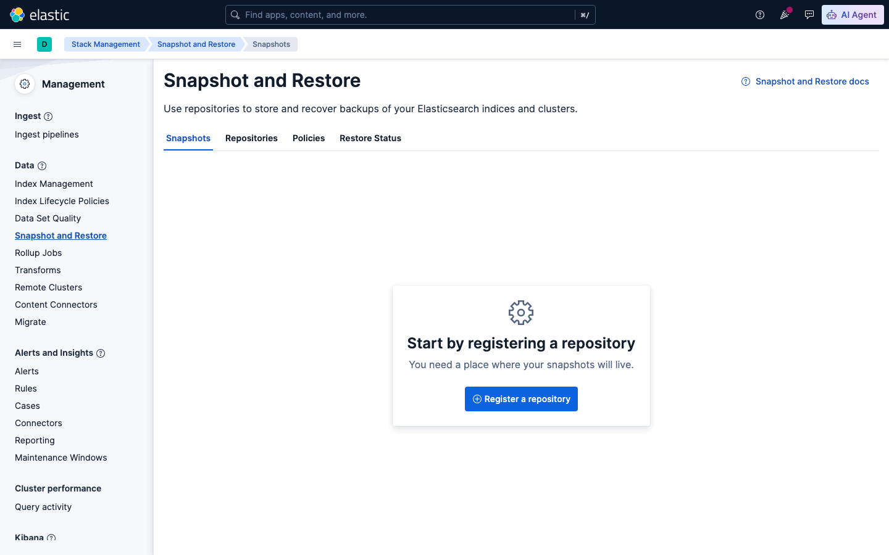
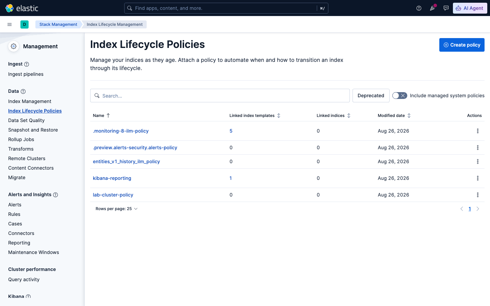

# Sesi 7 — Elasticsearch Administration & Scaling

## a. Tujuan Sesi

Setelah sesi ini, kamu mampu mengelola cluster Elasticsearch multi-node
(bukan cuma single-node seperti sesi-sesi sebelumnya), memahami snapshot &
restore untuk backup, mengatur Index Lifecycle Management (ILM), dan
melihat langsung bagaimana cluster tetap tersedia (high availability)
walau satu node mati.

## b. Output yang Diharapkan

Sesi ini selesai kalau cluster 3-node kamu berstatus `green`, kamu berhasil
melakukan snapshot+restore penuh (data identik sebelum/sesudah), dan
berhasil mensimulasikan 1 node mati lalu melihat cluster tetap available
(data tidak hilang, status `yellow` bukan `red`).

## c. Teori & Struktur Sistem

Sesi 1-6 kamu pakai Elasticsearch **single-node** — sekarang kita pindah
ke **cluster 3-node** untuk melihat konsep yang tidak bisa didemonstrasikan
di single-node:

- **Scaling** — menambah node ke cluster untuk menampung lebih banyak
  data/traffic. Tiap node menjalankan instance Elasticsearch sendiri,
  saling terhubung lewat `discovery.seed_hosts`.
- **`cluster.initial_master_nodes`** — daftar node yang jadi kandidat
  master saat cluster PERTAMA KALI dibentuk (cuma dipakai sekali di awal,
  bukan konfigurasi permanen).
- **Kenapa sekarang bisa `green`, bukan `yellow` terus** — ingat dari Sesi
  1: replica shard butuh node LAIN untuk ditempati. Dengan 3 node, replica
  akhirnya punya tempat, jadi status bisa `green` (semua primary DAN
  replica ter-assign) — kontras langsung dengan single-node yang
  mentok `yellow` selamanya.
- **High Availability (HA)** — kalau 1 node mati, cluster (dengan replica
  yang tersebar di node lain) tetap bisa melayani baca/tulis data,
  meski statusnya turun ke `yellow` sampai node itu kembali atau
  Elasticsearch realokasi shard ke node yang tersisa.

## d. Praktik: Instalasi & Konfigurasi

> **RAM:** cluster 3-node ini makan RAM jauh lebih banyak dari single-node
> Sesi 1-6 — dites nyata, tiap node pakai **~1.4GB RAM** (total **~4.2GB**
> cuma untuk Elasticsearch, di luar overhead Docker Desktop sendiri).
> Pastikan Docker Desktop dialokasikan **minimal 12GB** (lebih dari 8GB
> yang cukup untuk single-node) sebelum lanjut.

```bash
cd lab/day-4-administration-ingestion/sesi-7-administration-scaling
docker compose up -d
```

**Cek cluster health:**
```bash
curl "http://localhost:9200/_cluster/health?pretty"
```
Expected Output (aktual):
```json
{
  "cluster_name" : "elk-lab-cluster",
  "status" : "green",
  "number_of_nodes" : 3,
  "number_of_data_nodes" : 3,
  "unassigned_shards" : 0,
  "active_shards_percent_as_number" : 100.0
}
```
**`green`** — beda dari single-node yang selalu `yellow` (lihat penjelasan di atas).

> **Kalau cluster tetap `yellow` lebih dari ~1 menit** (bukan langsung
> `green`), cek dulu penyebabnya sebelum curiga ada yang rusak:
> ```bash
> curl "http://localhost:9200/_cluster/allocation/explain?pretty"
> ```
> Kalau alasannya `disk_threshold` — itu bukan masalah cluster, itu disk
> Docker Desktop-mu yang penuh (default watermark ES: 85% terpakai baru
> menahan alokasi shard). Ini kemungkinan besar terjadi kalau kamu sudah
> mengerjakan banyak sesi sebelumnya di host yang sama (image/volume
> menumpuk). Solusi: `docker system df` untuk cek pemakaian, lalu
> `docker builder prune -f` (aman, cuma build cache) atau
> `docker system prune` (lebih agresif, hapus image tak terpakai) — cluster
> akan otomatis re-cek disk dan pindah ke `green` dalam ~30 detik setelah
> ruang cukup.

**Lihat daftar node:**
```bash
curl "http://localhost:9200/_cat/nodes?v"
```
Expected Output (aktual): 3 baris (`es-node1`, `es-node2`, `es-node3`),
salah satunya ditandai `*` di kolom `master` (node yang sedang jadi elected master).

## e. Contoh Implementasi

### Snapshot & Restore

> **WAJIB dilakukan dulu — perbaiki permission volume snapshot.** Volume
> Docker baru (`es-snapshots`) dibuat dengan owner `root:root` dan mode
> `755` (grup cuma read+execute, TIDAK write), sementara proses
> Elasticsearch jalan sebagai `uid 1000` (grup `root`/gid 0). Tanpa langkah
> ini, `PUT _snapshot` di bawah akan **selalu gagal** dengan
> `HTTP 500 access_denied_exception: "path is not accessible on master node"`
> — dikonfirmasi terjadi di SETIAP run baru, di host manapun (bukan
> masalah sesekali). Jalankan sekali sebelum lanjut:
> ```bash
> docker run --rm -v sesi-7-administration-scaling_es-snapshots:/snap alpine chmod -R 775 /snap
> ```
> (Ganti prefix nama volume kalau folder project-mu berbeda — cek nama
> volume asli dengan `docker volume ls | grep es-snapshots`.)

**Setup repository** (`path.repo` di-set saat startup container, sudah
ada di `docker-compose.yml`):
```
PUT _snapshot/lab-fs-repo
{ "type": "fs", "settings": { "location": "/usr/share/elasticsearch/snapshots/lab-fs-repo" } }
```
Expected Output (aktual): `{"acknowledged":true}`. Verifikasi:
```
POST _snapshot/lab-fs-repo/_verify
```
Expected Output (aktual): `{"nodes":{...3 entry, satu per node...}}`.

**Index data contoh, lalu snapshot:**
```
POST lab-cluster-demo/_doc?refresh=true
{ "msg": "test before failure" }

PUT _snapshot/lab-fs-repo/snapshot-1?wait_for_completion=true
{ "indices": "lab-cluster-demo", "ignore_unavailable": true }
```
Expected Output (aktual): `"state":"SUCCESS"`.

**Uji restore penuh (hapus lalu kembalikan):**
```
GET lab-cluster-demo/_count                          # -> count: 1
DELETE lab-cluster-demo
POST _snapshot/lab-fs-repo/snapshot-1/_restore?wait_for_completion=true
{ "indices": "lab-cluster-demo", "include_global_state": false }
GET lab-cluster-demo/_count                          # -> count: 1 lagi
```
Expected Output (aktual): count SEBELUM dan SESUDAH restore identik (**1**
di kedua sisi) — dikonfirmasi nyata, restore benar-benar mengembalikan
data persis sama, di cluster 3-node sekalipun.

Semua langkah di atas juga bisa dilakukan lewat UI: **Stack Management →
Snapshot and Restore**:



*Stack Management → Snapshot and Restore — kalau belum ada repository
terdaftar, tampilannya seperti ini ("Start by registering a repository").
Setelah kamu register lewat API di atas, tab "Repositories" dan
"Snapshots" akan menampilkan `lab-fs-repo` dan `snapshot-1`.*

### Simulasi Failure (High Availability)

```bash
docker stop elk-lab-es-node3
curl "http://localhost:9200/_cluster/health?pretty"
```
Expected Output (aktual): status turun ke **`yellow`** (BUKAN `red`),
`number_of_nodes: 2`, `unassigned_primary_shards: 0` — **data tetap utuh
dan tetap bisa dibaca**:
```bash
curl "http://localhost:9200/lab-cluster-demo/_search"
```
Expected Output (aktual): dokumen tetap muncul normal, walau 1 dari 3 node mati.

**Kembalikan node:**
```bash
docker start elk-lab-es-node3
```
Tunggu beberapa detik, cluster otomatis kembali `green` begitu node
bergabung lagi dan shard ter-realokasi.

### ILM (Index Lifecycle Management)

Sama seperti prinsip yang berlaku di single-node — ILM tidak bergantung
pada jumlah node. Buat policy contoh:
```
PUT _ilm/policy/lab-cluster-policy
{
  "policy": {
    "phases": {
      "hot": { "actions": { "rollover": { "max_age": "1d", "max_primary_shard_size": "5gb" } } },
      "delete": { "min_age": "7d", "actions": { "delete": {} } }
    }
  }
}
```
Terapkan lewat index template ke pattern index yang kamu mau kelola
otomatis (lihat Sesi 8 untuk contoh index hasil pipeline Logstash yang
cocok dipasangi ILM ini).

Cek lewat UI: **Stack Management → Index Lifecycle Policies**:



*Stack Management → Index Lifecycle Policies — `lab-cluster-policy` yang
barusan kamu buat lewat API muncul di sini bersama policy sistem bawaan
Elasticsearch/Kibana lainnya.*

## f. Referensi Exercise

Lanjutkan latihan mandiri di [`exercise/sesi-7/README.md`](../../../exercise/sesi-7/README.md).
