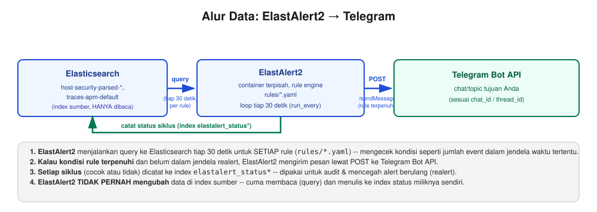
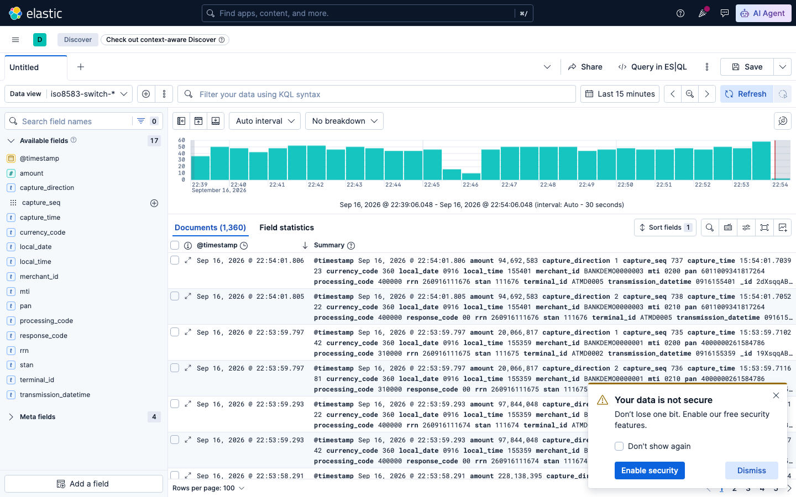
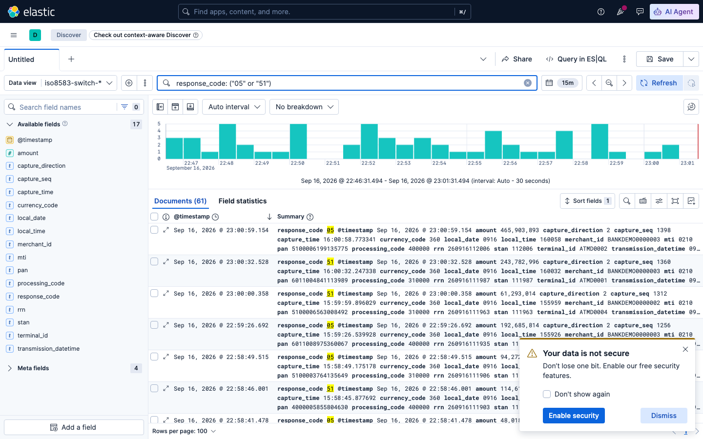
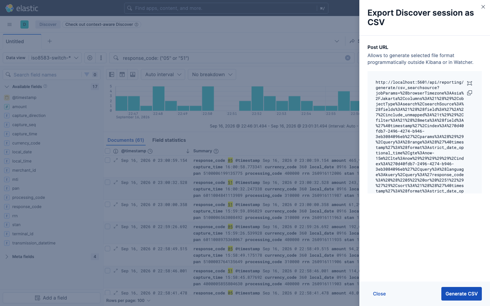
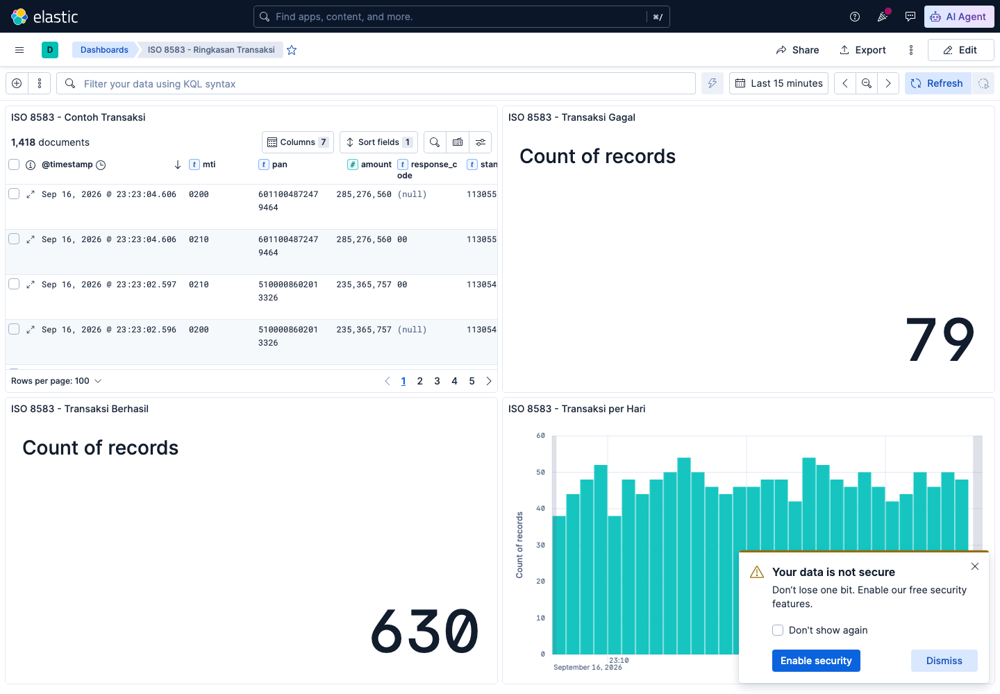

# Sesi 7 — Data Ingestion with Logstash & Beats

## a. Tujuan Sesi

Setelah sesi ini, Anda mampu membangun pipeline ingestion data dari sumber
nyata (log container Robot Shop) ke Elasticsearch menggunakan Filebeat dan
Logstash, termasuk melakukan parsing terhadap tiga format log yang berbeda
(grok manual, JSON, dan format standar industri), serta memahami cara
**menginstal Filebeat & Logstash langsung di Linux (VM/bare-metal)**,
sehingga keterampilan ini dapat diterapkan pada server nyata di luar
lingkungan lab ini. Anda juga akan membangun **notifikasi otomatis ke
Telegram** dari data yang sudah masuk ke Elasticsearch — baik anomali
level aplikasi (lonjakan load pada APM `payment-lab`, lihat Sesi 6) maupun
anomali level host (pembuatan user baru, akses ke file/data sensitif) —
menggunakan rule engine open source, bukan menulis kode pengiriman pesan
dari nol.

## b. Output yang Diharapkan

Sesi ini dinyatakan selesai apabila index `payment-service-parsed-*`,
`cart-service-parsed-*`, dan `web-service-parsed-*` telah terisi dokumen
nyata dari log Robot Shop (dengan field yang benar ter-extract, bukan
`null`), Anda berhasil menginstal serta menjalankan Filebeat & Logstash
secara manual (bukan melalui image Docker Elastic) pada sebuah container
Linux polos, serta memverifikasi sendiri bahwa data mengalir dari
Filebeat → Logstash → parsed output — termasuk memperluas Filebeat untuk
membaca lebih dari satu sumber sekaligus (log akses web, log autentikasi
SSH, dan command history), menghasilkan dokumen `ssh_login_success`/
`ssh_login_failed`/`bash_history` yang terpisah sesuai sumbernya, serta
mampu membaca dan mengubah pengaturan throughput pipeline Logstash
(`pipeline.workers`/`pipeline.batch.size`) lewat API monitoring. Sesi ini
JUGA dinyatakan selesai apabila index `host-security-parsed-*` terisi
dokumen NYATA secara terus-menerus (bukan demo sekali jalan), Anda
berhasil membuat bot Telegram sendiri lewat BotFather, dan ElastAlert2
berhasil mendeteksi ketiga kondisi berikut lalu mencoba mengirim
notifikasi (terkonfirmasi lewat log ElastAlert2, terlepas dari apakah
token bot Anda sudah valid atau belum): pembuatan user baru, akses ke
data/file sensitif, dan lonjakan load pada `payment-lab`.

## c. Teori & Struktur Sistem

**Mengapa Filebeat DAN Logstash, bukan salah satu saja?** Logstash secara
desain **menolak dijalankan sebagai root** (`Logstash cannot be run as
superuser`), sementara direktori log container di host
(`/var/lib/docker/containers`) hanya bisa dibaca oleh root. Filebeat, di
sisi lain, memang didesain agar bisa berjalan sebagai root dengan aman.
Solusinya: **Filebeat (root) membaca file log** → mengirim lewat network
(port beats 5044) → **Logstash (non-root) yang melakukan parsing** →
Elasticsearch. Logstash sendiri tidak pernah menyentuh filesystem host.


**Grok** adalah filter Logstash untuk mengekstrak field terstruktur dari
teks bebas menggunakan named-pattern (`%{PATTERN:nama_field}`, opsional
`:tipe` untuk cast, misalnya `%{NUMBER:amount:float}`). Dokumen yang gagal
di-match grok ditandai lewat `tag_on_failure` (lihat masing-masing file
`.conf`) — periksa field `tags` di ES apabila field yang diharapkan
kosong.

**Tiga teknik parsing berbeda dipakai pada sesi ini** (lihat 3 file
`.conf` di `logstash/pipeline/`):
- `payment-service.conf` — log plain-text tidak terstruktur → **grok manual**.
- `cart-service.conf` — log sudah berbentuk JSON dari aplikasinya sendiri → **JSON filter**.
- `web-service.conf` — log format standar Apache/Nginx Combined Log Format
  → **grok pattern bawaan** (`%{COMBINEDAPACHELOG}`), tidak perlu menulis regex sendiri.

**Apa itu alerting, dan kenapa tidak menulis kode pengiriman pesan
sendiri?** Data yang sudah masuk ke Elasticsearch baru berguna sebagai
notifikasi apabila ADA YANG MEMANTAU-nya terus-menerus dan mengabari
Anda saat kondisi tertentu terjadi — mengecek Kibana manual setiap
beberapa menit tidak realistis. **ElastAlert2** (open source, Apache 2.0,
`github.com/jertel/elastalert2`) adalah rule engine yang menjalankan
query Elasticsearch secara berkala (mis. tiap 30 detik), membandingkan
hasilnya terhadap kondisi yang Anda tentukan di file YAML ("rule"), dan
memanggil salah satu dari puluhan **alerter** bawaannya (email, Slack,
webhook, **Telegram**, dst.) begitu kondisi itu terpenuhi. Anda tidak
menulis satu baris kode HTTP request pun — cukup mendeskripsikan
query + threshold + tujuan notifikasi dalam YAML, lihat bagian d topik 7.

## d. Praktik: Instalasi & Konfigurasi

### 1. Verifikasi Pipeline Ingestion (Filebeat → Logstash → Elasticsearch)

**Prasyarat:** stack single-node Sesi 1 dan Robot Shop Sesi 4 (termasuk
servis `logstash-rs` dan `filebeat-rs`, sudah berjalan sejak Sesi 4)
masih berjalan. Apabila salah satunya sudah Anda matikan, nyalakan
kembali sesuai instruksi Sesi 4 bagian (d) topik 1.

**[Terminal] Verifikasi `logstash-rs`/`filebeat-rs` masih berjalan:**
```bash
cd lab/day-2-query-relevance/sesi-4-relevance-scoring
docker compose ps logstash-rs filebeat-rs
```
Expected Output: keduanya berstatus `Up`.

**Generate traffic** (apabila load generator belum berjalan):
```bash
docker start sesi-4-relevance-scoring-load-1
```

**Contoh Implementasi — cek data masuk** (tunggu beberapa menit supaya ada cukup log):
```bash
curl "http://localhost:9200/payment-service-parsed-*/_count"
curl "http://localhost:9200/cart-service-parsed-*/_count"
curl "http://localhost:9200/web-service-parsed-*/_count"
```
> **INFORMATION:** angka pada Expected Output di bawah adalah satu
> pengukuran nyata — angka pada tampilan Anda akan berbeda, tergantung
> berapa lama traffic sudah mengalir.

Expected Output:
```
payment-service-parsed-*: 322
cart-service-parsed-*: 2206
web-service-parsed-*: 3138
```

### 2. Uji Grok Pattern Interaktif — Kibana Grok Debugger

Sebelum menulis grok pattern langsung ke file `.conf` Logstash (seperti
`payment-service.conf` yang sudah Anda pakai), Kibana menyediakan tool
GUI untuk MENCOBA pattern secara interaktif — memasukkan satu baris log
contoh dan pattern grok, lalu langsung melihat hasil parsing-nya, tanpa
perlu restart Logstash berkali-kali untuk tiap percobaan.

**[Kibana] Buka Grok Debugger** — menu ☰ → Dev Tools → tab **Grok
Debugger** (di samping tab Console yang sudah Anda pakai sejak Sesi 2).

**Contoh Implementasi — uji pattern `payment-service.conf` secara
interaktif.** Isi **Sample Data** dengan satu baris log akses `payment`
yang nyata, dan **Grok Pattern** dengan pattern yang PERSIS SAMA seperti
pada `logstash/pipeline/payment-service.conf`:

Sample Data:
```
POST /pay/anonymous-4 => generated 51 bytes in 688 msecs (HTTP/1.1 200)
```
Grok Pattern:
```
POST /pay/%{DATA:payment_user} => generated %{NUMBER:response_bytes} bytes in %{NUMBER:response_time_ms:float} msecs \(HTTP/1\.1 %{NUMBER:http_status:int}\)
```
Klik **Simulate**.


*Panel **Structured Data** menampilkan hasil parsing langsung sebagai
JSON — `payment_user: "anonymous-4"`, `http_status: 200` (bertipe angka,
sesuai suffix `:int`), `response_time_ms: 688`, `response_bytes: "51"`
(TANPA suffix tipe, tetap string). Ini PERSIS field yang Anda temukan
pada index `payment-service-parsed-*` di topik 1 — Grok Debugger memakai
mesin grok yang SAMA dengan yang dipakai Logstash, hanya tanpa perlu
menjalankan pipeline sungguhan.*

> **INFORMATION:** kalau pattern SALAH (mis. lupa tanda `\(` untuk
> literal kurung buka), **Structured Data** akan menampilkan `{}` kosong
> atau error parsing — cara tercepat mengetahui pattern Anda salah
> SEBELUM menulisnya ke file `.conf` dan menunggu Logstash restart.
> Cocok dipakai untuk menyusun pattern `task-tracker.conf` pada
> exercise sesi ini (lihat `exercise/sesi-7/README.md` Bagian 2) — uji
> dulu pattern Anda di sini, baru salin ke file `.conf` setelah hasilnya
> benar.

### 3. Instalasi Manual Filebeat & Logstash (VM / Bare-Metal)

**Contoh Implementasi — instalasi native di VM:**

> **INFORMATION:** seluruh Filebeat/Logstash yang Anda gunakan sepanjang
> lab ini berjalan lewat **image Docker resmi Elastic** — praktis untuk
> lab, tetapi di dunia nyata Anda akan sering menjumpai server (VM cloud,
> bare-metal on-prem) yang TIDAK menggunakan Docker sama sekali. Bagian
> ini melatih keterampilan tersebut: menginstal Filebeat & Logstash
> **langsung di OS Linux** menggunakan package manager, bukan hanya
> `docker pull`.

**Siapkan "VM" percobaan** (langsung disambungkan ke `elk-lab-net` sejak
awal — dipakai belakangan supaya pipeline ini bisa mengirim data ke
Elasticsearch yang sama seperti Sesi 1, bukan cuma `stdout`):
```bash
docker run -d --name native-vm --network elk-lab-net ubuntu:22.04 sleep infinity
```
> **INFORMATION:** container Ubuntu polos ini mensimulasikan VM/bare-metal
> Linux — pada server sungguhan, langkah-langkah di bawah berlaku PERSIS
> SAMA. Kalau `native-vm` sudah pernah dibuat TANPA `--network elk-lab-net`
> (mis. dari percobaan lab versi sebelumnya), sambungkan belakangan pakai
> `docker network connect elk-lab-net native-vm` — hasilnya sama.

**Buka terminal BARU/TERPISAH** (jangan lanjutkan di terminal yang sama
dengan langkah-langkah sebelumnya) — Logstash pada langkah 6 nanti perlu
dijalankan di FOREGROUND agar log-nya terlihat langsung, sehingga masuk
ke `native-vm` sebaiknya dilakukan dari terminal lain supaya terminal
pertama tetap bebas dipakai (mis. untuk menjalankan `curl`/perintah lain
sambil Filebeat/Logstash di terminal kedua tetap berjalan). Pada terminal
baru ini:
```bash
docker exec -it native-vm bash
```

Sisa langkah pada bagian ini dijalankan **DI DALAM** `native-vm` (prompt shell-nya), pada terminal terpisah tersebut.

**1. Tambahkan repository resmi Elastic** (APT, untuk Debian/Ubuntu):
```bash
apt-get update -qq && apt-get install -y curl gnupg apt-transport-https

curl -fsSL https://artifacts.elastic.co/GPG-KEY-elasticsearch | gpg --dearmor -o /usr/share/keyrings/elastic.gpg
echo "deb [signed-by=/usr/share/keyrings/elastic.gpg] https://artifacts.elastic.co/packages/9.x/apt stable main" > /etc/apt/sources.list.d/elastic-9.x.list
apt-get update -qq
```
> **INFORMATION:** versi RHEL/CentOS menggunakan `yum`/`dnf` dengan repo
> `.repo` setara — pola langkahnya sama.

**2. Install Filebeat & Logstash** (pin versi sama dengan stack lab ini,
9.5.2 — supaya kompatibel):
```bash
apt-get install -y filebeat=9.5.2 logstash=1:9.5.2-1
```
Expected Output: kedua paket berhasil diunduh & terinstal lewat `dpkg`.

> **INFORMATION:** proses ini sama persis seperti instalasi package Linux
> lain (`apt-get install nginx`, dst.) — TIDAK ada langkah spesial.

Verifikasi:
```bash
/usr/share/filebeat/bin/filebeat version
/usr/share/logstash/bin/logstash --version
```
Expected Output: `filebeat version 9.5.2 (arm64)...` dan
`logstash 9.5.2`.

**3. Buat config Logstash** — pipeline sederhana, membaca event yang
sudah berbentuk JSON (lihat langkah 5), output LANGSUNG ke Elasticasearch
(beda dari versi lab sebelumnya yang ke `stdout` dulu) — supaya peserta
yang lebih nyaman GUI bisa memverifikasi pipeline ini lewat Kibana
Discover, bukan cuma baca terminal:
```bash
mkdir -p /etc/logstash/conf.d
cat > /etc/logstash/conf.d/native-demo.conf << 'EOF'
input {
  beats { port => 5044 }
}
filter {
  mutate { convert => { "amount" => "integer" } }
}
output {
  elasticsearch {
    hosts => ["http://elasticsearch:9200"]
    index => "native-vm-iso8583-demo-%{+YYYY.MM.dd}"
  }
}
EOF
chown logstash:logstash /etc/logstash/conf.d/native-demo.conf
```
> **INFORMATION:** `elasticsearch:9200` bisa dijangkau dari sini karena
> `native-vm` disambungkan ke `elk-lab-net` pada langkah persiapan VM di
> atas — jaringan Docker yang sama dipakai Elasticsearch Sesi 1. Kalau
> Anda MEMANG ingin melihat versi `stdout` (tanpa dependensi Elasticsearch
> sama sekali, seperti versi lab sebelumnya), ganti blok `output` dengan
> `stdout { codec => rubydebug }` -- keduanya valid, cuma beda tujuan.

> **CATATAN KEAMANAN** (kalau pola ini mau dipakai di luar lab training
> ini): `http://elasticsearch:9200` di atas plain HTTP, TANPA TLS dan
> TANPA autentikasi -- cukup untuk jaringan Docker internal terisolasi
> ini, TAPI untuk sistem produksi/tingkat keamanan lebih tinggi
> Elasticsearch-nya perlu `xpack.security.enabled` + kredensial, dan
> output Logstash ini perlu `ssl_enabled`/`ssl_certificate_authorities`
> (TLS, idealnya mutual TLS). Field `pan` yang mengalir lewat pipeline
> ini juga BELUM di-mask/truncate -- lihat catatan yang sama di
> `iso8583-switch/decoder/src/main.go` (PCI DSS mewajibkan PAN tidak
> pernah plaintext penuh di storage/log produksi).

**4. Buat config Filebeat** — membaca `decoded.jsonl` (hasil decode ISO
8583 pada langkah 5, sudah berbentuk JSON), mengirim ke Logstash:
```bash
mkdir -p /etc/filebeat
cat > /etc/filebeat/filebeat.yml << 'EOF'
filebeat.inputs:
  - type: filestream
    id: native-demo
    paths:
      - /tmp/iso8583-sample/decoded.jsonl
    parsers:
      - ndjson:
          keys_under_root: true
          add_error_key: true
          overwrite_keys: true

output.logstash:
  hosts: ["localhost:5044"]
EOF
```
> **INFORMATION:** pola arsitekturnya SAMA seperti topik 1 di atas —
> Filebeat membaca file, mengirim ke Logstash lewat port beats. Parser
> `ndjson` dipakai (bukan grok) karena sumbernya sudah JSON bersih, hasil
> decoder ISO 8583 pada topik baru di bagian bawah README ini.

> **CATATAN KEAMANAN:** hop `output.logstash` di atas ke `localhost:5044`
> aman dari eksposur jaringan luar karena Filebeat DAN Logstash sama-sama
> jalan DI DALAM container `native-vm` yang sama -- beda dari stack
> `iso8583-switch` di topik bawah yang Filebeat/Logstash-nya lintas
> container lewat Docker network (plain TCP juga, lihat catatan di
> `iso8583-switch/filebeat/filebeat.yml`). Kalau pola instalasi manual
> ini diadaptasi ke topologi produksi sungguhan (Filebeat di satu mesin,
> Logstash di mesin terpisah), tambahkan TLS (`ssl.certificate_authorities`,
> `ssl.certificate`, `ssl.key`) pada `output.logstash` -- jangan asumsikan
> `localhost` di lab ini otomatis berarti aman di topologi multi-host.

**5. Siapkan data contoh ISO 8583** (dummy, institusi fiktif "TDEMO" —
BUKAN data institusi manapun) — pakai binary decoder yang SAMA dengan
topik "ISO 8583 Switch Simulator" di bagian bawah README ini, supaya
peserta melihat sendiri fungsinya sebelum data itu masuk ke pipeline
Filebeat/Logstash:
```bash
mkdir -p /tmp/iso8583-sample
cat > /tmp/iso8583-sample/switch-sample.log << 'EOF'
@TAG@ 1 120 112 15:00:01.000000 1 800000 1
02007238000008C0800016400000000000000131000000000001500009161500001000011500000916260916100001ATMD0001BANKDEMO0000001360
@TAG@ 2 122 112 15:00:01.100000 2 800000 2
0210723800000AC080001640000000000000013100000000000150000916150000100001150000091626091610000100ATMD0001BANKDEMO0000001360
@TAG@ 3 120 112 15:00:02.000000 1 800000 3
02007238000008C0800016400000000000000231000000000001500009161500001000021500000916260916100002ATMD0002BANKDEMO0000002360
@TAG@ 4 122 112 15:00:02.100000 2 800000 4
0210723800000AC080001640000000000000023100000000000150000916150000100002150000091626091610000200ATMD0002BANKDEMO0000002360
EOF
```
> **INFORMATION:** dua pasang pesan ISO 8583 (request MTI `0200` +
> response MTI `0210`) dalam format wrapper `@TAG@` mirip capture switch
> nyata -- bitmap & field-nya dijelaskan di topik "ISO 8583 Switch
> Simulator" di bawah. Untuk lab ini Anda cukup salin blok di atas apa
> adanya, tidak perlu menyusun bitmap manual.

Salin binary decoder dari host ke `native-vm` (binary yang sama persis
dengan `iso8583-switch/decoder/bin/`, sudah di-build sebelumnya — lihat
topik baru di bawah), lalu decode sample di atas jadi JSON:
```bash
# dijalankan dari terminal HOST (bukan di dalam native-vm), path relatif
# di bawah ini artinya Anda harus berada DI DIREKTORI SESI INI
# (lab/day-4-administration-ingestion/sesi-7-data-ingestion) -- kalau
# terminal pertama Anda masih di folder sesi-4 (bekas topik 1), `cd` ke
# sini dulu:
cd lab/day-4-administration-ingestion/sesi-7-data-ingestion
docker cp iso8583-switch/decoder/bin/iso8583tool-linux-arm64 native-vm:/usr/local/bin/iso8583tool
# ganti -arm64 jadi -amd64 kalau host Anda x86_64 -- lihat langkah
# "Identifikasi Arsitektur CPU" di docs/prerequisites.md.

# kembali ke terminal native-vm:
chmod +x /usr/local/bin/iso8583tool
cat /tmp/iso8583-sample/switch-sample.log | iso8583tool decode - > /tmp/iso8583-sample/decoded.jsonl
cat /tmp/iso8583-sample/decoded.jsonl
```
Expected Output (diverifikasi nyata, 4 baris JSON — 2 request `mti:
"0200"` dengan `capture_direction: "1"` dan 2 response `mti: "0210"`
dengan `capture_direction: "2"` serta field `response_code` — pasangan
`mti`/`capture_direction` ini SAMA seperti yang dijelaskan pada topik
"ISO 8583 Switch Simulator" di bawah):
```json
{"@timestamp":"2026-09-16T15:19:04.904Z","amount":"15000","capture_direction":"1","capture_seq":"1","capture_time":"15:00:01.000000","currency_code":"360","local_date":"0916","local_time":"150000","merchant_id":"BANKDEMO0000001","mti":"0200","pan":"4000000000000001","processing_code":"310000","rrn":"260916100001","stan":"100001","terminal_id":"ATMD0001","transmission_datetime":"0916150000"}
{"@timestamp":"2026-09-16T15:19:04.904Z","amount":"15000","capture_direction":"2","capture_seq":"2","capture_time":"15:00:01.100000","currency_code":"360","local_date":"0916","local_time":"150000","merchant_id":"BANKDEMO0000001","mti":"0210","pan":"4000000000000001","processing_code":"310000","response_code":"00","rrn":"260916100001","stan":"100001","terminal_id":"ATMD0001","transmission_datetime":"0916150000"}
```
> **INFORMATION:** `iso8583tool decode -` (dengan `-` di akhir) membaca
> dari stdin dan BERHENTI otomatis setelah EOF -- cocok untuk demo
> sekali-jalan seperti ini. Tanpa `-` (mis. `iso8583tool decode
> /path/file.log`), tool ini akan TERUS `tail` file itu selamanya
> (dipakai oleh proses `decoder` di dalam `iso8583-switch-vm` pada topik
> baru di bawah, yang memang perlu berjalan terus selama Sesi 7).

**6. Jalankan Logstash** (di background, sebagai non-root user `logstash`):
```bash
mkdir -p /tmp/ls-data /tmp/ls-logs && chown logstash:logstash /tmp/ls-data /tmp/ls-logs
su -s /bin/bash logstash -c "/usr/share/logstash/bin/logstash -f /etc/logstash/conf.d/native-demo.conf --path.settings /etc/logstash --path.data /tmp/ls-data --path.logs /tmp/ls-logs &"
```
> **INFORMATION:** pada server sungguhan, Logstash biasanya dijalankan
> lewat `systemctl enable --now logstash`, tetapi container percobaan ini
> tidak memiliki systemd, sehingga dijalankan secara manual di sini. User
> `logstash` yang dibuat oleh package APT memiliki login shell
> `/usr/sbin/nologin` (memang disengaja — best practice service account
> tidak boleh login interaktif), karena itu diperlukan `su -s /bin/bash`
> (memaksa penggunaan bash untuk command ini saja) — `su logstash` biasa
> akan ditolak dengan error `This account is currently not available`.
> `--path.settings /etc/logstash` WAJIB disebutkan secara eksplisit pada
> command di atas — berbeda dari apabila dijalankan lewat `systemctl`
> (yang otomatis mengetahui lokasi config), invocation manual seperti ini
> tidak otomatis menemukan `log4j2.properties`/`jvm.options` milik paket
> APT (lokasinya di `/etc/logstash`, bukan `/usr/share/logstash/config`
> yang justru tidak ada) — tanpa flag ini Logstash tetap berjalan, tetapi
> fallback ke logging konsol saja, dan `/tmp/ls-logs/logstash-plain.log`
> pada langkah verifikasi berikut tidak akan pernah terbentuk.

Tunggu sampai muncul log `Pipelines running` (sekitar 30-40 detik, JVM
startup) sebelum melanjutkan ke langkah 7 — periksa dengan
`tail -f /tmp/ls-logs/logstash-plain.log`.

**7. Jalankan Filebeat** (root, pada server sungguhan `systemctl enable --now filebeat`):
```bash
/usr/share/filebeat/bin/filebeat -e -c /etc/filebeat/filebeat.yml \
  --path.home /usr/share/filebeat --path.config /etc/filebeat \
  --path.data /tmp/fb-data --path.logs /tmp/fb-logs
```
Beda dari versi lab sebelumnya (yang outputnya tampil di terminal
Logstash), pipeline ini output-nya ke Elasticsearch — verifikasi lewat
**GUI Kibana** (bukan CLI), cocok untuk peserta yang lebih terbiasa
klik-klik daripada baca terminal:

1. Buka Kibana (☰ → **Management → Stack Management → Data Views →
   Create data view**), index pattern: `native-vm-iso8583-demo-*`
2. ☰ → **Analytics → Discover**, pilih data view yang baru dibuat
3. 4 dokumen (2 `mti: "0200"`, 2 `mti: "0210"`) harus langsung terlihat,
   lengkap dengan field `pan`, `amount`, `terminal_id`, `merchant_id`,
   `response_code` (khusus dokumen `0210`) — sama persis dengan field
   yang tadi Anda lihat di `decoded.jsonl` (langkah 5), TAPI sekarang
   ada di Elasticsearch, bisa di-filter/di-search dari Kibana.

Kalau lebih suka CLI, verifikasi yang sama juga bisa lewat:
```bash
curl -s "http://localhost:9200/native-vm-iso8583-demo-*/_count"
```
Expected Output (diverifikasi nyata):
```json
{"count":4,"_shards":{"total":1,"successful":1,"skipped":0,"failed":0}}
```
> **INFORMATION:** ini bukti konkret bahwa pipeline instalasi MANUAL
> (bukan Docker) benar-benar bisa tersambung ke stack Elasticsearch yang
> sama seperti seluruh lab lain di sesi ini — proses instalasi native
> yang Anda praktikkan bukan cuma demo terisolasi.

**8. Perluas cakupan pengumpulan data — log aktivitas SSH & command
history.** Log akses web (langkah 1-7) hanya menjawab "traffic apa yang
masuk", bukan "siapa yang masuk ke server dan menjalankan perintah apa".
Untuk audit trail yang lebih lengkap, Filebeat pada server nyata sering
dikonfigurasi membaca **lebih dari satu sumber sekaligus** — tambahkan
dua sumber baru: log autentikasi SSH (`/var/log/auth.log`, mencatat
setiap upaya login berhasil/gagal) dan command history shell
(`~/.bash_history`, mencatat perintah yang dijalankan setelah login).

> **INFORMATION:** `.bash_history` polos tidak punya timestamp per
> baris secara default, dan mudah diubah/dihapus oleh pengguna itu
> sendiri — untuk audit yang benar-benar andal, lingkungan produksi
> biasanya memakai `auditd` atau shell logging terpusat lewat syslog.
> Mekanisme Filebeat/Logstash yang dipelajari di sini tetap sama persis
> apabila sumbernya diganti ke salah satu dari itu.

**Siapkan data contoh** (mensimulasikan `auth.log` dengan satu login sah
lewat SSH key, diikuti percobaan brute-force ke akun `root` — pola yang
umum ditemukan pada server yang terekspos ke internet):
```bash
cat > /var/log/auth.log << 'EOF'
Aug 27 09:14:02 web-prod-01 sshd[10432]: Accepted publickey for deploy from 10.20.30.41 port 52344 ssh2
Aug 27 09:16:47 web-prod-01 sshd[10577]: Failed password for root from 198.51.100.23 port 41822 ssh2
Aug 27 09:16:50 web-prod-01 sshd[10577]: Failed password for root from 198.51.100.23 port 41822 ssh2
Aug 27 09:16:53 web-prod-01 sshd[10577]: Failed password for root from 198.51.100.23 port 41822 ssh2
EOF

mkdir -p /home/deploy
cat > /home/deploy/.bash_history << 'EOF'
whoami
cd /var/www/app
git pull origin main
sudo systemctl restart app
EOF
```

**Tambahkan 2 input baru pada Filebeat** (edit
`/etc/filebeat/filebeat.yml`, tambahkan di bawah input yang sudah ada —
`fields`/`fields_under_root` menandai sumber tiap dokumen, dipakai
Logstash untuk memilih filter yang sesuai):
```yaml
  - type: filestream
    id: native-ssh-auth
    paths:
      - /var/log/auth.log
    fields:
      log_source: ssh_auth
    fields_under_root: true
  - type: filestream
    id: native-bash-history
    paths:
      - /home/deploy/.bash_history
    fields:
      log_source: bash_history
    fields_under_root: true
```

**Tambahkan filter baru pada Logstash** (edit
`/etc/logstash/conf.d/native-demo.conf`, tambahkan di dalam blok
`filter { }` yang sudah ada, SEBELUM baris `mutate { convert => ... }`):
```
  if [log_source] == "ssh_auth" {
    grok {
      match => { "message" => "%{SYSLOGTIMESTAMP:timestamp} %{HOSTNAME:host} sshd\[%{NUMBER:pid}\]: %{GREEDYDATA:ssh_message}" }
      tag_on_failure => ["_grok_auth_base_failed"]
    }
    if [ssh_message] =~ "^Accepted" {
      grok {
        match => { "ssh_message" => "Accepted %{WORD:auth_method} for %{USERNAME:ssh_user} from %{IP:src_ip} port %{NUMBER:src_port:int} ssh2" }
      }
      mutate { add_field => { "log_type" => "ssh_login_success" } }
    } else if [ssh_message] =~ "^Failed password" {
      grok {
        match => { "ssh_message" => "Failed password for (invalid user )?%{USERNAME:ssh_user} from %{IP:src_ip} port %{NUMBER:src_port:int} ssh2" }
      }
      mutate { add_field => { "log_type" => "ssh_login_failed" } }
    }
  } else if [log_source] == "bash_history" {
    grok {
      match => { "message" => "%{GREEDYDATA:command}" }
    }
    mutate { add_field => { "log_type" => "bash_history" } }
  }
```

**Restart Logstash** (WAJIB, SEBELUM Filebeat — beda dari langkah 7 yang
cuma butuh restart Filebeat). Logstash pada langkah 6 dijalankan TANPA
`--config.reload.automatic`, jadi filter baru yang baru saja Anda tambahkan
ke `native-demo.conf` TIDAK otomatis terbaca oleh proses yang sudah
berjalan — Anda harus menghentikannya lalu menjalankan ulang PERSIS
command langkah 6. Karena Logstash pada langkah 6 dijalankan di
background (`su -s /bin/bash logstash -c "... &"`, bukan di terminal
foreground seperti Filebeat), hentikan lewat `pkill`, bukan Ctrl+C:
```bash
pkill -f org.logstash.Logstash
```
> **INFORMATION:** tunggu proses BENAR-BENAR berhenti (beberapa detik)
> sebelum menjalankan ulang command langkah 6 — Logstash mengunci
> `--path.data` (`/tmp/ls-data`) selama berjalan, dan restart yang
> dijalankan terlalu cepat (sebelum proses lama benar-benar keluar) akan
> gagal dengan error `Logstash could not be started because there is
> already another instance using the configured data directory`. Cek dulu
> dengan `ps aux | grep logstash` sampai tidak ada proses `logstash`/`java`
> tersisa, baru jalankan ulang command langkah 6 di atas.

**Restart Filebeat** (Ctrl+C pada terminal langkah 7, lalu jalankan
ulang perintah yang sama) dan tunggu beberapa detik. Sama seperti
langkah 7, verifikasi lewat Kibana Discover (data view
`native-vm-iso8583-demo-*` yang sama, field `log_type` membedakan
dokumen ISO 8583 vs SSH vs bash_history) atau lewat CLI — total dokumen
per `log_type` (membuktikan SSH DAN bash_history sama-sama masuk ke index
yang sama):
```bash
curl -s "http://localhost:9200/native-vm-iso8583-demo-*/_search" -H 'Content-Type: application/json' -d '{
  "size": 0,
  "aggs": { "by_log_type": { "terms": { "field": "log_type.keyword" } } }
}'
```
Expected Output (diverifikasi nyata) — `bash_history: 4`,
`ssh_login_failed: 3`, `ssh_login_success: 1`:
```json
{
  "aggregations": {
    "by_log_type": {
      "buckets": [
        { "key": "bash_history", "doc_count": 4 },
        { "key": "ssh_login_failed", "doc_count": 3 },
        { "key": "ssh_login_success", "doc_count": 1 }
      ]
    }
  }
}
```
Detail per dokumen SSH (query lebih spesifik, field diringkas lewat
`python3` — pola yang sama seperti pada bagian "Best Practice" topik 4 di
atas, supaya output tidak tenggelam di antara field metadata Filebeat
seperti `agent`/`ecs`/`log`):
```bash
curl -s "http://localhost:9200/native-vm-iso8583-demo-*/_search?q=log_source:ssh_auth" | python3 -c "
import json, sys
d = json.load(sys.stdin)
for h in d['hits']['hits']:
    s = h['_source']
    print({k: s.get(k) for k in ('log_type', 'ssh_user', 'auth_method', 'src_ip', 'src_port')})
"
```
Expected Output (diverifikasi nyata) — 3 `ssh_login_failed` dari percobaan
brute-force (`root` dari `198.51.100.23`) dan 1 `ssh_login_success`
(`deploy` dari `10.20.30.41`, lewat `publickey`):
```
{'log_type': 'ssh_login_failed', 'ssh_user': 'root', 'auth_method': None, 'src_ip': '198.51.100.23', 'src_port': 41822}
{'log_type': 'ssh_login_failed', 'ssh_user': 'root', 'auth_method': None, 'src_ip': '198.51.100.23', 'src_port': 41822}
{'log_type': 'ssh_login_failed', 'ssh_user': 'root', 'auth_method': None, 'src_ip': '198.51.100.23', 'src_port': 41822}
{'log_type': 'ssh_login_success', 'ssh_user': 'deploy', 'auth_method': 'publickey', 'src_ip': '10.20.30.41', 'src_port': 52344}
```
> **INFORMATION:** pola query yang sama seperti pada payment/cart/web
> (agregasi per field, filter per status) berlaku juga di sini — mis.
> `terms` per `src_ip` pada dokumen `ssh_login_failed` akan langsung
> menunjukkan sumber percobaan brute-force di atas.

**Bersihkan** container percobaan setelah selesai:
```bash
exit                    # keluar dari native-vm
docker rm -f native-vm
```
> **INFORMATION:** langkah pembersihan ini bukan bagian dari lab utama,
> hanya latihan keterampilan instalasi.

### 4. Best Practice: Tuning Pipeline Logstash untuk Throughput Tinggi

Konfigurasi default Logstash (dipakai tanpa perubahan sejak awal sesi
ini) belum tentu optimal untuk volume data besar. Dua pengaturan yang
paling berpengaruh terhadap throughput:

- **`pipeline.workers`** — jumlah thread paralel yang menjalankan
  filter+output. Default = jumlah CPU core host. Menaikkannya membantu
  KALAU tahap filter (grok, dst.) adalah bottleneck (CPU-bound);
  menurunkannya berguna untuk MEMBATASI pemakaian CPU Logstash pada host
  yang resource-nya harus dibagi dengan servis lain (persis kasus lab
  ini — banyak stack berjalan bersamaan).
- **`pipeline.batch.size`** — jumlah event yang dikumpulkan tiap worker
  SEBELUM dieksekusi ke filter+output sekaligus (batch). Batch lebih
  besar = lebih sedikit overhead per-event (terutama untuk output
  Elasticsearch yang memakai `_bulk` di baliknya), tapi juga lebih
  banyak memori terpakai per batch.

**[Terminal] Lihat konfigurasi pipeline yang SEDANG berjalan** — API
monitoring Logstash (port 9600, sudah di-expose di `docker-compose.yml`
folder Sesi 4):
```bash
curl "http://localhost:9600/_node/pipelines?pretty"
```
Expected Output (nilai default, belum di-tuning):
```json
{
  "pipeline" : { "workers" : 10, "batch_size" : 125, "batch_delay" : 50 },
  "pipelines" : { "main" : { "workers" : 10, "batch_size" : 125, "batch_delay" : 50 } }
}
```
> **INFORMATION:** `workers: 10` di atas ADALAH jumlah CPU core yang
> terdeteksi Logstash pada contoh host di atas — angka pada layar
> Anda mengikuti jumlah core host Anda sendiri, bukan tetap 10.

**[Terminal] Lihat throughput NYATA yang sudah diproses** (jumlah event
in/out sejak container ini berjalan — respons `_node/stats/pipelines`
punya BANYAK blok `events` bersarang per-plugin, jadi ambil KHUSUS
level pipeline pakai `python3`, bukan `grep` yang akan menangkap blok
yang salah):
```bash
curl -s "http://localhost:9600/_node/stats/pipelines" | python3 -c "
import json, sys
d = json.load(sys.stdin)
print(json.dumps(d['pipelines']['main']['events'], indent=2))
"
```
Expected Output (satu pengukuran nyata, angka Anda akan berbeda
tergantung berapa lama container ini sudah berjalan):
```json
{
  "out": 44753,
  "duration_in_millis": 11416,
  "in": 44753,
  "filtered": 44753,
  "queue_push_duration_in_millis": 240
}
```
`in`, `out`, `filtered` bernilai SAMA — semua event yang masuk berhasil
keluar, tidak ada yang macet di pipeline. Angkanya naik terus selama
load generator Sesi 6 berjalan.

**[Terminal] Ubah `pipeline.workers`/`pipeline.batch.size`** — image
Docker resmi Logstash membaca env var `PIPELINE_WORKERS`/
`PIPELINE_BATCH_SIZE` (huruf besar, titik jadi underscore) dan
menerapkannya ke `logstash.yml` otomatis saat container start:
```yaml
# tambahkan di service logstash-rs pada docker-compose.yml (folder Sesi 4)
environment:
  - "LS_JAVA_OPTS=-Xms256m -Xmx256m"
  - xpack.monitoring.enabled=false
  - PIPELINE_WORKERS=2
  - PIPELINE_BATCH_SIZE=500
```
Setelah `docker compose up -d` ulang **dari folder
`sesi-4-relevance-scoring`**, verifikasi perubahan benar-benar diterapkan
lewat `curl` yang sama seperti di atas — Expected Output:
`"workers": 2, "batch_size": 500`.

> **INFORMATION:** TIDAK ada satu angka "benar" untuk `workers`/
> `batch_size` yang berlaku universal — pengaturan optimal bergantung
> pada karakteristik beban (CPU-bound vs I/O-bound), jumlah CPU core
> yang tersedia, dan seberapa banyak servis LAIN yang berbagi resource
> host yang sama (persis seperti lab ini). Prinsip yang berlaku umum:
> ukur dulu (`_node/stats/pipelines`) SEBELUM dan SESUDAH mengubah
> pengaturan, jangan mengubah berdasarkan tebakan.
>
> **Sisi Filebeat** juga punya pengaturan setara di sisi pengirim:
> `queue.mem.events` (kapasitas antrean internal Filebeat sebelum
> dikirim) dan `output.logstash.bulk_max_size` (jumlah event per batch
> yang dikirim ke Logstash) — prinsip tuning-nya sama: ukur dulu, jangan
> menebak, dan pertimbangkan resource host secara keseluruhan, bukan
> Filebeat/Logstash secara terpisah.

### 5. Analisis Hasil Parsing & Deteksi Anomali

**Contoh Implementasi — cek hasil parsing payment** (grok manual):
```
GET payment-service-parsed-*/_search
{ "query": { "exists": { "field": "http_status" } }, "size": 1 }
```
Expected Output — field `payment_user`, `http_status`,
`response_time_ms`, `response_bytes` ter-extract dari baris log plain-text:
```json
{
  "payment_user": "anonymous-30",
  "http_status": 200,
  "response_time_ms": 588.0,
  "response_bytes": "51",
  "log_type": "payment_access"
}
```

**Cari transaksi anomali.** Traffic Robot Shop pada sesi ini memiliki SATU
pola "tidak normal" yang PASTI ada (500, disuntik secara sengaja), dan
SATU pola yang MUNGKIN ada tergantung performa host Anda (429, kapasitas):
```
GET payment-service-parsed-*/_search
{ "size": 0, "aggs": { "by_status": { "terms": { "field": "http_status" } } } }
```
Expected Output (dari salah satu pengukuran nyata): `429: 133`,
`200: 14`, `500: 13`.

> **INFORMATION:** angka Anda bisa berbeda totalnya. Apabila pada layar
> Anda tidak terdapat `429` sama sekali dan hampir seluruhnya `200`, hal
> tersebut normal juga, yang berarti host Anda cukup kuat menangani
> `NUM_CLIENTS: 6` tanpa `payment` kewalahan (lihat catatan Sesi 6).

Field `500` PASTI selalu ada, tidak tergantung performa host.

Breakdown per `payment_user` untuk status `500` menunjukkan pola yang jelas:
```
GET payment-service-parsed-*/_search
{ "size": 0, "query": { "term": { "http_status": 500 } },
  "aggs": { "by_user": { "terms": { "field": "payment_user.keyword" } } } }
```
Expected Output: **SEMUA dokumen `http_status: 500` berasal
dari SATU user id yang sama, `partner-57`** — bukan pola `anonymous-N`
yang normal. Ini adalah transaksi yang sengaja disuntikkan (fitur
`ERROR=1` pada load generator, lihat Sesi 6) — pola KONSENTRASI pada satu
identitas mencurigakan merupakan tanda anomali/fraud.

**Apabila `429` MUNCUL pada traffic Anda**, breakdown per user-nya akan
menunjukkan pola yang SANGAT berbeda dari 500 — tersebar ke banyak user id
`anonymous-N` yang berbeda-beda (masing-masing hanya 1-2 kejadian), bukan
terkonsentrasi pada satu id. Hal itu menandakan BUKAN anomali/fraud,
melainkan **kapasitas service yang kewalahan** (lihat Sesi 6): banyak
user LEGITIMATE yang kebetulan sama-sama gagal karena `payment` tidak
sanggup menampung request secara bersamaan. Dua pola yang sama-sama
"tidak normal" ini membutuhkan respons yang berbeda — 500 membutuhkan
investigasi keamanan, sedangkan 429 (apabila muncul) membutuhkan
perbaikan kapasitas/scaling.

### 6. Ingest Log Keamanan Host Secara Persisten

Topik 3 mendemonstrasikan parsing `auth.log`/`bash_history` di container
sekali-pakai (`native-vm`) — output-nya cuma tampil di terminal, langsung
hilang begitu container dihapus. Supaya bisa dipakai untuk notifikasi
otomatis (topik 8), data itu perlu benar-benar tersimpan di Elasticsearch,
terus-menerus. Folder `host-security/` di sesi ini (mandiri, tidak
bergantung folder sesi lain kecuali jaringan Docker `elk-lab-net` dari
Sesi 1) berisi:
- `log-generator/` — script Python yang terus menghasilkan baris
  `auth.log`/`bash_history` PALSU, mayoritas aktivitas normal (login SSH
  berhasil, command sehari-hari), diselingi anomali: percobaan
  brute-force SSH dan **pembuatan user baru** (`useradd`) — keduanya
  memang dibuat JARANG (realistis, 1-2 menit sekali) — serta **akses ke
  file sensitif** (`/etc/shadow`, `/etc/passwd`, `id_rsa`, `.env`, dst.)
  yang SENGAJA dibuat lebih SERING (puluhan detik sekali) supaya Anda
  tidak perlu menunggu lama saat menguji rule notifikasinya di topik 8.
- `filebeat/filebeat.yml` — membaca dua file itu dari volume bersama.
- `logstash/pipeline/` — grok pattern yang SAMA seperti topik 3 (plus
  tambahan pattern `useradd` dan deteksi command sensitif), outputnya
  kali ini benar-benar ke index `host-security-parsed-*`.

> **INFORMATION (Windows/amd64 vs Mac Apple Silicon/arm64):**
> `log-generator` (satu-satunya image custom di stack ini) di-build
> LANGSUNG lewat `docker build` saat perintah di bawah dijalankan —
> sama seperti `payment-lab` di Sesi 6, otomatis sesuai arsitektur
> perangkat Anda. `filebeat`/`logstash` adalah image resmi Elastic yang
> sudah multi-arch. Tidak ada override apa pun yang perlu ditambahkan,
> baik di Windows maupun Mac.

**[Terminal] Jalankan (dari direktori sesi ini):**
```bash
docker compose -f docker-compose.host-security.yml up -d --build
```
Tunggu 1-2 menit supaya generator sempat menghasilkan beberapa baris,
lalu verifikasi datanya masuk:
```bash
curl -s "http://localhost:9200/host-security-parsed-*/_count"
```
Expected Output: `count` bertambah terus setiap kali perintah ini
diulang (generator berjalan terus di background).

**Buat Data View di Kibana** (☰ → Stack Management → Data Views → Create
data view, isi `host-security-parsed-*`, time field `@timestamp`), lalu
buka **Discover**, filter `log_type : bash_history_sensitive`:


*Setiap baris `command` di sini adalah perintah yang cocok dengan pola
sensitif (`/etc/shadow`, `/etc/passwd`, `id_rsa`, `.env`, `mysql -u
root`) — dideteksi Logstash lewat regex pada filter `host-security.conf`,
ditandai `log_type: bash_history_sensitive` supaya mudah di-query
terpisah dari command normal.*

Filter `log_type : user_created`:


*Baris `useradd[PID]: new user: name=..., UID=..., home=...` pada
`auth.log` asli (Debian/Ubuntu) memang berformat seperti ini setiap kali
akun baru dibuat lewat perintah `useradd` — pola yang sama berlaku pada
server sungguhan, bukan cuma simulasi di sini.*

> **INFORMATION:** field `log_type` bertipe `text` dengan sub-field
> `.keyword` (mapping dinamis default Elasticsearch) — untuk `terms`
> aggregation atau exact-match filter di Dev Tools, gunakan
> `log_type.keyword`, BUKAN `log_type` biasa (akan gagal dengan error
> "Fielddata is disabled"). Filter KQL di Discover (seperti contoh di
> atas) tidak terpengaruh soal ini.

### 7. Buat Bot Telegram Sendiri Lewat BotFather

Setiap peserta membuat bot Telegram MASING-MASING (bukan berbagi satu
bot) — supaya notifikasi yang Anda terima benar-benar dari data Anda
sendiri, dan token bot tidak perlu dibagikan ke siapa pun.

1. Buka aplikasi Telegram, cari akun **@BotFather** (akun resmi Telegram
   untuk membuat bot, tercentang biru), mulai chat dengannya.
2. Kirim perintah `/newbot`.
3. BotFather menanyakan **nama tampilan** bot (bebas, bisa diisi apa
   saja, mis. "Lab ELK Stack Notifier N" — ganti N dengan nomor peserta
   Anda).
4. BotFather menanyakan **username** bot — ini yang harus mengikuti
   format `lab-elk-stack-modul-student-N`, TAPI username Telegram HANYA
   boleh berisi huruf/angka/underscore dan WAJIB diakhiri kata `bot` —
   tanda hubung (`-`) TIDAK diperbolehkan. Sesuaikan jadi:
   ```
   lab_elk_stack_modul_student_N_bot
   ```
   (ganti `N` dengan nomor Anda, mis. `lab_elk_stack_modul_student_7_bot`).
   Apabila username itu sudah dipakai peserta lain, tambahkan angka acak
   di akhir sebelum `_bot`.
5. BotFather membalas dengan **token** bot, formatnya
   `123456789:AAHdqT-contoh-token-anda-sendiri`. **Simpan baik-baik**,
   token ini setara password penuh ke bot Anda.

**Dapatkan `chat_id` Anda** (dibutuhkan topik 8, ID numerik tujuan pesan
— penomoran di bawah SENGAJA pakai huruf, bukan angka, supaya tidak
tertukar dengan 5 langkah pembuatan bot di atas):
- **Langkah A.** Klik link `t.me/lab_elk_stack_modul_student_N_bot` dari
  balasan BotFather, tekan **Start** (kirim minimal satu pesan apa saja
  ke bot Anda sendiri — bot belum bisa mengirim pesan ke Anda sebelum ini).
- **Langkah B.** Buka URL berikut di browser (ganti `<TOKEN>` dengan
  token dari langkah 5 di atas):
  ```
  https://api.telegram.org/bot<TOKEN>/getUpdates
  ```
- **Langkah C.** Expected Output — JSON berisi `"chat":{"id": 123456789, ...}` — angka
   itu adalah `chat_id` Anda.

> **INFORMATION:** apabila responsnya `{"ok":true,"result":[]}` (kosong),
> berarti Anda belum mengirim pesan apa pun ke bot — ulangi langkah 1.

### 8. Pasang ElastAlert2 & Hubungkan ke Telegram

**Alur data end-to-end** — penting dipahami SEBELUM mengutak-atik rule,
supaya jelas bagian mana yang benar-benar perlu diubah:



*ElastAlert2 berjalan sebagai loop tiap 30 detik (`run_every`), mengecek
setiap rule di `rules/*.yaml` satu per satu. Elasticsearch HANYA di-query
(panah biru), tidak pernah ditulis oleh ElastAlert2 kecuali ke index
miliknya sendiri (panah hijau kembali ke `elastalert_status*`, dipakai
untuk mencatat hasil tiap siklus — inilah yang saya baca untuk
memverifikasi pengiriman berhasil tanpa perlu akses Telegram langsung).
Ada pengaman anti-spam (realert) di balik layar: kalau rule yang sama
baru saja mengirim alert, siklus berikutnya cuma mencatat status tanpa
mengirim ulang ke Telegram.*

**Poin paling penting dari diagram ini:** ElastAlert2 **TIDAK mengubah
atau menyentuh data** di Elasticsearch sama sekali — dia cuma
**membaca** (query) secara berkala, lalu memutuskan sendiri kapan harus
memanggil Telegram. Kalau tidak ada dokumen yang cocok dengan `filter`
rule, siklus itu selesai tanpa aksi apa pun (Anda akan lihat ini sebagai
`matches: 0` kalau memeriksa index `elastalert_status_status` langsung
lewat Dev Tools).

**Anatomi satu file rule** — KETIGA file di `elastalert/rules/` memakai
struktur yang SAMA persis, cuma beda isi tiga bagian ini:

| Bagian | Contoh (`new_user.yaml`) | Fungsi |
|---|---|---|
| **Sumber & kondisi** | `index: "host-security-parsed-*"`, `type: frequency`, `filter: log_type.keyword: "user_created"`, `num_events: 1`, `timeframe: {minutes: 1}` | Data MANA yang dipantau, dan kapan dianggap "terjadi" |
| **Tujuan notifikasi** | `alert: ["telegram"]`, `telegram_bot_token`, `telegram_room_id` (opsional `telegram_thread_id`) | KE MANA pesan dikirim |
| **Isi pesan** | `alert_text_type: alert_text_only`, `alert_text`, `alert_text_args` | Apa yang DITULIS di pesan itu |

Untuk memakai KETIGA rule yang sudah disediakan, Anda **HANYA perlu
mengubah bagian "Tujuan notifikasi"** (ganti dua placeholder token/chat_id)
— bagian "Sumber & kondisi" dan "Isi pesan" sudah benar dan sudah teruji,
tidak perlu disentuh sama sekali. Baru kalau suatu saat Anda ingin
membuat rule notifikasi BARU (kondisi lain di luar 3 yang sudah ada),
Anda akan mengubah bagian "Sumber & kondisi" dan "Isi pesan" juga —
caranya: salin salah satu file `.yaml` di `elastalert/rules/` jadi nama
baru, ganti `filter`/`index` sesuai kondisi yang mau dipantau, sesuaikan
`alert_text_args` dengan nama field yang relevan pada data itu.
ElastAlert2 otomatis membaca SEMUA file `.yaml` di `rules_folder` saat
start (lihat `config.yaml`) — tidak perlu mendaftarkan rule baru di
tempat lain manapun, cukup restart container-nya.

> **INFORMATION:** ElastAlert2 juga mendukung tipe rule LAIN di luar
> `frequency` (yang cuma menghitung JUMLAH kejadian) — mis.
> `metric_aggregation` (mengevaluasi rata-rata/agregasi suatu field
> numerik, mis. response time) dan `percentage_match` (mengevaluasi
> PERSENTASE dokumen yang cocok kondisi tertentu dari total). Dibahas
> lengkap di bagian tambahan pada akhir topik ini, setelah ketiga rule
> dasar di bawah ini berjalan.

Folder `elastalert/` di sesi ini berisi:
- `config.yaml` — pengaturan umum (alamat Elasticsearch, seberapa sering
  query dijalankan, dst.) — tidak perlu diubah.
- `rules/*.yaml` — LIMA rule notifikasi. TIGA rule dasar (satu file per
  kondisi, dipakai mulai dari sini): `new_user.yaml` (pembuatan user
  baru), `sensitive_access.yaml` (akses data sensitif), `apm_load.yaml`
  (lonjakan JUMLAH request `payment-lab`, lihat Sesi 6). DUA rule
  tambahan berbasis metrik (response time & persentase transaksi
  lambat) dibahas di bagian akhir topik ini.

> **INFORMATION (Windows/amd64 vs Mac Apple Silicon/arm64):** image
> ElastAlert2 (`jertel/elastalert2`) sudah multi-arch (mendukung amd64
> DAN arm64 dalam satu tag yang sama) — `docker compose up` otomatis
> menarik varian yang sesuai perangkat Anda. Tidak ada override apa pun
> yang perlu ditambahkan di sini juga.

**Buka masing-masing file di `elastalert/rules/`**, ganti placeholder
`GANTI_DENGAN_TOKEN_BOT_ANDA` dengan token dari topik 7 langkah 5, dan
`GANTI_DENGAN_CHAT_ID_ANDA` dengan `chat_id` dari topik 7 langkah C (di
KETIGA file).

**Contoh isi `new_user.yaml`** (dua rule lain memakai struktur serupa,
cuma beda `filter` dan `index`):
```yaml
name: "Notifikasi Pembuatan User Baru"
type: frequency
index: "host-security-parsed-*"
num_events: 1
timeframe:
  minutes: 1

filter:
  - term:
      log_type.keyword: "user_created"

alert:
  - "telegram"
telegram_bot_token: "GANTI_DENGAN_TOKEN_BOT_ANDA"
telegram_room_id: "GANTI_DENGAN_CHAT_ID_ANDA"

alert_text_type: alert_text_only
alert_text: |
  User baru terdeteksi di server!
  Username: {0}
  UID: {1}
  Home directory: {2}
alert_text_args: ["new_username", "new_uid", "new_home"]

realert:
  minutes: 5
```
*`type: frequency`, `num_events: 1`, `timeframe: 1 menit` berarti: SATU
kejadian saja dalam 1 menit sudah cukup memicu alert (cocok untuk
kejadian yang harus SELALU diperhatikan, beda dengan `apm_load.yaml`
yang butuh 15 kejadian dalam 2 menit — baru dianggap "lonjakan"). `realert`
mencegah Telegram Anda dibanjiri notifikasi identik berulang-ulang dalam
5 menit yang sama.*

**[Terminal] Jalankan ElastAlert2** (dari direktori sesi ini):
```bash
docker compose -f docker-compose.elastalert.yml up -d
```
Lihat log-nya:
```bash
docker compose -f docker-compose.elastalert.yml logs -f elastalert
```
Expected Output pada percobaan PERTAMA (`New index elastalert_status
created`), lalu setiap ±30 detik ElastAlert2 mengevaluasi ketiga rule.
Karena `log-generator` (topik 6) sudah berjalan sejak tadi dan pasti
menghasilkan `user_created`/`bash_history_sensitive` beberapa kali dalam
1-2 menit terakhir, Anda akan melihat baris log pengiriman ke Telegram
dalam waktu singkat — **apabila token & chat_id Anda benar, pesan
langsung muncul di Telegram**. Apabila salah satu placeholder belum
diganti atau salah ketik, log akan menunjukkan error dari Telegram API
(mis. `404 Not Found` untuk token tidak valid, `400 Bad Request` untuk
`chat_id` salah) — perbaiki lalu `docker compose -f
docker-compose.elastalert.yml restart elastalert`.

**Uji rule `apm_load.yaml`** (butuh `payment-lab` yang SUDAH dipasangi
APM dari Sesi 6 — lihat README Sesi 6 bagian d topik 3):
```bash
docker compose -f ../../day-3-analytics-optimization/sesi-6-performance-optimization/docker-compose.payment-lab.yml up -d
```
Tunggu 2-3 detik supaya Flask selesai start (lihat catatan serupa di
README Sesi 6 bagian d topik 3 — curl yang dijalankan tepat setelah
container baru saja `Started` bisa gagal diam-diam), baru kirim burst
request-nya:
```bash
for i in $(seq 1 20); do curl -s -X POST http://localhost:8090/pay/$i > /dev/null & done
wait
```
Tunggu 1-2 menit (ElastAlert2 perlu waktu untuk melihat lonjakan ini di
siklus query berikutnya, plus data APM perlu waktu terindeks) — pesan
notifikasi "Load APM tinggi" akan masuk ke Telegram Anda.

> **INFORMATION:** ketiga rule pada lab ini sudah diuji end-to-end dengan
> bot Telegram sungguhan (bukan cuma sampai ke server Telegram, tapi
> pesannya benar-benar diterima) — jadi konfigurasi di atas TERBUKTI
> bekerja apabila diikuti persis. Kalau pesan Anda tidak muncul padahal
> sudah mengikuti semua langkah, penyebab paling umum adalah token/chat_id
> salah ketik atau lupa `docker compose ... restart elastalert` setelah
> mengedit rule — cek log ElastAlert2 dulu (`docker compose -f
> docker-compose.elastalert.yml logs elastalert`) sebelum menduga
> pipeline data-nya yang salah.

> **INFORMATION (opsional, untuk grup Telegram ber-Topics/forum):**
> apabila Anda memakai grup (bukan chat pribadi dengan bot) dan grup itu
> punya fitur **Topics** aktif, ElastAlert2 bisa mengarahkan notifikasi
> ke topic tertentu lewat satu baris tambahan di rule YAML:
> ```yaml
> telegram_thread_id: 2
> ```
> Angka itu adalah ID topic tujuan (BUKAN nama topic) — cara termudah
> mendapatkannya: kirim satu pesan apa saja di topic tersebut, lalu buka
> `https://api.telegram.org/bot<TOKEN>/getUpdates` di browser, cari field
> `"message_thread_id"` pada pesan itu. Fitur ini TIDAK didokumentasikan
> di situs resmi ElastAlert2, tapi ada di kode sumbernya dan sudah diuji
> nyata bekerja.

**(Lanjutan) Alert Berbasis Metrik: Response Time & Persentase, Bukan
Cuma Jumlah Transaksi**

`apm_load.yaml` di atas memakai `type: frequency` — cuma menghitung
JUMLAH transaksi dalam suatu jendela waktu (lebih dari 15 dalam 2 menit
= lonjakan). Ini berguna untuk mendeteksi lonjakan TRAFFIC, tapi **tidak
bisa mendeteksi kalau traffic-nya normal namun setiap request jadi
lambat** — pada implementasi production yang sesungguhnya, dua kondisi
ini adalah masalah yang BEDA (traffic tinggi vs. layanan degradasi) dan
butuh dua jenis alert yang berbeda pula. ElastAlert2 menyediakan dua
tipe rule lain yang cocok untuk ini:

| Tipe rule | Mengukur apa | Cocok untuk |
|---|---|---|
| `frequency` (`apm_load.yaml`) | JUMLAH dokumen yang cocok filter | Lonjakan volume request |
| `metric_aggregation` | Agregasi (avg/min/max/sum/percentiles) dari SATU field numerik | Response time rata-rata melebihi batas normal |
| `percentage_match` | PERSENTASE dokumen yang cocok kondisi tertentu, dari total dokumen | Proporsi transaksi lambat/gagal melebihi batas wajar (walau jumlah TOTAL-nya normal) |

**Contoh isi `apm_response_time.yaml`** (`type: metric_aggregation` —
rata-rata `transaction.duration.us` pada `payment-lab` selama 4 menit
terakhir):
```yaml
name: "Notifikasi Response Time APM Tinggi - payment-lab"
type: metric_aggregation
index: "traces-apm-default"
buffer_time:
  minutes: 4

filter:
  - term:
      service.name: "payment-lab"
  - term:
      processor.event: "transaction"

metric_agg_key: transaction.duration.us
metric_agg_type: avg
max_threshold: 1500000

alert:
  - "telegram"
telegram_bot_token: "GANTI_DENGAN_TOKEN_BOT_ANDA"
telegram_room_id: "GANTI_DENGAN_CHAT_ID_ANDA"

alert_text_type: alert_text_only
alert_text: |
  Response time APM payment-lab MELEBIHI batas normal!
  Rata-rata durasi transaksi 4 menit terakhir: {0} mikrodetik
  (batas normal: di bawah 1.500.000 mikrodetik / 1.5 detik -- baseline
  normal payment-lab ada di sekitar 600.000 mikrodetik / 0.6 detik).
alert_text_args: ["metric_agg_value"]

realert:
  minutes: 5
```
*`metric_agg_key`/`metric_agg_type` menentukan agregasi APA yang
dihitung (di sini: rata-rata `transaction.duration.us`), `max_threshold`
adalah batas atasnya (dalam satuan field aslinya — APM menyimpan durasi
dalam MIKROdetik, jadi 1.500.000 = 1.5 detik). Berbeda dari
`num_events`/`timeframe` pada `frequency`, rule tipe agregasi memakai
`buffer_time` sebagai jendela waktu query — dibuat lebih lebar (4 menit,
bukan 2) daripada jendela `apm_load.yaml` supaya rule tetap menangkap
lonjakan meski siklus evaluasi ElastAlert2 sesekali tertunda karena
banyaknya container yang berjalan bersamaan di sesi ini.*

**Contoh isi `apm_slow_percentage.yaml`** (`type: percentage_match` —
persentase transaksi berdurasi lebih dari 1 detik, dari total transaksi
`payment-lab` selama 4 menit terakhir):
```yaml
name: "Notifikasi Persentase Transaksi Lambat Tinggi - payment-lab"
type: percentage_match
index: "traces-apm-default"
buffer_time:
  minutes: 4
min_denominator: 10

filter:
  - term:
      service.name: "payment-lab"
  - term:
      processor.event: "transaction"

match_bucket_filter:
  - range:
      transaction.duration.us:
        gt: 1000000

max_percentage: 30

alert:
  - "telegram"
telegram_bot_token: "GANTI_DENGAN_TOKEN_BOT_ANDA"
telegram_room_id: "GANTI_DENGAN_CHAT_ID_ANDA"

alert_text_type: alert_text_only
alert_text: |
  Persentase transaksi LAMBAT pada payment-lab melebihi batas wajar!
  {0}% dari {1} transaksi (4 menit terakhir) berdurasi lebih dari 1 detik
  -- ini bisa jadi tanda payment gateway pihak ketiga sedang bermasalah,
  BUKAN sekadar lonjakan jumlah request biasa.
alert_text_args: ["percentage", "denominator"]

realert:
  minutes: 5
```
*`match_bucket_filter` mendefinisikan subset "lambat" (durasi > 1 detik)
dari total populasi yang dibatasi `filter` (semua transaksi
`payment-lab`). `min_denominator: 10` PENTING — tanpa ini, satu transaksi
lambat dari total satu transaksi akan terbaca "100% lambat" dan memicu
alert palsu; dengan `min_denominator: 10`, rule menunggu setidaknya 10
transaksi dulu sebelum persentase-nya dianggap valid untuk dievaluasi.*

**Buat kedua file di atas** di `elastalert/rules/` (nama file harus
sama persis: `apm_response_time.yaml` dan `apm_slow_percentage.yaml`),
ganti kedua placeholder token/chat_id seperti sebelumnya, lalu restart:
```bash
docker compose -f docker-compose.elastalert.yml restart elastalert
```

> **INFORMATION (cara memvalidasi rule TANPA cluster ES nyata):**
> `elastalert-test-rule --schema-only <file rule>` mengecek struktur rule
> terhadap schema resmi ElastAlert2 tanpa perlu terhubung ke
> Elasticsearch — dipakai untuk memvalidasi KEDUA rule di atas terhadap
> image `jertel/elastalert2:2.31.0` yang sama persis dengan yang dipakai
> sesi ini sebelum ditulis ke README ini (exit code 0, tidak ada error
> schema). Berguna kalau Anda membuat rule baru sendiri dan ingin
> mengecek typo/struktur sebelum menjalankannya beneran.

**Contoh data aktivitas load yang memicu KEDUA alert ini** — beda dari
`apm_load.yaml` (yang butuh JUMLAH request tinggi), dua alert ini butuh
transaksi yang LAMBAT durasinya, bukan sekadar banyak. Karena
`payment-lab/app.py` yang ada sekarang men-simulasikan delay TETAP 0.6
detik (`time.sleep(0.6)`, lihat bagian d topik 3 Sesi 6), perlu satu
tambahan kecil supaya bisa mensimulasikan gateway yang "sedang
bermasalah" (delay lebih panjang) sesuai permintaan:

Buka `payment-lab/app.py` (folder Sesi 6, versi yang SUDAH Anda pasangi
APM), ubah jadi seperti ini (blok `app.config["ELASTIC_APM"] = {...}` dan
`apm = ElasticAPM(app)` dari Sesi 6 ada DI ANTARA baris import dan
`@app.route(...)` di file Anda -- tetap seperti itu, tidak perlu diubah,
sengaja tidak ditulis ulang di sini supaya diff-nya fokus ke bagian yang
berubah saja):
```diff
 import time
+import random

-from flask import Flask, jsonify
+from flask import Flask, jsonify, request
 from elasticapm.contrib.flask import ElasticAPM

 @app.route("/pay/<order_id>", methods=["POST"])
 def pay(order_id):
     # Simulasi pemanggilan payment gateway pihak ketiga yang lambat.
-    time.sleep(0.6)
+    # ?degraded=1 mensimulasikan gateway yang SEDANG bermasalah --
+    # tanpa parameter ini, delay tetap normal 0.6 detik seperti semula.
+    if request.args.get("degraded") == "1":
+        time.sleep(random.uniform(2.5, 3.5))
+    else:
+        time.sleep(0.6)
     return jsonify({"order_id": order_id, "status": "approved"})
```
Build ulang & jalankan:
```bash
docker compose -f ../../day-3-analytics-optimization/sesi-6-performance-optimization/docker-compose.payment-lab.yml up -d --build payment-lab
```

> **INFORMATION:** perilaku dua mode ini SUDAH diverifikasi nyata
> (build & jalankan container terpisah, `curl` + ukur waktu betulan,
> BUKAN estimasi): permintaan normal (`/pay/1`, tanpa parameter) selesai
> dalam **~0.67 detik**, permintaan dengan `?degraded=1` (`/pay/2?degraded=1`)
> selesai dalam **~3.28 detik** — konsisten dengan `time.sleep(0.6)` vs
> `time.sleep(random.uniform(2.5, 3.5))` di kode.

Kirim burst request MELALUI mode degraded (perhatikan bedanya dengan
uji `apm_load.yaml` di atas — di sana TANPA `?degraded=1`):
```bash
for i in $(seq 1 15); do curl -s -X POST "http://localhost:8090/pay/$i?degraded=1" > /dev/null & done
wait
```
Tunggu sampai 5 menit (APM Server + ElastAlert2 perlu waktu mengagregasi
dan mengevaluasi siklus berikutnya, dan jendela `buffer_time` kedua rule
ini sengaja dibuat 4 menit — lihat catatan di bagian d di atas) — DUA
notifikasi baru akan masuk ke Telegram Anda: response time rata-rata di
atas 1.5 detik, DAN persentase transaksi lambat di atas 30%.

> **INFORMATION:** burst 15 request di atas JUGA memenuhi syarat
> `num_events: 15` milik `apm_load.yaml` (rule itu tidak peduli
> degraded atau tidak, cuma menghitung jumlah) — apabila jendela
> `realert: 5 menit` dari uji `apm_load.yaml` sebelumnya sudah lewat
> (kemungkinan besar iya, mengingat langkah-langkah di antaranya:
> buat 2 file rule, restart ElastAlert2, edit & build ulang
> `app.py`), Anda mungkin menerima notifikasi KETIGA ("Load APM
> tinggi terdeteksi...") selain dua yang baru ini. Ini normal, bukan
> tanda ada yang salah.

*Sebagai perbandingan konsep: burst 20 request MODE NORMAL (`/pay/$i`
tanpa `?degraded=1`, jumlah sama seperti pada uji `apm_load.yaml`
sebelumnya) akan memicu `apm_load.yaml` (jumlah request tinggi) TAPI
TIDAK memicu dua rule baru ini — rata-ratanya tetap ~0.6 detik (di bawah
threshold 1.5 detik) dan persentase lambatnya tetap 0% (tidak ada yang
melebihi 1 detik). Inilah bedanya memantau JUMLAH vs memantau
KUALITAS/KECEPATAN response — kedua sisi sama-sama perlu dipantau pada
sistem production sungguhan, dan sengaja dipisah jadi rule yang berbeda
supaya pesan notifikasinya juga jelas menyebutkan masalah SPESIFIK yang
mana.*

> **INFORMATION:** kedua rule ini juga sudah diuji end-to-end dengan bot
> Telegram sungguhan, sama seperti tiga rule dasar sebelumnya — jadi
> konfigurasi di atas TERBUKTI bekerja apabila diikuti persis. Kalau
> pesan Anda tidak muncul dalam 5 menit, cek log ElastAlert2 (`docker
> compose -f docker-compose.elastalert.yml logs elastalert`) dulu sebelum
> menduga pipeline data-nya yang salah — penyebab paling umum tetap
> token/chat_id salah ketik atau lupa restart container setelah mengedit
> rule.

### 9. ISO 8583 Switch Simulator (dummy) — Buffer & Decoder Binary Nyata

Topik 3-8 di atas memakai log Robot Shop/host-security yang sudah dalam
bentuk teks biasa (Apache/syslog). Di dunia nyata, transaksi kartu/switch
pembayaran mengalir dalam format **ISO 8583** — pesan biner/ASCII
terstruktur (bitmap + field bernomor), bukan baris teks bebas. Topik ini
mensimulasikan itu: **1 VM/container** yang di dalamnya generator log DAN
decoder berjalan bersamaan, mengirim transaksi ISO 8583 DUMMY ke
Elasticsearch secara terus-menerus, lengkap dengan decoder yang
benar-benar bisa Anda jalankan sendiri.

> **INFORMATION:** seluruh data pada topik ini SINTETIS — institusi
> fiktif "TDEMO", PAN dari test BIN range (`400000`/`510000`/`601100`,
> rentang uji standar industri kartu, BUKAN kartu nasabah manapun).
> Tidak ada data institusi/nasabah nyata yang dipakai untuk membangun
> topik ini.

**Teori — struktur pesan ISO 8583 & cara decoder membacanya:**

Setiap pesan yang ditulis `log-generator` (dan yang dibaca `decoder`)
terdiri dari 2 baris: baris **envelope** (`@TAG@ ...`, metadata capture —
nomor urut, panjang pesan, waktu, arah) diikuti baris **pesan ISO 8583
mentah itu sendiri**:
```
@TAG@ <seq> <len> <session> <HH:MM:SS.ffffff> <direction:1|2> <const> <counter>
<MTI><BITMAP-HEX><FIELD1><FIELD2>...<FIELDN>
```
- **MTI (Message Type Indicator)** — 4 digit di awal pesan, mis. `0200`
  (financial request) atau `0210` (financial response, MTI request + 10).
- **Bitmap** — 8 byte (64 bit, ditulis sebagai 16 karakter hex) yang
  menandai field bernomor mana saja yang HADIR pada pesan ini — bit ke-N
  menyala (1) kalau field nomor N ikut disertakan. Contoh sederhana
  (angka ilustrasi, BUKAN bitmap sungguhan lab ini): kalau cuma field
  2, 3, dan 4 yang aktif, 8 bit pertama bitmap adalah `01110000` (bit
  ke-2,3,4 dari kiri menyala) — dalam praktiknya bitmap lab ini menyala
  di lebih banyak posisi karena field yang dipakai (2, 3, 4, 7, 11, 12,
  13, 37, 39, 41, 42, 49) tersebar sampai byte ke-7.
- **Field bernomor** — decoder tahu PERSIS bagaimana membaca tiap field
  dari definisi `switchSpec` di `iso8583-switch/decoder/src/spec.go`
  (field number → panjang & tipe), field 2 (PAN) LLVAR (2 digit prefix
  panjang sebelum nilainya, karena panjang PAN bisa beda-beda), field
  lain FIXED-length (mis. field 3/processing code selalu 6 digit, field
  39/response code selalu 2 digit — HANYA ada di pesan response `0210`).
  `iso8583tool decode` membaca MTI, lalu bitmap untuk tahu field mana
  yang ada, lalu membaca tiap field sesuai definisi panjangnya di
  `spec.go` secara berurutan — persis proses yang sama dipakai
  `iso8583tool encode` di sisi `log-generator`, jadi keduanya SELALU
  konsisten (satu sumber definisi field, bukan 2 implementasi terpisah
  yang bisa "miss-match").


**Contoh Implementasi — jalankan stack simulator:**

Seluruh file ada di `iso8583-switch/` (folder sesi ini) +
`docker-compose.iso8583-switch.yml` (root folder sesi ini, sibling dari
`docker-compose.host-security.yml`/`docker-compose.elastalert.yml`):
```bash
docker compose -f docker-compose.iso8583-switch.yml up -d --build
```
Expected Output (diverifikasi nyata) — 3 container jalan:
`iso8583-switch-vm`, `logstash-iso8583`, `filebeat-iso8583`.

> **INFORMATION:** `iso8583-switch-vm` adalah **1 VM/container** yang di
> dalamnya JALAN BERSAMAAN 2 proses — persis pola native-vm Topic 3 di
> atas (Filebeat+Logstash sekaligus di 1 VM), bukan 2 container
> Docker terpisah:
> 1. `log-generator` (Python) menulis pasangan pesan ISO 8583 (request
>    `0200` + response `0210`) terus-menerus ke **DUA file terpisah** —
>    `switch-send.log` (request) dan `switch-recv.log` (response) —
>    mirror langsung dari konvensi capture switch produksi (biasa
>    dipisah per arah: file "S"/send dan "R"/receive).
> 2. `decoder` (binary Go, LIHAT bagian "decoder binary" di bawah)
>    mem-`tail` KEDUA file itu (lewat filesystem yang sama di dalam VM
>    yang sama, bukan lewat jaringan) dan decode tiap pesan jadi JSON —
>    field `capture_direction` pada hasil JSON (`1`=send, `2`=recv)
>    langsung mencerminkan file mana pesan itu berasal.
>
> Kedua proses dijalankan oleh 1 entrypoint (`iso8583-switch/vm/entrypoint.sh`)
> yang start keduanya lalu `wait` — kalau salah satu proses mati, seluruh
> VM ikut berhenti supaya `restart: unless-stopped` menghidupkan ulang
> KEDUANYA bersih, bukan meninggalkan 1 proses zombie. `--build` WAJIB
> dipakai pertama kali supaya image (yang menyertakan binary decoder)
> ter-build sesuai arsitektur host Anda secara otomatis — sudah
> diverifikasi jalan tanpa override apa pun baik di ARM (host
> pembangunan lab ini) maupun x86_64 (binary `iso8583tool-linux-amd64`
> disertakan juga).

**Decoder binary — lihat & jalankan sendiri fungsinya:**

Binary hasil build sendiri ada di `iso8583-switch/decoder/bin/` (source
Go di `iso8583-switch/decoder/src/`, pakai library
[`moov-io/iso8583`](https://github.com/moov-io/iso8583) — 532 stars per
September 2026, dipilih karena ringan & jadi 1 binary statis, dibanding
alternatif `jPOS` yang stars-nya lebih tinggi tapi merupakan framework
switch penuh, bukan sekadar decoder). Coba jalankan manual (`exec` masuk
ke `iso8583-switch-vm`, VM yang sama tempat decoder-nya berjalan):
```bash
docker compose -f docker-compose.iso8583-switch.yml exec iso8583-switch-vm sh -c \
  "tail -3 /data/decoded/decoded.jsonl"
```
Expected Output (diverifikasi nyata, bentuk & isi field bisa beda —
data digenerate acak — tapi strukturnya SELALU seperti ini; perhatikan
`mti`/`capture_direction` SELALU berpasangan: `0200`+`"1"` untuk request
dari `switch-send.log`, `0210`+`"2"` untuk response dari
`switch-recv.log`):
```json
{"@timestamp":"2026-09-16T15:50:55.564371293Z","amount":"317336594","capture_direction":"2","capture_seq":"434","capture_time":"15:50:55.506548","currency_code":"360","local_date":"0916","local_time":"155055","merchant_id":"BANKDEMO0000001","mti":"0210","pan":"5100001582328681","processing_code":"310000","response_code":"00","rrn":"260916111524","stan":"111524","terminal_id":"ATMD0005","transmission_datetime":"0916155055"}
{"@timestamp":"2026-09-16T15:50:56.569232294Z","amount":"438878080","capture_direction":"1","capture_seq":"435","capture_time":"15:50:56.489555","currency_code":"360","local_date":"0916","local_time":"155056","merchant_id":"BANKDEMO0000003","mti":"0200","pan":"5100006281479329","processing_code":"310000","rrn":"260916111525","stan":"111525","terminal_id":"ATMD0003","transmission_datetime":"0916155056"}
```

**Buffer 1 hari — kenapa `queue.max_bytes` di `logstash-iso8583` diset 200mb:**

Diukur nyata dari stack ini (bukan tebakan): rata-rata **1.6
dokumen/detik**, rata-rata **~420 byte/dokumen JSON mentah** (diukur
lewat `wc -c` pada `decoded.jsonl` sungguhan). Estimasi 1 hari:
`1.6 x 86400 x 420 byte` &asymp; **55 MB/hari**. `queue.max_bytes: 200mb`
(diset di `docker-compose.iso8583-switch.yml`, env var `queue.type:
persisted`) memberi headroom &asymp;3.6x di atas volume 1 hari yang
terukur — cukup untuk menampung traffic normal SATU HARI PENUH kalau
Elasticsearch sempat tidak bisa diakses, tanpa kehilangan data (disimpan
di disk, bukan memory).

**VM ini TIDAK berhenti otomatis** (`restart: unless-stopped` pada
semua service) — biarkan jalan sampai SELURUH Sesi 7 selesai (termasuk
topik 3-8 di atas yang juga butuh Elasticsearch yang sama), baru:
```bash
docker compose -f docker-compose.iso8583-switch.yml down
```

**Verifikasi lewat Kibana (GUI):**
1. ☰ → **Management → Stack Management → Data Views → Create data view**,
   index pattern: `iso8583-switch-*`
2. ☰ → **Analytics → Discover** — transaksi baru terus bertambah setiap
   beberapa detik, field `mti`/`pan`/`amount`/`response_code` langsung
   terlihat tanpa perlu query manual.



**Skenario query: cari transaksi gagal, lalu export CSV**

Peserta jarang butuh SEMUA transaksi — biasanya yang dicari adalah
transaksi yang GAGAL (untuk investigasi) atau kategori tertentu. Coba
filter dengan KQL langsung di search bar Discover:
```
response_code: ("05" or "51")
```
(`05` = do not honor, `51` = insufficient funds — dua response code
gagal paling umum pada data dummy lab ini)



Untuk mengekspor hasil filter ini jadi file (mis. dikirim ke tim lain
yang tidak punya akses Kibana): klik ikon **⋮ (More) → Export tab
results → CSV**. Kibana membuka panel **"Export Discover session as
CSV"** — klik **Generate CSV**:



> **INFORMATION:** export CSV di Kibana berjalan lewat **Reporting API**
> secara asinkron (job di-queue, bukan download instan) — panel di atas
> juga menampilkan **Post URL** yang bisa dipakai memicu export ini
> secara programatik dari luar Kibana (mis. dari script/cron), bukan
> cuma lewat klik UI. Sudah diverifikasi nyata di lab ini: job selesai
> dalam hitungan detik, hasil CSV berisi 64 baris (63 transaksi gagal +
> header), seluruh datanya sintetis (`TDEMO`/`BANKDEMO`, test BIN PAN)
> persis seperti yang tampil di Discover.

**Dashboard ringkasan — transaksi per hari, gagal, berhasil, contoh data:**

Sama seperti mini dashboard eCommerce di Sesi 5 (Lens, point-and-click,
tanpa satu query Dev Tools pun), bangun 4 panel berikut lalu gabung ke
1 dashboard:

1. **Bar chart "Transaksi per Hari"** — ☰ → Analytics → Visualize
   Library → **Create visualization → Visualization** (Lens). Data
   view `iso8583-switch-*`. Horizontal axis: **Date histogram** pada
   `@timestamp`; Vertical axis: fungsi **Count**. Save to library
   (jangan attach ke dashboard dulu — pilih **"None"** lalu **"Save
   and add to library"**).
2. **Metric "Transaksi Berhasil"** — visualisasi baru lagi, ganti tipe
   chart ke **Metric** (dropdown "Bar" di kanan atas → pilih Metric).
   Isi search bar KQL dengan `response_code: "00"`, Primary metric:
   fungsi **Count**. Save to library.
3. **Metric "Transaksi Gagal"** — sama seperti langkah 2, tapi KQL-nya
   `mti: "0210" and not response_code: "00"` — BUKAN cuma
   `not response_code: "00"` saja.

   > **INFORMATION:** jebakan nyata yang ketemu saat membangun panel ini
   > — KQL `not response_code: "00"` SENDIRIAN ternyata juga ikut
   > menghitung dokumen request (`mti: "0200"` — TIDAK PUNYA field
   > `response_code` sama sekali, karena response code cuma ada di
   > pesan response `0210`), bukan cuma transaksi response yang
   > benar-benar gagal. Diverifikasi nyata: tanpa `mti: "0210" and`, metric ini
   > menunjukkan ~785 (nyaris SEMUA dokumen non-`00`, termasuk seluruh
   > request `0200`) — setelah ditambah `mti: "0210" and`, turun jadi
   > angka yang benar (~79, cocok dengan jumlah response
   > `05`/`51` sungguhan). Alasannya: negasi (`not field: value`) pada
   > KQL bernilai TRUE untuk dokumen yang field-nya tidak ada sama
   > sekali, bukan cuma untuk dokumen yang field-nya ada tapi beda
   > nilai — sama persis kelasnya dengan jebakan "field salah tipe"
   > yang sudah dibahas di Sesi 3, cuma bentuknya beda (di sini soal
   > field yang TIDAK ADA pada sebagian dokumen, bukan soal tipe data).
4. **Contoh data mentah** — bukan Lens, tapi **Discover session
   tersimpan**: buka Discover dengan data view `iso8583-switch-*`,
   tambahkan kolom `mti`, `pan`, `amount`, `response_code`, `stan`,
   `terminal_id` (klik ikon **+** di sebelah tiap field pada panel kiri),
   urutkan berdasarkan `@timestamp` terbaru (default), **Save** dengan
   nama bebas (mis. "ISO 8583 - Contoh Transaksi").

Lalu ☰ → **Analytics → Dashboards → Create dashboard** → **Add** →
tab **"From library"** → cari & klik keempat item di atas satu per
satu → **Save**.



*Hasil nyata dari stack lab ini — angka SELALU beda tiap kali Anda coba
(generator terus jalan sejak `docker compose up`), tapi pola relatifnya
konsisten: `Transaksi Gagal` + `Transaksi Berhasil` harus SELALU sama
dengan total dokumen bertipe response (`mti: "0210"`) pada rentang waktu
yang sama — bisa disilang-cek lewat `curl` aggregation kalau ingin
verifikasi manual, sama seperti prinsip yang sudah dipakai di topik-topik
sebelumnya sesi ini.*

## e. Referensi Exercise

Lanjutkan latihan mandiri di [`exercise/sesi-7/README.md`](../../../exercise/sesi-7/README.md)
— Bagian 1 deteksi transaksi anomali, Bagian 2 menyusun grok pattern
sendiri untuk format log custom aplikasi [`crud-app/`](../../../crud-app/README.md).
