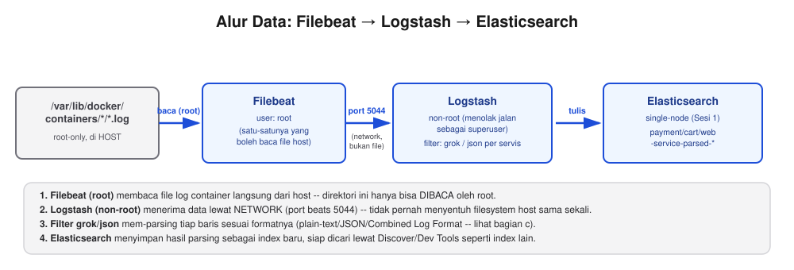
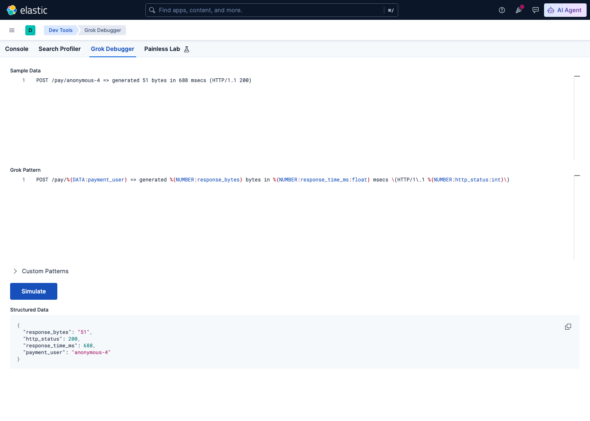
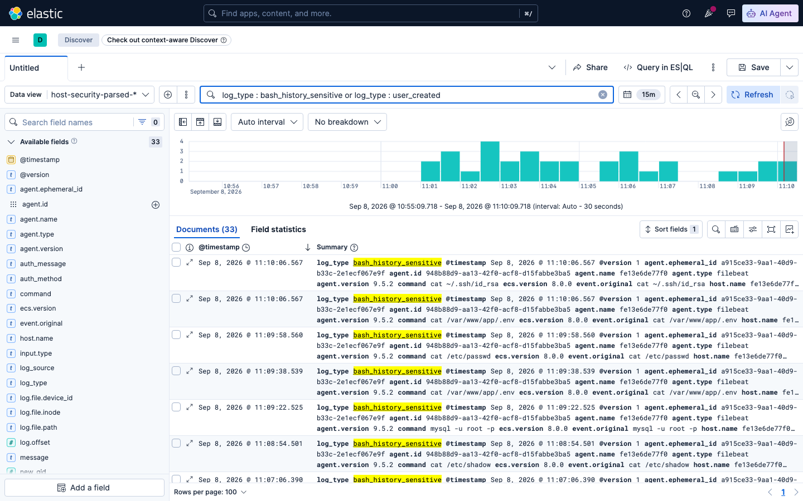
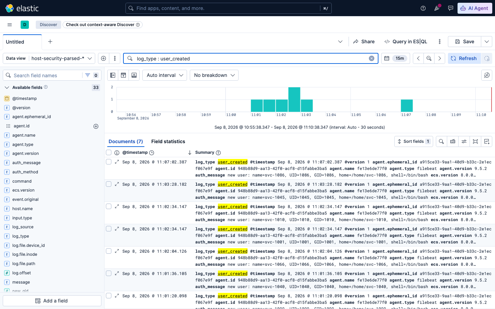

# Sesi 7 — Data Ingestion with Logstash & Beats

## a. Tujuan Sesi

Setelah sesi ini, Anda mampu membangun pipeline ingestion data dari sumber
nyata (log container Robot Shop) ke Elasticsearch menggunakan Filebeat dan
Logstash, termasuk melakukan parsing terhadap tiga format log yang berbeda
(grok manual, JSON, dan format standar industri), serta memahami cara
**menginstal Filebeat & Logstash langsung di Linux (VM/bare-metal)**,
sehingga keterampilan ini dapat diterapkan pada server nyata di luar
lingkungan lab ini. Anda juga akan membangun **notifikasi otomatis ke
Telegram** dari data yang sudah masuk ke Elasticsearch — baik anomali
level aplikasi (lonjakan load pada APM `payment-lab`, lihat Sesi 6) maupun
anomali level host (pembuatan user baru, akses ke file/data sensitif) —
menggunakan rule engine open source, bukan menulis kode pengiriman pesan
dari nol.

## b. Output yang Diharapkan

Sesi ini dinyatakan selesai apabila index `payment-service-parsed-*`,
`cart-service-parsed-*`, dan `web-service-parsed-*` telah terisi dokumen
nyata dari log Robot Shop (dengan field yang benar ter-extract, bukan
`null`), Anda berhasil menginstal serta menjalankan Filebeat & Logstash
secara manual (bukan melalui image Docker Elastic) pada sebuah container
Linux polos, serta memverifikasi sendiri bahwa data mengalir dari
Filebeat → Logstash → parsed output — termasuk memperluas Filebeat untuk
membaca lebih dari satu sumber sekaligus (log akses web, log autentikasi
SSH, dan command history), menghasilkan dokumen `ssh_login_success`/
`ssh_login_failed`/`bash_history` yang terpisah sesuai sumbernya, serta
mampu membaca dan mengubah pengaturan throughput pipeline Logstash
(`pipeline.workers`/`pipeline.batch.size`) lewat API monitoring. Sesi ini
JUGA dinyatakan selesai apabila index `host-security-parsed-*` terisi
dokumen NYATA secara terus-menerus (bukan demo sekali jalan), Anda
berhasil membuat bot Telegram sendiri lewat BotFather, dan ElastAlert2
berhasil mendeteksi ketiga kondisi berikut lalu mencoba mengirim
notifikasi (terkonfirmasi lewat log ElastAlert2, terlepas dari apakah
token bot Anda sudah valid atau belum): pembuatan user baru, akses ke
data/file sensitif, dan lonjakan load pada `payment-lab`.

## c. Teori & Struktur Sistem

**Mengapa Filebeat DAN Logstash, bukan salah satu saja?** Logstash secara
desain **menolak dijalankan sebagai root** (`Logstash cannot be run as
superuser`), sementara direktori log container di host
(`/var/lib/docker/containers`) hanya bisa dibaca oleh root. Filebeat, di
sisi lain, memang didesain agar bisa berjalan sebagai root dengan aman.
Solusinya: **Filebeat (root) membaca file log** → mengirim lewat network
(port beats 5044) → **Logstash (non-root) yang melakukan parsing** →
Elasticsearch. Logstash sendiri tidak pernah menyentuh filesystem host.



**Grok** adalah filter Logstash untuk mengekstrak field terstruktur dari
teks bebas menggunakan named-pattern (`%{PATTERN:nama_field}`, opsional
`:tipe` untuk cast, misalnya `%{NUMBER:amount:float}`). Dokumen yang gagal
di-match grok ditandai lewat `tag_on_failure` (lihat masing-masing file
`.conf`) — periksa field `tags` di ES apabila field yang diharapkan
kosong.

**Tiga teknik parsing berbeda dipakai pada sesi ini** (lihat 3 file
`.conf` di `logstash/pipeline/`):
- `payment-service.conf` — log plain-text tidak terstruktur → **grok manual**.
- `cart-service.conf` — log sudah berbentuk JSON dari aplikasinya sendiri → **JSON filter**.
- `web-service.conf` — log format standar Apache/Nginx Combined Log Format
  → **grok pattern bawaan** (`%{COMBINEDAPACHELOG}`), tidak perlu menulis regex sendiri.

**Apa itu alerting, dan kenapa tidak menulis kode pengiriman pesan
sendiri?** Data yang sudah masuk ke Elasticsearch baru berguna sebagai
notifikasi apabila ADA YANG MEMANTAU-nya terus-menerus dan mengabari
Anda saat kondisi tertentu terjadi — mengecek Kibana manual setiap
beberapa menit tidak realistis. **ElastAlert2** (open source, Apache 2.0,
`github.com/jertel/elastalert2`) adalah rule engine yang menjalankan
query Elasticsearch secara berkala (mis. tiap 30 detik), membandingkan
hasilnya terhadap kondisi yang Anda tentukan di file YAML ("rule"), dan
memanggil salah satu dari puluhan **alerter** bawaannya (email, Slack,
webhook, **Telegram**, dst.) begitu kondisi itu terpenuhi. Anda tidak
menulis satu baris kode HTTP request pun — cukup mendeskripsikan
query + threshold + tujuan notifikasi dalam YAML, lihat bagian d topik 7.

## d. Praktik: Instalasi & Konfigurasi

### 1. Verifikasi Pipeline Ingestion (Filebeat → Logstash → Elasticsearch)

**Prasyarat:** stack single-node Sesi 1 dan Robot Shop Sesi 4 (termasuk
servis `logstash-rs` dan `filebeat-rs`, sudah berjalan sejak Sesi 4)
masih berjalan. Apabila salah satunya sudah Anda matikan, nyalakan
kembali sesuai instruksi Sesi 4 bagian (d) topik 1.

**[Terminal] Verifikasi `logstash-rs`/`filebeat-rs` masih berjalan:**
```bash
cd lab/day-2-query-relevance/sesi-4-relevance-scoring
docker compose ps logstash-rs filebeat-rs
```
Expected Output: keduanya berstatus `Up`.

**Generate traffic** (apabila load generator belum berjalan):
```bash
docker start sesi-4-relevance-scoring-load-1
```

**Contoh Implementasi — cek data masuk** (tunggu beberapa menit supaya ada cukup log):
```bash
curl "http://localhost:9200/payment-service-parsed-*/_count"
curl "http://localhost:9200/cart-service-parsed-*/_count"
curl "http://localhost:9200/web-service-parsed-*/_count"
```
> **INFORMATION:** angka pada Expected Output di bawah adalah satu
> pengukuran nyata — angka pada tampilan Anda akan berbeda, tergantung
> berapa lama traffic sudah mengalir.

Expected Output:
```
payment-service-parsed-*: 322
cart-service-parsed-*: 2206
web-service-parsed-*: 3138
```

### 2. Uji Grok Pattern Interaktif — Kibana Grok Debugger

Sebelum menulis grok pattern langsung ke file `.conf` Logstash (seperti
`payment-service.conf` yang sudah Anda pakai), Kibana menyediakan tool
GUI untuk MENCOBA pattern secara interaktif — memasukkan satu baris log
contoh dan pattern grok, lalu langsung melihat hasil parsing-nya, tanpa
perlu restart Logstash berkali-kali untuk tiap percobaan.

**[Kibana] Buka Grok Debugger** — menu ☰ → Dev Tools → tab **Grok
Debugger** (di samping tab Console yang sudah Anda pakai sejak Sesi 2).

**Contoh Implementasi — uji pattern `payment-service.conf` secara
interaktif.** Isi **Sample Data** dengan satu baris log akses `payment`
yang nyata, dan **Grok Pattern** dengan pattern yang PERSIS SAMA seperti
pada `logstash/pipeline/payment-service.conf`:

Sample Data:
```
POST /pay/anonymous-4 => generated 51 bytes in 688 msecs (HTTP/1.1 200)
```
Grok Pattern:
```
POST /pay/%{DATA:payment_user} => generated %{NUMBER:response_bytes} bytes in %{NUMBER:response_time_ms:float} msecs \(HTTP/1\.1 %{NUMBER:http_status:int}\)
```
Klik **Simulate**.



*Panel **Structured Data** menampilkan hasil parsing langsung sebagai
JSON — `payment_user: "anonymous-4"`, `http_status: 200` (bertipe angka,
sesuai suffix `:int`), `response_time_ms: 688`, `response_bytes: "51"`
(TANPA suffix tipe, tetap string). Ini PERSIS field yang Anda temukan
pada index `payment-service-parsed-*` di topik 1 — Grok Debugger memakai
mesin grok yang SAMA dengan yang dipakai Logstash, hanya tanpa perlu
menjalankan pipeline sungguhan.*

> **INFORMATION:** kalau pattern SALAH (mis. lupa tanda `\(` untuk
> literal kurung buka), **Structured Data** akan menampilkan `{}` kosong
> atau error parsing — cara tercepat mengetahui pattern Anda salah
> SEBELUM menulisnya ke file `.conf` dan menunggu Logstash restart.
> Cocok dipakai untuk menyusun pattern `task-tracker.conf` pada
> exercise sesi ini (lihat `exercise/sesi-7/README.md` Bagian 2) — uji
> dulu pattern Anda di sini, baru salin ke file `.conf` setelah hasilnya
> benar.

### 3. Instalasi Manual Filebeat & Logstash (VM / Bare-Metal)

**Contoh Implementasi — instalasi native di VM:**

> **INFORMATION:** seluruh Filebeat/Logstash yang Anda gunakan sepanjang
> lab ini berjalan lewat **image Docker resmi Elastic** — praktis untuk
> lab, tetapi di dunia nyata Anda akan sering menjumpai server (VM cloud,
> bare-metal on-prem) yang TIDAK menggunakan Docker sama sekali. Bagian
> ini melatih keterampilan tersebut: menginstal Filebeat & Logstash
> **langsung di OS Linux** menggunakan package manager, bukan hanya
> `docker pull`.

**Siapkan "VM" percobaan:**
```bash
docker run -d --name native-vm ubuntu:22.04 sleep infinity
```
> **INFORMATION:** container Ubuntu polos ini mensimulasikan VM/bare-metal
> Linux — pada server sungguhan, langkah-langkah di bawah berlaku PERSIS
> SAMA.

**Buka terminal BARU/TERPISAH** (jangan lanjutkan di terminal yang sama
dengan langkah-langkah sebelumnya) — Logstash pada langkah 6 nanti perlu
dijalankan di FOREGROUND agar log-nya terlihat langsung, sehingga masuk
ke `native-vm` sebaiknya dilakukan dari terminal lain supaya terminal
pertama tetap bebas dipakai (mis. untuk menjalankan `curl`/perintah lain
sambil Filebeat/Logstash di terminal kedua tetap berjalan). Pada terminal
baru ini:
```bash
docker exec -it native-vm bash
```

Sisa langkah pada bagian ini dijalankan **DI DALAM** `native-vm` (prompt shell-nya), pada terminal terpisah tersebut.

**1. Tambahkan repository resmi Elastic** (APT, untuk Debian/Ubuntu):
```bash
apt-get update -qq && apt-get install -y curl gnupg apt-transport-https

curl -fsSL https://artifacts.elastic.co/GPG-KEY-elasticsearch | gpg --dearmor -o /usr/share/keyrings/elastic.gpg
echo "deb [signed-by=/usr/share/keyrings/elastic.gpg] https://artifacts.elastic.co/packages/9.x/apt stable main" > /etc/apt/sources.list.d/elastic-9.x.list
apt-get update -qq
```
> **INFORMATION:** versi RHEL/CentOS menggunakan `yum`/`dnf` dengan repo
> `.repo` setara — pola langkahnya sama.

**2. Install Filebeat & Logstash** (pin versi sama dengan stack lab ini,
9.5.2 — supaya kompatibel):
```bash
apt-get install -y filebeat=9.5.2 logstash=1:9.5.2-1
```
Expected Output: kedua paket berhasil diunduh & terinstal lewat `dpkg`.

> **INFORMATION:** proses ini sama persis seperti instalasi package Linux
> lain (`apt-get install nginx`, dst.) — TIDAK ada langkah spesial.

Verifikasi:
```bash
/usr/share/filebeat/bin/filebeat version
/usr/share/logstash/bin/logstash --version
```
Expected Output: `filebeat version 9.5.2 (arm64)...` dan
`logstash 9.5.2`.

**3. Buat config Logstash** — pipeline sederhana, membaca file, melakukan
parsing `%{COMBINEDAPACHELOG}` (pattern bawaan Logstash, sama seperti
`web-service.conf` yang Anda gunakan untuk Robot Shop), output ke `stdout`
terlebih dahulu:
```bash
mkdir -p /etc/logstash/conf.d
cat > /etc/logstash/conf.d/native-demo.conf << 'EOF'
input {
  beats { port => 5044 }
}
filter {
  grok { match => { "message" => "%{COMBINEDAPACHELOG}" } }
}
output {
  stdout { codec => rubydebug }
}
EOF
chown logstash:logstash /etc/logstash/conf.d/native-demo.conf
```
> **INFORMATION:** output diarahkan ke `stdout` terlebih dahulu supaya
> hasilnya langsung terlihat tanpa perlu setup Elasticsearch di container
> percobaan ini.

**4. Buat config Filebeat** — membaca file log contoh, mengirim ke
Logstash:
```bash
mkdir -p /etc/filebeat
cat > /etc/filebeat/filebeat.yml << 'EOF'
filebeat.inputs:
  - type: filestream
    id: native-demo
    paths:
      - /tmp/sample-access.log

output.logstash:
  hosts: ["localhost:5044"]
EOF
```
> **INFORMATION:** pola arsitekturnya SAMA seperti topik 1 di atas —
> Filebeat membaca file, mengirim ke Logstash lewat port beats.

**5. Siapkan data contoh** (mensimulasikan log Apache/Nginx access):
```bash
cat > /tmp/sample-access.log << 'EOF'
203.0.113.42 - - [12/Mar/2026:08:14:23 +0000] "GET /index.html HTTP/1.1" 200 4523 "-" "Mozilla/5.0 (Windows NT 10.0; Win64; x64) AppleWebKit/537.36"
198.51.100.17 - - [12/Mar/2026:08:14:25 +0000] "GET /images/logo.png HTTP/1.1" 200 1820 "http://example.com/index.html" "Mozilla/5.0 (Macintosh; Intel Mac OS X 10_15_7)"
203.0.113.99 - - [12/Mar/2026:08:14:31 +0000] "POST /api/login HTTP/1.1" 401 512 "-" "curl/8.4.0"
198.51.100.5 - - [12/Mar/2026:08:14:40 +0000] "GET /favicon.ico HTTP/1.1" 404 209 "-" "Mozilla/5.0 (X11; Linux x86_64)"
203.0.113.7 - - [12/Mar/2026:08:15:02 +0000] "GET /products?category=shoes HTTP/1.1" 200 8877 "-" "Mozilla/5.0 (iPhone; CPU iPhone OS 17_0 like Mac OS X)"
EOF
```
> **INFORMATION:** formatnya adalah format standar yang sama seperti yang
> Anda temukan pada dokumentasi resmi Apache/Nginx atau tutorial mana pun
> di internet mengenai Combined Log Format.

**6. Jalankan Logstash** (di background, sebagai non-root user `logstash`):
```bash
mkdir -p /tmp/ls-data /tmp/ls-logs && chown logstash:logstash /tmp/ls-data /tmp/ls-logs
su -s /bin/bash logstash -c "/usr/share/logstash/bin/logstash -f /etc/logstash/conf.d/native-demo.conf --path.settings /etc/logstash --path.data /tmp/ls-data --path.logs /tmp/ls-logs &"
```
> **INFORMATION:** pada server sungguhan, Logstash biasanya dijalankan
> lewat `systemctl enable --now logstash`, tetapi container percobaan ini
> tidak memiliki systemd, sehingga dijalankan secara manual di sini. User
> `logstash` yang dibuat oleh package APT memiliki login shell
> `/usr/sbin/nologin` (memang disengaja — best practice service account
> tidak boleh login interaktif), karena itu diperlukan `su -s /bin/bash`
> (memaksa penggunaan bash untuk command ini saja) — `su logstash` biasa
> akan ditolak dengan error `This account is currently not available`.
> `--path.settings /etc/logstash` WAJIB disebutkan secara eksplisit pada
> command di atas — berbeda dari apabila dijalankan lewat `systemctl`
> (yang otomatis mengetahui lokasi config), invocation manual seperti ini
> tidak otomatis menemukan `log4j2.properties`/`jvm.options` milik paket
> APT (lokasinya di `/etc/logstash`, bukan `/usr/share/logstash/config`
> yang justru tidak ada) — tanpa flag ini Logstash tetap berjalan, tetapi
> fallback ke logging konsol saja, dan `/tmp/ls-logs/logstash-plain.log`
> pada langkah verifikasi berikut tidak akan pernah terbentuk.

Tunggu sampai muncul log `Pipelines running` (sekitar 30-40 detik, JVM
startup) sebelum melanjutkan ke langkah 7 — periksa dengan
`tail -f /tmp/ls-logs/logstash-plain.log`.

**7. Jalankan Filebeat** (root, pada server sungguhan `systemctl enable --now filebeat`):
```bash
/usr/share/filebeat/bin/filebeat -e -c /etc/filebeat/filebeat.yml \
  --path.home /usr/share/filebeat --path.config /etc/filebeat \
  --path.data /tmp/fb-data --path.logs /tmp/fb-logs
```
Expected Output — pada terminal Logstash (langkah 6), 5 dokumen
ter-parse, tiap dokumen berisi `response.status_code`, `url.original`,
`source.address`, `user_agent.original`:
```
{
    "url" => { "original" => "/products?category=shoes" },
    "http" => {
        "response" => { "status_code" => 200, "body" => { "bytes" => 8877 } }
    },
    "source" => { "address" => "203.0.113.7" },
    "user_agent" => { "original" => "Mozilla/5.0 (iPhone; CPU iPhone OS 17_0 like Mac OS X)" }
}
```
> **INFORMATION:** field yang ter-extract ini PERSIS sama seperti hasil
> parsing `web-service.conf` terhadap log Robot Shop — instalasi manual
> ini menghasilkan pipeline yang fungsinya identik dengan versi Docker.

**8. Perluas cakupan pengumpulan data — log aktivitas SSH & command
history.** Log akses web (langkah 1-7) hanya menjawab "traffic apa yang
masuk", bukan "siapa yang masuk ke server dan menjalankan perintah apa".
Untuk audit trail yang lebih lengkap, Filebeat pada server nyata sering
dikonfigurasi membaca **lebih dari satu sumber sekaligus** — tambahkan
dua sumber baru: log autentikasi SSH (`/var/log/auth.log`, mencatat
setiap upaya login berhasil/gagal) dan command history shell
(`~/.bash_history`, mencatat perintah yang dijalankan setelah login).

> **INFORMATION:** `.bash_history` polos tidak punya timestamp per
> baris secara default, dan mudah diubah/dihapus oleh pengguna itu
> sendiri — untuk audit yang benar-benar andal, lingkungan produksi
> biasanya memakai `auditd` atau shell logging terpusat lewat syslog.
> Mekanisme Filebeat/Logstash yang dipelajari di sini tetap sama persis
> apabila sumbernya diganti ke salah satu dari itu.

**Siapkan data contoh** (mensimulasikan `auth.log` dengan satu login sah
lewat SSH key, diikuti percobaan brute-force ke akun `root` — pola yang
umum ditemukan pada server yang terekspos ke internet):
```bash
cat > /var/log/auth.log << 'EOF'
Aug 27 09:14:02 web-prod-01 sshd[10432]: Accepted publickey for deploy from 10.20.30.41 port 52344 ssh2
Aug 27 09:16:47 web-prod-01 sshd[10577]: Failed password for root from 198.51.100.23 port 41822 ssh2
Aug 27 09:16:50 web-prod-01 sshd[10577]: Failed password for root from 198.51.100.23 port 41822 ssh2
Aug 27 09:16:53 web-prod-01 sshd[10577]: Failed password for root from 198.51.100.23 port 41822 ssh2
EOF

mkdir -p /home/deploy
cat > /home/deploy/.bash_history << 'EOF'
whoami
cd /var/www/app
git pull origin main
sudo systemctl restart app
EOF
```

**Tambahkan 2 input baru pada Filebeat** (edit
`/etc/filebeat/filebeat.yml`, tambahkan di bawah input yang sudah ada —
`fields`/`fields_under_root` menandai sumber tiap dokumen, dipakai
Logstash untuk memilih filter yang sesuai):
```yaml
  - type: filestream
    id: native-ssh-auth
    paths:
      - /var/log/auth.log
    fields:
      log_source: ssh_auth
    fields_under_root: true
  - type: filestream
    id: native-bash-history
    paths:
      - /home/deploy/.bash_history
    fields:
      log_source: bash_history
    fields_under_root: true
```

**Tambahkan filter baru pada Logstash** (edit
`/etc/logstash/conf.d/native-demo.conf`, tambahkan di dalam blok
`filter { }` yang sudah ada, SEBELUM baris grok `%{COMBINEDAPACHELOG}`):
```
  if [log_source] == "ssh_auth" {
    grok {
      match => { "message" => "%{SYSLOGTIMESTAMP:timestamp} %{HOSTNAME:host} sshd\[%{NUMBER:pid}\]: %{GREEDYDATA:ssh_message}" }
      tag_on_failure => ["_grok_auth_base_failed"]
    }
    if [ssh_message] =~ "^Accepted" {
      grok {
        match => { "ssh_message" => "Accepted %{WORD:auth_method} for %{USERNAME:ssh_user} from %{IP:src_ip} port %{NUMBER:src_port:int} ssh2" }
      }
      mutate { add_field => { "log_type" => "ssh_login_success" } }
    } else if [ssh_message] =~ "^Failed password" {
      grok {
        match => { "ssh_message" => "Failed password for (invalid user )?%{USERNAME:ssh_user} from %{IP:src_ip} port %{NUMBER:src_port:int} ssh2" }
      }
      mutate { add_field => { "log_type" => "ssh_login_failed" } }
    }
  } else if [log_source] == "bash_history" {
    grok {
      match => { "message" => "%{GREEDYDATA:command}" }
    }
    mutate { add_field => { "log_type" => "bash_history" } }
  }
```

**Restart Filebeat** (Ctrl+C pada terminal langkah 7, lalu jalankan
ulang perintah yang sama) dan tunggu beberapa detik. Expected Output —
4 dokumen SSH (1 `ssh_login_success`, 3 `ssh_login_failed` dari
percobaan brute-force) dan 4 dokumen `bash_history`, tampil di terminal
Logstash (langkah 6):
```
{
    "log_source" => "ssh_auth",
      "log_type" => "ssh_login_failed",
        "ssh_user" => "root",
         "src_ip" => "198.51.100.23",
       "src_port" => 41822
}
{
    "log_source" => "ssh_auth",
      "log_type" => "ssh_login_success",
        "ssh_user" => "deploy",
    "auth_method" => "publickey",
         "src_ip" => "10.20.30.41",
       "src_port" => 52344
}
{
    "log_source" => "bash_history",
      "log_type" => "bash_history",
        "command" => "sudo systemctl restart app"
}
```
> **INFORMATION:** pola query yang sama seperti pada payment/cart/web
> (agregasi per field, filter per status) berlaku juga di sini — mis.
> `terms` per `src_ip` pada dokumen `ssh_login_failed` akan langsung
> menunjukkan sumber percobaan brute-force di atas.

**Bersihkan** container percobaan setelah selesai:
```bash
exit                    # keluar dari native-vm
docker rm -f native-vm
```
> **INFORMATION:** langkah pembersihan ini bukan bagian dari lab utama,
> hanya latihan keterampilan instalasi.

### 4. Best Practice: Tuning Pipeline Logstash untuk Throughput Tinggi

Konfigurasi default Logstash (dipakai tanpa perubahan sejak awal sesi
ini) belum tentu optimal untuk volume data besar. Dua pengaturan yang
paling berpengaruh terhadap throughput:

- **`pipeline.workers`** — jumlah thread paralel yang menjalankan
  filter+output. Default = jumlah CPU core host. Menaikkannya membantu
  KALAU tahap filter (grok, dst.) adalah bottleneck (CPU-bound);
  menurunkannya berguna untuk MEMBATASI pemakaian CPU Logstash pada host
  yang resource-nya harus dibagi dengan servis lain (persis kasus lab
  ini — banyak stack berjalan bersamaan).
- **`pipeline.batch.size`** — jumlah event yang dikumpulkan tiap worker
  SEBELUM dieksekusi ke filter+output sekaligus (batch). Batch lebih
  besar = lebih sedikit overhead per-event (terutama untuk output
  Elasticsearch yang memakai `_bulk` di baliknya), tapi juga lebih
  banyak memori terpakai per batch.

**[Terminal] Lihat konfigurasi pipeline yang SEDANG berjalan** — API
monitoring Logstash (port 9600, sudah di-expose di `docker-compose.yml`
folder Sesi 4):
```bash
curl "http://localhost:9600/_node/pipelines?pretty"
```
Expected Output (nilai default, belum di-tuning):
```json
{
  "pipeline" : { "workers" : 10, "batch_size" : 125, "batch_delay" : 50 },
  "pipelines" : { "main" : { "workers" : 10, "batch_size" : 125, "batch_delay" : 50 } }
}
```
> **INFORMATION:** `workers: 10` di atas ADALAH jumlah CPU core yang
> terdeteksi Logstash pada contoh host di atas — angka pada layar
> Anda mengikuti jumlah core host Anda sendiri, bukan tetap 10.

**[Terminal] Lihat throughput NYATA yang sudah diproses** (jumlah event
in/out sejak container ini berjalan — respons `_node/stats/pipelines`
punya BANYAK blok `events` bersarang per-plugin, jadi ambil KHUSUS
level pipeline pakai `python3`, bukan `grep` yang akan menangkap blok
yang salah):
```bash
curl -s "http://localhost:9600/_node/stats/pipelines" | python3 -c "
import json, sys
d = json.load(sys.stdin)
print(json.dumps(d['pipelines']['main']['events'], indent=2))
"
```
Expected Output (satu pengukuran nyata, angka Anda akan berbeda
tergantung berapa lama container ini sudah berjalan):
```json
{
  "out": 44753,
  "duration_in_millis": 11416,
  "in": 44753,
  "filtered": 44753,
  "queue_push_duration_in_millis": 240
}
```
`in`, `out`, `filtered` bernilai SAMA — semua event yang masuk berhasil
keluar, tidak ada yang macet di pipeline. Angkanya naik terus selama
load generator Sesi 6 berjalan.

**[Terminal] Ubah `pipeline.workers`/`pipeline.batch.size`** — image
Docker resmi Logstash membaca env var `PIPELINE_WORKERS`/
`PIPELINE_BATCH_SIZE` (huruf besar, titik jadi underscore) dan
menerapkannya ke `logstash.yml` otomatis saat container start:
```yaml
# tambahkan di service logstash-rs pada docker-compose.yml (folder Sesi 4)
environment:
  - "LS_JAVA_OPTS=-Xms256m -Xmx256m"
  - xpack.monitoring.enabled=false
  - PIPELINE_WORKERS=2
  - PIPELINE_BATCH_SIZE=500
```
Setelah `docker compose up -d` ulang **dari folder
`sesi-4-relevance-scoring`**, verifikasi perubahan benar-benar diterapkan
lewat `curl` yang sama seperti di atas — Expected Output:
`"workers": 2, "batch_size": 500`.

> **INFORMATION:** TIDAK ada satu angka "benar" untuk `workers`/
> `batch_size` yang berlaku universal — pengaturan optimal bergantung
> pada karakteristik beban (CPU-bound vs I/O-bound), jumlah CPU core
> yang tersedia, dan seberapa banyak servis LAIN yang berbagi resource
> host yang sama (persis seperti lab ini). Prinsip yang berlaku umum:
> ukur dulu (`_node/stats/pipelines`) SEBELUM dan SESUDAH mengubah
> pengaturan, jangan mengubah berdasarkan tebakan.
>
> **Sisi Filebeat** juga punya pengaturan setara di sisi pengirim:
> `queue.mem.events` (kapasitas antrean internal Filebeat sebelum
> dikirim) dan `output.logstash.bulk_max_size` (jumlah event per batch
> yang dikirim ke Logstash) — prinsip tuning-nya sama: ukur dulu, jangan
> menebak, dan pertimbangkan resource host secara keseluruhan, bukan
> Filebeat/Logstash secara terpisah.

### 5. Analisis Hasil Parsing & Deteksi Anomali

**Contoh Implementasi — cek hasil parsing payment** (grok manual):
```
GET payment-service-parsed-*/_search
{ "query": { "exists": { "field": "http_status" } }, "size": 1 }
```
Expected Output — field `payment_user`, `http_status`,
`response_time_ms`, `response_bytes` ter-extract dari baris log plain-text:
```json
{
  "payment_user": "anonymous-30",
  "http_status": 200,
  "response_time_ms": 588.0,
  "response_bytes": "51",
  "log_type": "payment_access"
}
```

**Cari transaksi anomali.** Traffic Robot Shop pada sesi ini memiliki SATU
pola "tidak normal" yang PASTI ada (500, disuntik secara sengaja), dan
SATU pola yang MUNGKIN ada tergantung performa host Anda (429, kapasitas):
```
GET payment-service-parsed-*/_search
{ "size": 0, "aggs": { "by_status": { "terms": { "field": "http_status" } } } }
```
Expected Output (dari salah satu pengukuran nyata): `429: 133`,
`200: 14`, `500: 13`.

> **INFORMATION:** angka Anda bisa berbeda totalnya. Apabila pada layar
> Anda tidak terdapat `429` sama sekali dan hampir seluruhnya `200`, hal
> tersebut normal juga, yang berarti host Anda cukup kuat menangani
> `NUM_CLIENTS: 6` tanpa `payment` kewalahan (lihat catatan Sesi 6).

Field `500` PASTI selalu ada, tidak tergantung performa host.

Breakdown per `payment_user` untuk status `500` menunjukkan pola yang jelas:
```
GET payment-service-parsed-*/_search
{ "size": 0, "query": { "term": { "http_status": 500 } },
  "aggs": { "by_user": { "terms": { "field": "payment_user.keyword" } } } }
```
Expected Output: **SEMUA dokumen `http_status: 500` berasal
dari SATU user id yang sama, `partner-57`** — bukan pola `anonymous-N`
yang normal. Ini adalah transaksi yang sengaja disuntikkan (fitur
`ERROR=1` pada load generator, lihat Sesi 6) — pola KONSENTRASI pada satu
identitas mencurigakan merupakan tanda anomali/fraud.

**Apabila `429` MUNCUL pada traffic Anda**, breakdown per user-nya akan
menunjukkan pola yang SANGAT berbeda dari 500 — tersebar ke banyak user id
`anonymous-N` yang berbeda-beda (masing-masing hanya 1-2 kejadian), bukan
terkonsentrasi pada satu id. Hal itu menandakan BUKAN anomali/fraud,
melainkan **kapasitas service yang kewalahan** (lihat Sesi 6): banyak
user LEGITIMATE yang kebetulan sama-sama gagal karena `payment` tidak
sanggup menampung request secara bersamaan. Dua pola yang sama-sama
"tidak normal" ini membutuhkan respons yang berbeda — 500 membutuhkan
investigasi keamanan, sedangkan 429 (apabila muncul) membutuhkan
perbaikan kapasitas/scaling.

### 6. Ingest Log Keamanan Host Secara Persisten

Topik 3 mendemonstrasikan parsing `auth.log`/`bash_history` di container
sekali-pakai (`native-vm`) — output-nya cuma tampil di terminal, langsung
hilang begitu container dihapus. Supaya bisa dipakai untuk notifikasi
otomatis (topik 8), data itu perlu benar-benar tersimpan di Elasticsearch,
terus-menerus. Folder `host-security/` di sesi ini (mandiri, tidak
bergantung folder sesi lain kecuali jaringan Docker `elk-lab-net` dari
Sesi 1) berisi:
- `log-generator/` — script Python yang terus menghasilkan baris
  `auth.log`/`bash_history` PALSU, mayoritas aktivitas normal (login SSH
  berhasil, command sehari-hari), sesekali anomali: percobaan brute-force
  SSH, **pembuatan user baru** (`useradd`), dan **akses ke file
  sensitif** (`/etc/shadow`, `/etc/passwd`, `id_rsa`, `.env`, dst.).
- `filebeat/filebeat.yml` — membaca dua file itu dari volume bersama.
- `logstash/pipeline/` — grok pattern yang SAMA seperti topik 3 (plus
  tambahan pattern `useradd` dan deteksi command sensitif), outputnya
  kali ini benar-benar ke index `host-security-parsed-*`.

**[Terminal] Jalankan (dari direktori sesi ini):**
```bash
docker compose -f docker-compose.host-security.yml up -d --build
```
Tunggu 1-2 menit supaya generator sempat menghasilkan beberapa baris,
lalu verifikasi datanya masuk:
```bash
curl -s "http://localhost:9200/host-security-parsed-*/_count"
```
Expected Output: `count` bertambah terus setiap kali perintah ini
diulang (generator berjalan terus di background).

**Buat Data View di Kibana** (☰ → Stack Management → Data Views → Create
data view, isi `host-security-parsed-*`, time field `@timestamp`), lalu
buka **Discover**, filter `log_type : bash_history_sensitive`:



*Setiap baris `command` di sini adalah perintah yang cocok dengan pola
sensitif (`/etc/shadow`, `/etc/passwd`, `id_rsa`, `.env`, `mysql -u
root`) — dideteksi Logstash lewat regex pada filter `host-security.conf`,
ditandai `log_type: bash_history_sensitive` supaya mudah di-query
terpisah dari command normal.*

Filter `log_type : user_created`:



*Baris `useradd[PID]: new user: name=..., UID=..., home=...` pada
`auth.log` asli (Debian/Ubuntu) memang berformat seperti ini setiap kali
akun baru dibuat lewat perintah `useradd` — pola yang sama berlaku pada
server sungguhan, bukan cuma simulasi di sini.*

> **INFORMATION:** field `log_type` bertipe `text` dengan sub-field
> `.keyword` (mapping dinamis default Elasticsearch) — untuk `terms`
> aggregation atau exact-match filter di Dev Tools, gunakan
> `log_type.keyword`, BUKAN `log_type` biasa (akan gagal dengan error
> "Fielddata is disabled"). Filter KQL di Discover (seperti contoh di
> atas) tidak terpengaruh soal ini.

### 7. Buat Bot Telegram Sendiri Lewat BotFather

Setiap peserta membuat bot Telegram MASING-MASING (bukan berbagi satu
bot) — supaya notifikasi yang Anda terima benar-benar dari data Anda
sendiri, dan token bot tidak perlu dibagikan ke siapa pun.

1. Buka aplikasi Telegram, cari akun **@BotFather** (akun resmi Telegram
   untuk membuat bot, tercentang biru), mulai chat dengannya.
2. Kirim perintah `/newbot`.
3. BotFather menanyakan **nama tampilan** bot (bebas, bisa diisi apa
   saja, mis. "Lab ELK Stack Notifier N" — ganti N dengan nomor peserta
   Anda).
4. BotFather menanyakan **username** bot — ini yang harus mengikuti
   format `lab-elk-stack-modul-student-N`, TAPI username Telegram HANYA
   boleh berisi huruf/angka/underscore dan WAJIB diakhiri kata `bot` —
   tanda hubung (`-`) TIDAK diperbolehkan. Sesuaikan jadi:
   ```
   lab_elk_stack_modul_student_N_bot
   ```
   (ganti `N` dengan nomor Anda, mis. `lab_elk_stack_modul_student_7_bot`).
   Apabila username itu sudah dipakai peserta lain, tambahkan angka acak
   di akhir sebelum `_bot`.
5. BotFather membalas dengan **token** bot, formatnya
   `123456789:AAHdqT-contoh-token-anda-sendiri`. **Simpan baik-baik**,
   token ini setara password penuh ke bot Anda.

**Dapatkan `chat_id` Anda** (dibutuhkan topik 8, ID numerik tujuan pesan):
1. Klik link `t.me/lab_elk_stack_modul_student_N_bot` dari balasan
   BotFather, tekan **Start** (kirim minimal satu pesan apa saja ke bot
   Anda sendiri — bot belum bisa mengirim pesan ke Anda sebelum ini).
2. Buka URL berikut di browser (ganti `<TOKEN>` dengan token dari
   langkah 5):
   ```
   https://api.telegram.org/bot<TOKEN>/getUpdates
   ```
3. Expected Output — JSON berisi `"chat":{"id": 123456789, ...}` — angka
   itu adalah `chat_id` Anda.

> **INFORMATION:** apabila responsnya `{"ok":true,"result":[]}` (kosong),
> berarti Anda belum mengirim pesan apa pun ke bot — ulangi langkah 1.

### 8. Pasang ElastAlert2 & Hubungkan ke Telegram

Folder `elastalert/` di sesi ini berisi:
- `config.yaml` — pengaturan umum (alamat Elasticsearch, seberapa sering
  query dijalankan, dst.) — tidak perlu diubah.
- `rules/*.yaml` — TIGA rule notifikasi, satu file per kondisi:
  `new_user.yaml` (pembuatan user baru), `sensitive_access.yaml` (akses
  data sensitif), `apm_load.yaml` (lonjakan load `payment-lab`, lihat
  Sesi 6).

**Buka masing-masing file di `elastalert/rules/`**, ganti placeholder
`GANTI_DENGAN_TOKEN_BOT_ANDA` dengan token dari topik 7 langkah 5, dan
`GANTI_DENGAN_CHAT_ID_ANDA` dengan `chat_id` dari topik 7 langkah 3 (di
KETIGA file).

**Contoh isi `new_user.yaml`** (dua rule lain memakai struktur serupa,
cuma beda `filter` dan `index`):
```yaml
name: "Notifikasi Pembuatan User Baru"
type: frequency
index: "host-security-parsed-*"
num_events: 1
timeframe:
  minutes: 1

filter:
  - term:
      log_type.keyword: "user_created"

alert:
  - "telegram"
telegram_bot_token: "GANTI_DENGAN_TOKEN_BOT_ANDA"
telegram_room_id: "GANTI_DENGAN_CHAT_ID_ANDA"

alert_text_type: alert_text_only
alert_text: |
  User baru terdeteksi di server!
  Username: {0}
  UID: {1}
  Home directory: {2}
alert_text_args: ["new_username", "new_uid", "new_home"]

realert:
  minutes: 5
```
*`type: frequency`, `num_events: 1`, `timeframe: 1 menit` berarti: SATU
kejadian saja dalam 1 menit sudah cukup memicu alert (cocok untuk
kejadian yang harus SELALU diperhatikan, beda dengan `apm_load.yaml`
yang butuh 15 kejadian dalam 2 menit — baru dianggap "lonjakan"). `realert`
mencegah Telegram Anda dibanjiri notifikasi identik berulang-ulang dalam
5 menit yang sama.*

**[Terminal] Jalankan ElastAlert2** (dari direktori sesi ini):
```bash
docker compose -f docker-compose.elastalert.yml up -d
```
Lihat log-nya:
```bash
docker compose -f docker-compose.elastalert.yml logs -f elastalert
```
Expected Output pada percobaan PERTAMA (`New index elastalert_status
created`), lalu setiap ±30 detik ElastAlert2 mengevaluasi ketiga rule.
Karena `log-generator` (topik 6) sudah berjalan sejak tadi dan pasti
menghasilkan `user_created`/`bash_history_sensitive` beberapa kali dalam
1-2 menit terakhir, Anda akan melihat baris log pengiriman ke Telegram
dalam waktu singkat — **apabila token & chat_id Anda benar, pesan
langsung muncul di Telegram**. Apabila salah satu placeholder belum
diganti atau salah ketik, log akan menunjukkan error dari Telegram API
(mis. `404 Not Found` untuk token tidak valid, `400 Bad Request` untuk
`chat_id` salah) — perbaiki lalu `docker compose -f
docker-compose.elastalert.yml restart elastalert`.

**Uji rule `apm_load.yaml`** (butuh `payment-lab` yang SUDAH dipasangi
APM dari Sesi 6 — lihat README Sesi 6 bagian d topik 3):
```bash
docker compose -f ../../day-3-analytics-optimization/sesi-6-performance-optimization/docker-compose.payment-lab.yml up -d
```
Tunggu 2-3 detik supaya Flask selesai start (lihat catatan serupa di
README Sesi 6 bagian d topik 3 — curl yang dijalankan tepat setelah
container baru saja `Started` bisa gagal diam-diam), baru kirim burst
request-nya:
```bash
for i in $(seq 1 20); do curl -s -X POST http://localhost:8090/pay/$i > /dev/null & done
wait
```
Tunggu 1-2 menit (ElastAlert2 perlu waktu untuk melihat lonjakan ini di
siklus query berikutnya, plus data APM perlu waktu terindeks) — pesan
notifikasi "Load APM tinggi" akan masuk ke Telegram Anda.

> **INFORMATION:** verifikasi pada lab ini sudah memastikan KETIGA rule
> benar-benar match terhadap data nyata dan mencoba mengirim ke Telegram
> (request-nya benar-benar sampai ke server Telegram, terbukti dari
> respons error terstruktur `404`/`400` saat token contoh dipakai) —
> tapi pengiriman pesan yang BENAR-BENAR diterima bergantung pada token
> bot Anda sendiri yang valid, hanya bisa diverifikasi oleh Anda sendiri
> dengan bot Anda sendiri.

## e. Referensi Exercise

Lanjutkan latihan mandiri di [`exercise/sesi-7/README.md`](../../../exercise/sesi-7/README.md)
— Bagian 1 deteksi transaksi anomali, Bagian 2 menyusun grok pattern
sendiri untuk format log custom aplikasi [`crud-app/`](../../../crud-app/README.md).
