# Sesi 8 — Elasticsearch Administration & Scaling

## a. Tujuan Sesi

Setelah sesi ini, Anda mampu mengelola cluster Elasticsearch multi-node
(bukan hanya single-node seperti sesi-sesi sebelumnya), memahami snapshot
dan restore untuk backup, mengatur Index Lifecycle Management (ILM)
lengkap dengan Snapshot Lifecycle Management (SLM) untuk backup
terjadwal, dan melihat langsung bagaimana cluster tetap tersedia (high
availability) walau satu node mati.

## b. Output yang Diharapkan

Sesi ini selesai apabila cluster 3-node Anda berstatus `green`, Anda
berhasil melakukan snapshot dan restore penuh (data identik
sebelum/sesudah), berhasil mensimulasikan 1 node mati lalu melihat
cluster tetap tersedia (data tidak hilang, status `yellow` bukan `red`),
mampu membaca kondisi resource cluster (CPU/heap/disk per node,
distribusi shard) lewat API monitoring, dan berhasil membuat serta
memverifikasi policy ILM (hot/warm/cold/delete) + SLM lewat Kibana.

## c. Teori & Struktur Sistem

Pada sesi-sesi sebelumnya Anda menggunakan Elasticsearch **single-node**.
Pada sesi ini kita beralih ke **cluster 3-node** untuk melihat konsep
yang tidak dapat didemonstrasikan pada single-node:

- **Scaling** — menambah node ke cluster untuk menampung lebih banyak
  data/traffic. Tiap node menjalankan instance Elasticsearch sendiri,
  saling terhubung lewat `discovery.seed_hosts`.
- **`cluster.initial_master_nodes`** — daftar node yang menjadi kandidat
  master saat cluster PERTAMA KALI dibentuk (hanya dipakai sekali di
  awal, bukan konfigurasi permanen).
- **Perbedaan node master vs node data ("worker"):**
  - **Node master** mengurus METADATA cluster — index apa saja yang
    ada, di node mana tiap shard seharusnya berada, node apa saja yang
    sedang jadi anggota cluster. Tugasnya RINGAN secara komputasi (bukan
    memproses query/data), tapi KRITIS: kalau tidak ada master yang
    terpilih, cluster tidak bisa membuat/menghapus index atau
    merealokasi shard sama sekali.
  - **Node data (sering disebut "worker" node)** yang benar-benar
    menyimpan shard dan mengeksekusi kerja berat: indexing, search,
    aggregation. Butuh RAM/CPU/disk jauh lebih besar dibanding node
    master.
  - Di cluster kecil (seperti `es-node1`/`es-node2` pada sesi ini),
    WAJAR 1 node merangkap kedua peran (master-eligible + data) — ini
    yang selama ini Anda pakai di Sesi 1-7. Di cluster PRODUKSI
    berskala besar, kedua peran biasanya DIPISAH: node master khusus
    (kecil, stabil, tidak menyimpan data — seperti `es-node3` pada
    sesi ini) supaya pemilihan master tidak terganggu oleh beban
    indexing/query yang berat di node data, dan node data bisa
    ditambah/dikurangi bebas tanpa mengganggu stabilitas master.
- **Kenapa sekarang bisa `green`, bukan `yellow` terus?**

  > **INFORMATION:** pada Sesi 1 dijelaskan bahwa replica shard
  > membutuhkan node LAIN untuk ditempati. Dengan 3 node, replica
  > akhirnya memiliki tempat, sehingga status dapat menjadi `green`
  > (seluruh primary DAN replica ter-assign) — kontras langsung dengan
  > single-node yang selalu bertahan pada status `yellow`.
- **High Availability (HA)** — apabila 1 node mati, cluster (dengan
  replica yang tersebar di node lain) tetap dapat melayani baca/tulis
  data, meski statusnya turun ke `yellow` sampai node tersebut kembali
  atau Elasticsearch merealokasi shard ke node yang tersisa.

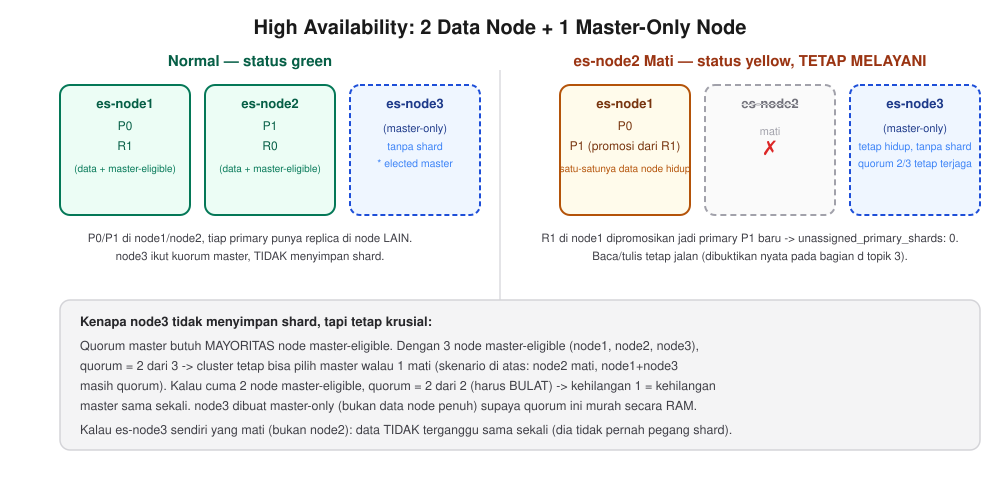

*Perbandingan langsung: pada kondisi normal (kiri), primary (P) dan
replica (R) tersebar di `es-node1`/`es-node2` (dua-duanya data node),
sementara `es-node3` cuma ikut kuorum master TANPA menyimpan shard.
Apabila `es-node2` mati (kanan), replica `R1` yang ada di `es-node1`
DIPROMOSIKAN jadi primary baru — `unassigned_primary_shards` tetap 0,
cluster turun status menjadi `yellow` (bukan `red`) dan TETAP melayani
baca/tulis. Hal ini akan Anda buktikan sendiri pada bagian "Simulasi
Failure" nanti.*

**Data Retention — hubungannya dengan storage.** "Retention" adalah
kebijakan berapa lama data disimpan sebelum dihapus otomatis. Ini bukan
sekadar soal disiplin administratif — terdapat hubungan matematis
langsung ke kapasitas disk:

```
kebutuhan storage ≈ (rata-rata data masuk per hari) × (jumlah hari retensi) × (1 + jumlah replica)
```

Index yang tidak pernah dihapus akan tumbuh TANPA BATAS hingga disk
penuh (lihat catatan `disk_threshold` pada bagian d topik 1) — semakin
lama retensi, semakin besar storage yang dibutuhkan, dan faktor replica
(tiap replica adalah salinan penuh data) melipatgandakannya lagi. Inilah
sebabnya `delete` phase pada ILM (dibahas pada bagian d topik 5) bukan fitur
opsional untuk data log/metrik/trace bervolume tinggi — tanpa retensi,
cluster produksi umumnya akan kehabisan disk dalam hitungan
minggu/bulan, bukan tahun. Kebijakan retensi yang umum digunakan: log
aplikasi 7-30 hari, metrik 30-90 hari, data compliance/audit dapat
tahunan (biasanya dipindah ke tier storage yang lebih murah, bukan
disimpan penuh pada hot tier — di luar cakupan lab ini).

**Kapan Snapshot & Restore digunakan?** Ini pertanyaan yang sering
membingungkan pemula: kalau sudah ada `replica` (lihat "High
Availability" di atas), untuk apa lagi snapshot? Jawabannya: **replica
dan snapshot melindungi dari ancaman yang BERBEDA**:

- **Replica** melindungi dari kegagalan 1 NODE (hardware/network mati) —
  TAPI replica adalah salinan yang selalu mengikuti primary. Kalau data
  di primary terhapus/rusak (mis. salah `DELETE`, bug aplikasi menulis
  data rusak, atau serangan ransomware), replica IKUT terhapus/rusak
  dalam hitungan detik — replica TIDAK melindungi dari kesalahan pada
  level DATA.
- **Snapshot** adalah salinan BEKU pada satu titik waktu, disimpan
  TERPISAH dari cluster (repository `fs`/S3/GCS/Azure). Snapshot-lah
  yang melindungi dari skenario di atas — dan juga dipakai untuk:
  - **Migrasi** data antar cluster (mis. pindah data center) atau
    sebelum **upgrade versi Elasticsearch** yang berisiko.
  - **Titik pulih (rollback point)** sebelum operasi berisiko dijalankan
    manual (reindex besar-besaran, perubahan mapping yang tidak bisa
    dibatalkan).
  - **Retensi jangka panjang** yang di-gate lewat `wait_for_snapshot`
    (dibahas di bawah) — memastikan data punya salinan permanen SEBELUM
    dihapus otomatis oleh ILM.

> **INFORMATION:** kesimpulannya: replica = pertahanan HARIAN terhadap
> kegagalan node (otomatis, real-time); snapshot = pertahanan TERAKHIR
> terhadap kehilangan/kerusakan DATA (terjadwal, harus sengaja
> dikonfigurasi lewat SLM — dibahas di bawah). Cluster produksi butuh
> KEDUANYA, bukan salah satu saja.

**ILM (Index Lifecycle Management) — konsep dasar.** ILM mengotomatisasi
perpindahan index melalui beberapa **fase** seiring bertambah umurnya,
tanpa perlu dieksekusi manual satu per satu. Ada 5 fase resmi (index
tidak wajib melewati semuanya, tergantung kebutuhan):

- **Hot** — fase aktif, index masih menerima tulisan baru DAN dibaca
  intensif (mis. log yang baru masuk hari ini). Action paling umum:
  `rollover` (bikin index baru begitu index lama mencapai
  `max_age`/`max_docs`/`max_primary_shard_size`, supaya 1 index fisik
  tidak tumbuh tanpa batas). Di produksi, hot tier biasanya ditaruh di
  hardware TERCEPAT (SSD/NVMe, CPU besar) karena beban baca-tulisnya
  paling tinggi.
- **Warm** — data masih sering DIBACA tapi jarang/tidak lagi DITULIS
  (mis. log kemarin — masih dicari-cari, tapi tidak bertambah lagi).
  Action umum: `shrink` (kurangi jumlah primary shard — data yang sudah
  tidak bertambah tidak butuh sebanyak itu) dan `forcemerge` (gabungkan
  segmen Lucene jadi lebih sedikit, query lebih cepat & hemat disk). Di
  produksi, warm tier boleh pakai hardware LEBIH MURAH (disk lebih
  lambat, CPU lebih kecil) karena tidak ada lagi beban tulis.
- **Cold** — data jarang diakses, prioritas paling rendah (mis. log
  bulan lalu — kadang dicek untuk investigasi, tapi jarang). Action
  `readonly` mencegah index ini ditulis lagi (mencegah perubahan tak
  sengaja pada data arsip). Hardware paling murah dalam katalog storage
  tier (disk kapasitas besar, kecepatan rendah).
- **Frozen** — fase paling jarang dipakai, untuk data yang HAMPIR tidak
  pernah diakses lagi tapi masih wajib disimpan (mis. retensi
  compliance).
- **Delete** — index dihapus permanen. Action `delete`, dan action
  penting `wait_for_snapshot` (dibahas di bawah).

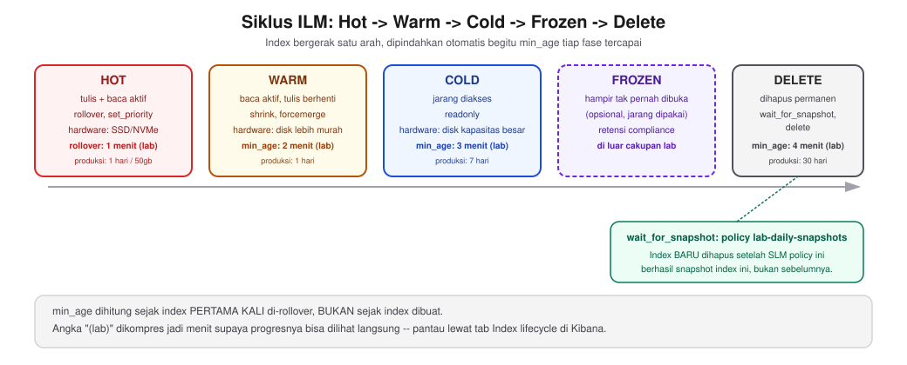

**Node mana yang harus diberi atribut hot/warm/cold pada cluster
multi-node?** Di Elasticsearch modern (7.10+), ini diatur lewat
**`node.roles`** eksplisit per node — BUKAN atribut bebas, tapi role
resmi: `data_hot`, `data_warm`, `data_cold`, `data_frozen` (mirip
`node.roles=master` yang dipakai `es-node3` pada sesi ini, tapi untuk
tier data). Contoh konfigurasi 3 node dengan tier terpisah (ILUSTRASI
konfigurasi produksi, BUKAN diterapkan pada docker-compose lab ini):
```yaml
# node khusus hot (hardware tercepat)
- node.roles=data_hot,data_content,master
# node khusus warm (hardware sedang)
- node.roles=data_warm
# node khusus cold (hardware termurah)
- node.roles=data_cold
```
ES lalu otomatis menaruh shard sesuai fase ILM-nya ke node dengan role
tier yang cocok — mekanismenya lewat setting index
`index.routing.allocation.include._tier_preference` yang DIUBAH OTOMATIS
oleh ILM setiap index pindah fase (Anda TIDAK perlu mengatur ini
manual).

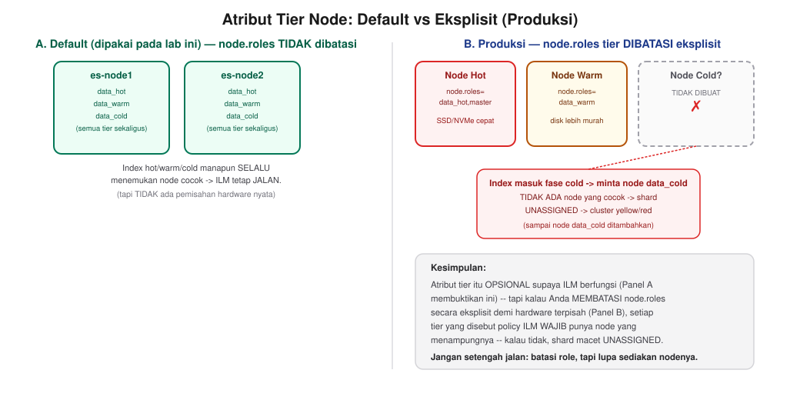

> **Kalau atribut tier TIDAK ditambahkan, apakah fase hot/warm/cold
> tetap bisa jalan?** **YA, TETAP BISA** — dan ini terbukti pada cluster
> sesi ini sendiri. `es-node1`/`es-node2` TIDAK diberi `node.roles`
> eksplisit (dibiarkan default), dan hasil nyata dari `GET _nodes`
> membuktikan default role SUDAH otomatis mencakup SEMUA tier
> (`data_content`, `data_hot`, `data_warm`, `data_cold`, `data_frozen`
> sekaligus):
> ```
> "roles": ["data","data_cold","data_content","data_frozen","data_hot","data_warm","ingest","master","ml","remote_cluster_client","transform"]
> ```
> Karena SEMUA node data pada cluster ini kompatibel dengan SEMUA tier,
> `_tier_preference` index manapun (hot, warm, ataupun cold) SELALU
> menemukan node yang cocok, sehingga shard-nya tetap teralokasi normal
> — inilah kenapa lab ini bisa mempraktikkan hot→warm→cold tanpa
> mengonfigurasi node.roles tier apa pun secara manual.
>
> **TAPI** ada risiko nyata kalau Anda MEMBATASI `node.roles` secara
> eksplisit (mis. cuma `data_hot` di semua node, tanpa satu pun node
> `data_cold`) sementara ILM policy Anda punya fase `cold`: begitu index
> masuk fase `cold`, `_tier_preference`-nya berubah minta node
> `data_cold`, TIDAK ADA node yang cocok, dan shard-nya akan
> **UNASSIGNED** (cluster jadi `yellow`/`red`) sampai Anda menambahkan
> node dengan role yang sesuai. Kesimpulannya: atribut tier itu OPSIONAL
> untuk membuat ILM BERFUNGSI, tapi WAJIB dikonfigurasi dengan benar
> begitu Anda MEMBATASI role node secara eksplisit — jangan setengah
> jalan (membatasi role tapi lupa menyediakan node untuk salah satu
> tier).

> **INFORMATION:** fase `cold` dan `frozen` di produksi biasanya memakai
> action `searchable_snapshot` (mount data langsung dari snapshot,
> nyaris tanpa disk lokal) — TAPI ini fitur BERBAYAR (Enterprise/trial
> license). Lab ini memakai license **Basic** (gratis, sama seperti
> sesi-sesi sebelumnya), jadi `searchable_snapshot` akan DITOLAK
> (`current license is non-compliant`) — pada praktik di bagian d
> dipakai `readonly` sebagai gantinya. Ini tetap konsep cold yang valid
> (data diam, prioritas rendah), hanya tanpa pemindahan storage
> snapshot-nya.

> **INFORMATION:** `min_age` tiap fase dihitung sejak index PERTAMA KALI
> di-*rollover* (bukan sejak index dibuat) — inilah kenapa `min_age`
> pada fase `warm`/`cold`/`delete` dikonfigurasi RELATIF terhadap waktu
> rollover, bukan usia index itu sendiri.

**SLM (Snapshot Lifecycle Management) — berbeda dari ILM.** ILM mengatur
DATA-nya sendiri (rollover/shrink/delete); SLM mengatur BACKUP terjadwal
ke snapshot repository — dua fitur yang TERPISAH. SLM punya `schedule`
sendiri (format **cron 6-field** — `detik menit jam tanggal bulan
hari-minggu`, BUKAN format cron 5-field yang lebih umum) dan
`retention` sendiri (`expire_after`, `min_count`, `max_count`),
independen dari policy ILM manapun.

> **INFORMATION:** SLM MENOLAK schedule yang lebih sering dari 15 menit
> (`schedule would be too frequent, executing more than every [15m]`) —
> batasan ini sengaja diberlakukan Elastic supaya SLM tidak dipakai
> untuk kebutuhan mendekati real-time (bukan tujuannya SLM). Untuk
> menguji policy tanpa menunggu jadwal, jalankan manual lewat
> `POST _slm/policy/<nama>/_execute`.

**Kombinasi ILM + SLM lewat `wait_for_snapshot` — fitur paling penting
untuk keamanan data.** Action `wait_for_snapshot` pada fase `delete` ILM
membuat index TIDAK akan benar-benar dihapus sampai SLM policy yang
direferensikan berhasil menjalankan snapshot SETELAH index itu masuk
fase delete. Tanpa action ini, ILM bisa saja menghapus index yang belum
sempat di-backup sama sekali — `wait_for_snapshot` adalah jaring pengaman
yang menghubungkan retensi data (ILM) dengan kewajiban backup (SLM).

**Kenapa cluster ini cuma 2 node yang menyimpan data, padahal jumlah
node-nya 3?** `es-node3` dikonfigurasi sebagai node **master-only**
(`node.roles: [master]`, TANPA role `data`) — dia ikut pemilihan master,
tapi tidak menyimpan shard sama sekali. Ada 2 alasan:

- **Quorum master tetap valid.** Elasticsearch butuh MAYORITAS node
  master-eligible untuk memilih master (lihat lagi bagian "Simulasi
  Failure" di bagian d). Dengan 3 node master-eligible (node1, node2,
  node3), quorum = 2 dari 3 — cluster tetap bisa memilih master walau 1
  node mati. **Kalau cluster ini cuma punya 2 node master-eligible,
  quorum = 2 dari 2 (harus BULAT) — begitu 1 mati, cluster LANGSUNG
  kehilangan master sama sekali**, bukan cuma turun status. Inilah kenapa
  arsitektur
  tetap mempertahankan 3 node master-eligible, bukan dipangkas jadi 2,
  walau yang benar-benar menyimpan data cuma 2.
- **Node master-only jauh lebih ringan** (tanpa beban shard, heap cukup
  512MB dibanding 1GB pada node data) — RAM yang dihemat dari sini dipakai
  untuk menjalankan **Kibana** pada sesi ini.

> **INFORMATION:** total RAM riil cluster 3-node + Kibana pada sesi ini
> (diukur nyata lewat `docker stats`): ±4,3GB (3 node ES) + ±1,8GB
> (Kibana) = **±6,1GB** — MASIH di bawah requirement 12GB pada
> `docs/prerequisites.md`, jadi requirement RAM TIDAK berubah walau
> Kibana ikut aktif.

Karena Kibana aktif, Dev Tools Console TERSEDIA pada sesi ini. Sebagian
besar contoh pada bagian d tetap ditulis dalam bentuk `curl` (konsisten
dengan cara kerja server produksi tanpa Kibana), KECUALI bagian ILM/SLM
pada topik 5 — bagian itu memang dipraktikkan lewat Kibana UI karena
keduanya punya halaman visual khusus yang sangat membantu memahami
struktur policy-nya.

## d. Praktik: Instalasi & Konfigurasi

### 1. Instalasi Cluster 3-Node & Verifikasi Kesehatan

**Contoh Implementasi — matikan dahulu stack single-node Sesi 1:**
```bash
cd lab/day-1-fundamentals/sesi-1-intro-elk
docker compose down
```

> **INFORMATION:** cluster 3-node pada sesi ini menggunakan port yang
> SAMA (`9200`) dengan Elasticsearch single-node, sehingga keduanya
> tidak dapat berjalan bersamaan.

**[Terminal] Sebelum memulai — periksa kapasitas host:**
```bash
docker system df                                     # periksa disk terpakai Docker
docker info --format '{{.MemTotal}}'                  # periksa RAM total yang dialokasikan ke Docker Desktop
```

> **INFORMATION:** pemeriksaan ini dilakukan PROAKTIF, sebelum `docker
> compose up`, agar tidak menemukan masalah storage/memori di tengah
> sesi seperti catatan `disk_threshold` di bawah.

Apabila `docker system df` menunjukkan banyak image/build cache
menumpuk dari sesi-sesi sebelumnya, bersihkan TERLEBIH DAHULU:
`docker builder prune -f` (aman, hanya build cache). Apabila RAM Docker
Desktop di bawah 12GB, naikkan dahulu lewat Docker Desktop → Settings →
Resources → Memory (lihat `docs/prerequisites.md` bagian 3), SEBELUM
`docker compose up` — jauh lebih mudah dibanding mendiagnosis cluster
yang gagal `green` di tengah sesi.

```bash
cd lab/day-4-administration-ingestion/sesi-8-administration-scaling
docker compose up -d
```

> **INFORMATION (Windows/amd64 vs Mac Apple Silicon/arm64):** BERBEDA
> dari Robot Shop di Sesi 4 (yang butuh `docker-compose.arm64-override.yml`
> untuk `mysql`), seluruh image pada sesi ini (`elasticsearch:9.5.2`,
> `alpine:3.20`) sudah multi-arch — tidak ada file override apa pun yang
> perlu ditambahkan, perintah di atas sudah final untuk Windows maupun
> Mac Apple Silicon.

**[Terminal] Periksa cluster health:**
```bash
curl "http://localhost:9200/_cluster/health?pretty"
```
Expected Output:
```json
{
  "cluster_name" : "elk-lab-cluster",
  "status" : "green",
  "number_of_nodes" : 3,
  "number_of_data_nodes" : 3,
  "unassigned_shards" : 0,
  "active_shards_percent_as_number" : 100.0
}
```

> **INFORMATION:** status **`green`** ini berbeda dari single-node yang
> selalu `yellow` (lihat penjelasan pada bagian c).

> **Apabila cluster tetap `yellow` lebih dari ±1 menit** (tidak langsung
> `green`), periksa dahulu penyebabnya sebelum menduga ada yang rusak:
> ```bash
> curl "http://localhost:9200/_cluster/allocation/explain?pretty"
> ```
> Apabila alasannya `disk_threshold`, itu bukan masalah pada cluster,
> melainkan disk Docker Desktop yang penuh (default watermark ES: 85%
> terpakai sudah menahan alokasi shard). Kondisi ini kemungkinan besar
> terjadi apabila Anda sudah mengerjakan banyak sesi sebelumnya pada
> host yang sama (image/volume menumpuk). Solusi: `docker system df`
> untuk memeriksa pemakaian, lalu `docker builder prune -f` (aman,
> hanya build cache) atau `docker system prune` (lebih agresif,
> menghapus image yang tidak dipakai) — cluster akan otomatis
> memeriksa ulang disk dan berpindah ke `green` dalam ±30 detik setelah
> ruang mencukupi.

**[Terminal] Lihat daftar node:**
```bash
curl "http://localhost:9200/_cat/nodes?v"
```
Expected Output: 3 baris (`es-node1`, `es-node2`, `es-node3`), salah
satunya ditandai `*` pada kolom `master` (node yang sedang menjadi
elected master).

Seluruh contoh pada bagian ini dan seterusnya (kecuali topik 5, ILM/SLM)
dijalankan lewat **[Terminal]** (`curl`), konsisten dengan cara kerja
server produksi tanpa Kibana — lihat catatan pada bagian c.

### 2. Snapshot & Restore

**Contoh Implementasi — setup repository:**
```bash
curl -X PUT "http://localhost:9200/_snapshot/lab-fs-repo" \
  -H 'Content-Type: application/json' \
  -d '{ "type": "fs", "settings": { "location": "/usr/share/elasticsearch/snapshots/lab-fs-repo" } }'
```

> **INFORMATION:** `path.repo` sudah diatur saat startup container pada
> `docker-compose.yml`, dan volume snapshot juga sudah disiapkan
> otomatis saat `docker compose up` — tidak ada langkah manual tambahan
> yang perlu Anda lakukan untuk repository ini.

Expected Output: `{"acknowledged":true}`. Verifikasi:
```bash
curl -X POST "http://localhost:9200/_snapshot/lab-fs-repo/_verify"
```
Expected Output: `{"nodes":{...3 entri, satu per node...}}`.

**Index data contoh, lalu snapshot:**
```bash
curl -X POST "http://localhost:9200/lab-cluster-demo/_doc?refresh=true" \
  -H 'Content-Type: application/json' \
  -d '{ "msg": "test before failure" }'

curl -X PUT "http://localhost:9200/_snapshot/lab-fs-repo/snapshot-1?wait_for_completion=true" \
  -H 'Content-Type: application/json' \
  -d '{ "indices": "lab-cluster-demo", "ignore_unavailable": true }'
```
Expected Output: `"state":"SUCCESS"`.

**Uji restore penuh (hapus lalu kembalikan):**
```bash
curl "http://localhost:9200/lab-cluster-demo/_count"                 # -> count: 1

curl -X DELETE "http://localhost:9200/lab-cluster-demo"

curl -X POST "http://localhost:9200/_snapshot/lab-fs-repo/snapshot-1/_restore?wait_for_completion=true" \
  -H 'Content-Type: application/json' \
  -d '{ "indices": "lab-cluster-demo", "include_global_state": false }'

curl "http://localhost:9200/lab-cluster-demo/_count"                 # -> count: 1 lagi
```
Expected Output: jumlah dokumen SEBELUM dan SESUDAH restore identik
(**1** pada kedua sisi) — restore benar-benar mengembalikan data persis
sama, pada cluster 3-node sekalipun.

### 3. Simulasi Failure (High Availability)

> **INFORMATION:** node yang dimatikan pada simulasi ini adalah
> **`es-node2`** (node DATA), BUKAN `es-node3` (node master-only dari
> bagian c). Mematikan node data membuktikan data tetap terbaca berkat
> replica; mematikan node master-only membuktikan hal yang BEDA (quorum
> master tetap terjaga selama masih 2 dari 3 node master-eligible hidup)
> — keduanya bagian dari HA, tapi bukti yang berbeda.

**Contoh Implementasi:**
```bash
docker stop elk-lab-es-node2
curl "http://localhost:9200/_cluster/health?pretty"
```
Expected Output: status turun ke **`yellow`** (BUKAN `red`),
`number_of_nodes: 2`, `number_of_data_nodes: 1`,
`unassigned_primary_shards: 0` — **primary shard tetap utuh, data tetap
dapat dibaca**:
```json
{
  "cluster_name" : "elk-lab-cluster",
  "status" : "yellow",
  "number_of_nodes" : 2,
  "number_of_data_nodes" : 1,
  "unassigned_primary_shards" : 0,
  "active_shards_percent_as_number" : 91.37931034482759
}
```
```bash
curl "http://localhost:9200/lab-cluster-demo/_search"
```
Expected Output: dokumen tetap muncul normal, walau 1 dari 2 node data mati.

**Kembalikan node:**
```bash
docker start elk-lab-es-node2
```
Tunggu ±20 detik hingga cluster kembali berstatus `green` (angka ini
hasil pengukuran nyata — durasi Anda bisa sedikit berbeda tergantung
beban host).

> **INFORMATION:** proses ini berjalan otomatis — cluster kembali
> `green` setelah node bergabung kembali dan shard terealokasi, tanpa
> memerlukan perintah tambahan dari Anda.

### 4. Monitoring & Maintenance Cluster

Selama ini Anda memeriksa kesehatan cluster satu-satu lewat
`_cluster/health`. Untuk pemeliharaan sehari-hari (bukan cuma saat ada
insiden), Elasticsearch punya beberapa API monitoring lain yang lebih
spesifik — semuanya lewat `curl` biasa, konsisten dengan cara kerja
server produksi yang belum tentu punya Kibana aktif.

**Contoh Implementasi — resource per node** (CPU, heap JVM, RAM, disk, dalam satu tabel):
```bash
curl "http://localhost:9200/_cat/nodes?v&h=name,node.role,master,heap.percent,ram.percent,cpu,load_1m,disk.used_percent"
```
Expected Output (angka bergantung beban host Anda saat itu, tapi
formatnya sama):
```
name     node.role   master heap.percent ram.percent cpu load_1m disk.used_percent
es-node2 cdfhilmrstw -                17          68   2    0.10              8.09
es-node1 cdfhilmrstw -                31          68   2    0.10              8.09
es-node3 m           *                71          68   2    0.10              8.09
```
`master` bertanda `*` menunjukkan node yang sedang menjadi elected
master — pada contoh di atas `es-node3` (node master-only dari bagian c)
yang terpilih. Kolom `node.role` juga membuktikan langsung arsitektur
bagian c: `es-node1`/`es-node2` bertanda `cdfhilmrstw` (full role,
termasuk data), `es-node3` cuma `m` (master-only). `heap.percent`
tinggi terus-menerus (>85%) adalah tanda node butuh lebih banyak memori
JVM atau beban perlu disebar ke node tambahan — inilah metrik yang
dipakai untuk memutuskan KAPAN harus scaling (menambah node), bukan
menebak-nebak.

**[Terminal] Distribusi shard & disk per node:**
```bash
curl "http://localhost:9200/_cat/allocation?v"
```
Expected Output:
```
shards shards.undesired write_load.forecast disk.indices.forecast disk.indices disk.used disk.avail disk.total disk.percent host       ip         node     node.role
    52                0                 0.0                   3mb          3mb    73.7gb    836.9gb    910.6gb            8 172.20.0.3 172.20.0.3 es-node1 cdfhilmrstw
    52                0                 0.0                 2.9mb        2.9mb    73.7gb    836.9gb    910.6gb            8 172.20.0.2 172.20.0.2 es-node2 cdfhilmrstw
```
> **INFORMATION:** `es-node3` TIDAK muncul di tabel ini — bukan bug.
> `_cat/allocation` hanya menampilkan node yang benar-benar menyimpan
> shard, dan `es-node3` (master-only, dari bagian c) memang tidak
> menyimpan shard sama sekali. Ini bukti langsung lain dari arsitektur
> master-only: node itu ikut pemilihan master, tapi nol beban storage.

> **INFORMATION:** kolom `disk.percent` di atas menunjukkan angka
> rendah (8%, instalasi baru). Kalau di layar Anda angkanya SUDAH di
> atas `cluster.routing.allocation.disk.watermark.low` (85%, lihat
> catatan `disk_threshold` pada bagian d topik 1), itu bukan kesalahan
> Anda — lakukan langkah pembersihan yang sama seperti catatan
> `disk_threshold` sebelumnya. Pemeriksaan proaktif lewat
> `_cat/allocation` berguna karena memberi tahu Anda risiko shard baru
> gagal dialokasikan SEBELUM cluster benar-benar `yellow`/gagal, bukan
> sesudahnya.

**[Terminal] Ringkasan cluster secara keseluruhan** (jumlah index,
dokumen, ukuran data — cek cepat "seberapa besar cluster saya"):
```bash
curl "http://localhost:9200/_cluster/stats?human&filter_path=indices.count,indices.docs,indices.store,nodes.count.total"
```
Expected Output:
```json
{"indices":{"count":51,"docs":{"count":1436,"deleted":24,"total_size":"2.6mb"},"store":{"size":"6.4mb"}},"nodes":{"count":{"total":3}}}
```
> **INFORMATION:** jumlah index (51) jauh lebih banyak dibanding sesi
> single-node sebelumnya — ini WAJAR sejak Kibana aktif pada sesi ini:
> Kibana membuat banyak index sistem sendiri (`.kibana*`, `.apm*`, `.security*`,
> dst.) begitu dia menyala, di luar index yang Anda buat sendiri.

`filter_path` membatasi response HANYA ke field yang diminta — `_cluster/stats`
tanpa filter menghasilkan JSON yang sangat panjang (statistik JVM, OS,
filesystem per node, dst.), `filter_path` adalah teknik yang berguna
kapan pun Anda hanya butuh sebagian kecil dari response API manapun di
Elasticsearch.

> **INFORMATION:** ketiga API di atas (`_cat/nodes`, `_cat/allocation`,
> `_cluster/stats`) adalah dasar dari apa yang ditampilkan Kibana **Stack
> Monitoring** secara visual. Anda mempraktikkannya lewat API di sini
> supaya paham cara kerja monitoring di server produksi yang belum tentu
> punya Kibana aktif — datanya persis sama dengan yang tampil di Kibana.

### 5. ILM (Index Lifecycle Management) & SLM (Snapshot Lifecycle Management)

> **INFORMATION:** prinsip ILM sama seperti pada single-node — ILM tidak
> bergantung pada jumlah node. Definisi fase, action, dan SLM sudah
> dibahas pada bagian c — bagian ini murni praktik. **Hampir seluruh
> bagian ini dikerjakan lewat Kibana UI** (form, wizard, tab monitoring
> khusus) — jauh berbeda dari topik 1-4 yang penuh `curl`. Ada **HANYA
> SATU pengecualian kecil** di Langkah 3 (1 perintah lewat Dev Tools
> Console, bukan terminal) untuk 2 hal yang memang tidak punya UI di
> Kibana sama sekali — dijelaskan detail begitu Anda sampai di sana.

#### Langkah 1 — Buat SLM policy (backup terjadwal) lebih dulu

SLM dibuat lebih dulu supaya bisa direferensikan oleh ILM policy pada
langkah berikutnya. Buka **Stack Management → Snapshot and Restore →
Policies → Create policy**:

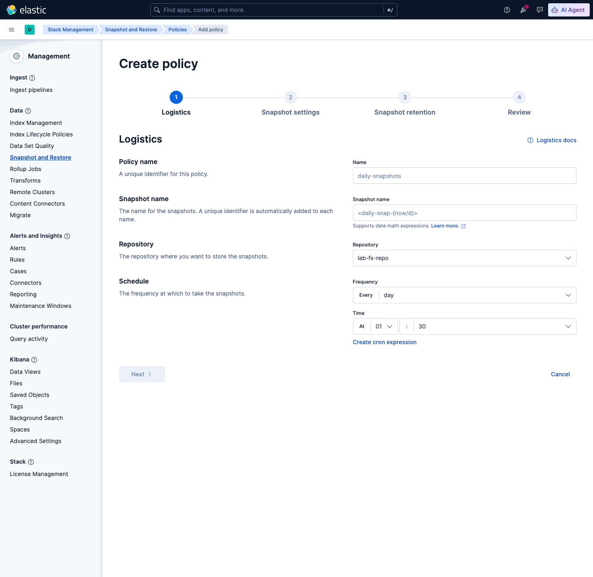

Isi **step 1 (Logistics)**:
- **Name**: `lab-daily-snapshots`
- **Snapshot name**: `<lab-snap-{now/m}>`

  > **Jebakan nyata:** kalau Anda ketik `lab-snap-{now/m}` TANPA kurung
  > siku `<...>` di depan-belakang, Kibana MENOLAK saat Create dengan
  > pesan: `invalid snapshot name [lab-snap-{now/m}]: must not contain
  > contain the following characters [' ','"','*',';',',','/','<','>','?','\\','|']`
  > — tanda `/` di dalam `{now/m}` (artinya "sekarang, dibulatkan ke
  > menit") dianggap karakter terlarang KECUALI seluruh nama dibungkus
  > `<...>` (sintaks resmi ES untuk *date math expression*).
- **Repository**: `lab-fs-repo` (reuse dari topik 2 — repository yang
  sama dipakai ILM maupun SLM)
- **Schedule**: klik link **"Create cron expression"**, isi
  `0 */15 * * * ?`

  > **INFORMATION:** field wizard sederhana (Every/day/hour) TIDAK
  > punya opsi "menit" sama sekali — itu sebabnya harus pakai cron
  > expression manual untuk interval 15 menit. SLM MEWAJIBKAN format
  > cron **6-field** (ada `detik` di depan, bukan format 5-field yang
  > lebih umum), DAN menolak jadwal yang lebih sering dari 15 menit
  > (`schedule would be too frequent, executing more than every [15m]`)
  > — dibahas juga di bagian c.

**Step 2 (Snapshot settings)**: matikan toggle **"All data streams and
indices"**, klik **"Use index patterns"**, isi `lab-ilm-demo-*` (supaya
snapshot cuma mencakup data lab ini, bukan seluruh cluster).

**Step 3 (Snapshot retention)**: **Delete after** `1` hari, **Minimum
count** `1`, **Maximum count** `10`.

**Step 4 (Review)** — cek ringkasan, lalu klik **Create policy**.

**Jalankan manual (pengganti `POST _slm/policy/.../_execute`)** — di
halaman daftar Policies, klik ikon **▷** pada baris `lab-daily-snapshots`:

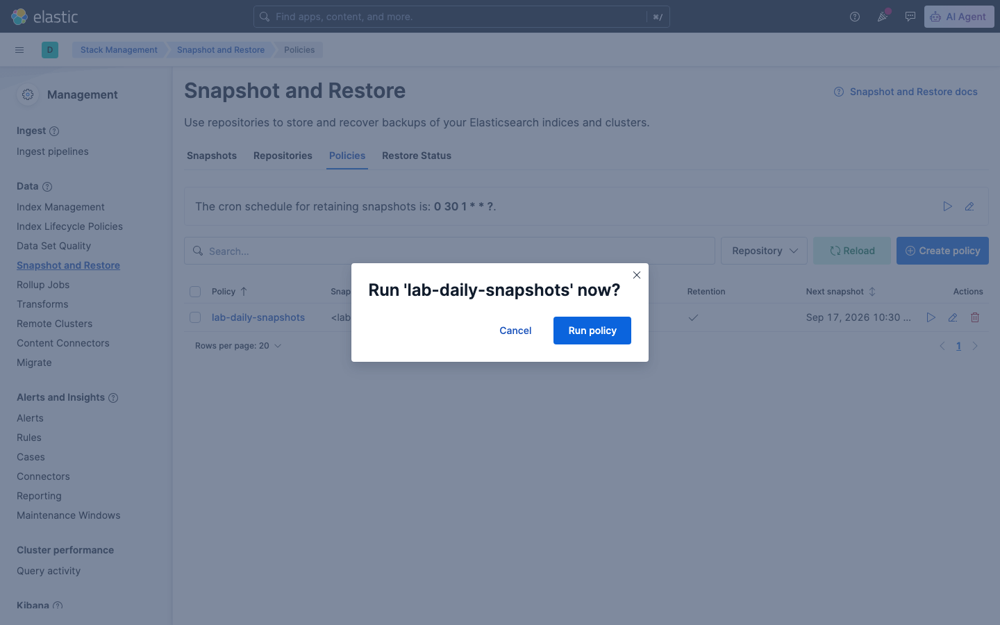

Klik **Run policy**. Expected Output: toast hijau *"Policy
'lab-daily-snapshots' is running"*. Klik nama policy lagi untuk lihat
detailnya — **Snapshots taken** bertambah jadi lebih dari 0:

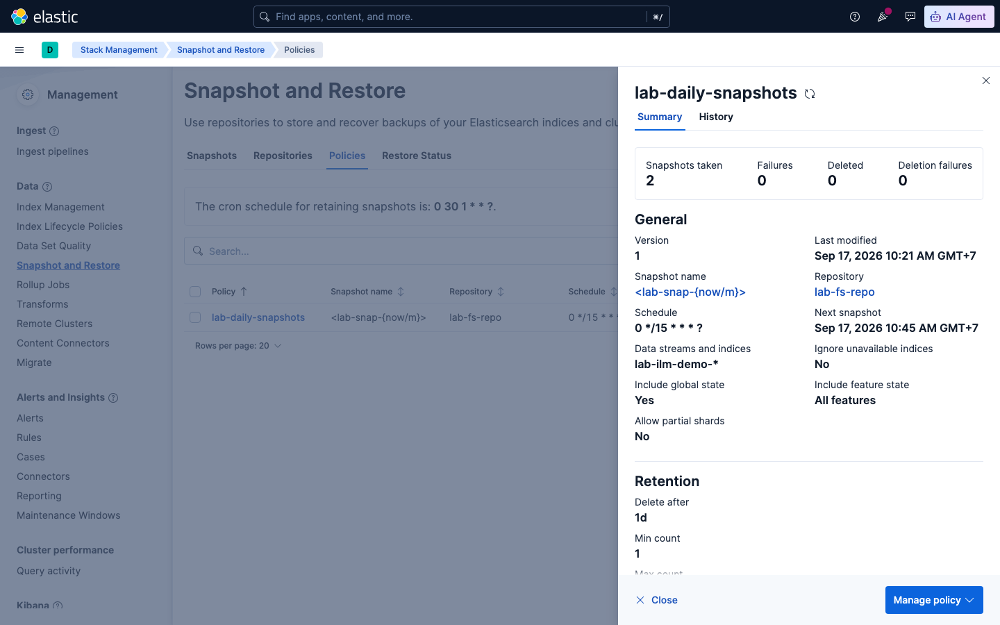

#### Langkah 2 — Buat ILM policy hot → warm → cold → delete

Buka **Stack Management → Index Lifecycle Policies → Create policy**.
Isi **Policy name**: `lab-ilm-full-policy`.

> **INFORMATION:** angka `min_age`/`max_age` pada Langkah 2 ini SENGAJA
> ditulis dalam **menit** (1/2/3/4 menit), BUKAN hari/minggu seperti
> pola produksi realistis yang dibahas di bagian c (1 hari/7 hari/30
> hari). Alasannya murni supaya seluruh siklus hot→warm→cold→delete
> BISA Anda lihat sendiri progresnya dalam satu sesi kelas (~10 menit),
> bukan berhari-hari. Setiap field di bawah punya dropdown satuan waktu
> (`minutes`/`hours`/`days`) — di produksi nyata, cukup ganti satuannya
> ke `days` dengan angka yang sesuai kebutuhan retensi Anda, seluruh
> langkah lain di bawah ini TETAP SAMA.

**Hot phase** — klik **Advanced settings**, isi kondisi rollover:

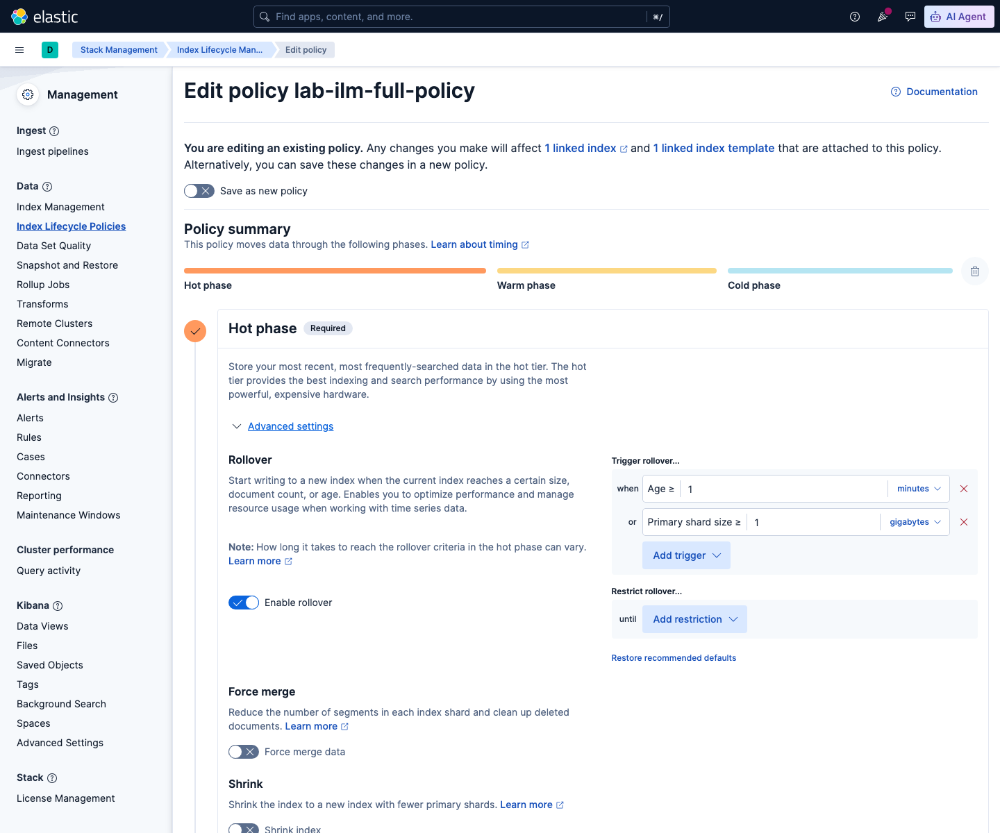

- **Trigger rollover... when Age ≥** `1`, satuan **minutes**
- **or Primary shard size ≥** `1` **gigabytes**

**Warm & Cold phase** — aktifkan toggle di kanan judul tiap fase
(**"Activate warm phase"** / **"Activate cold phase"**):

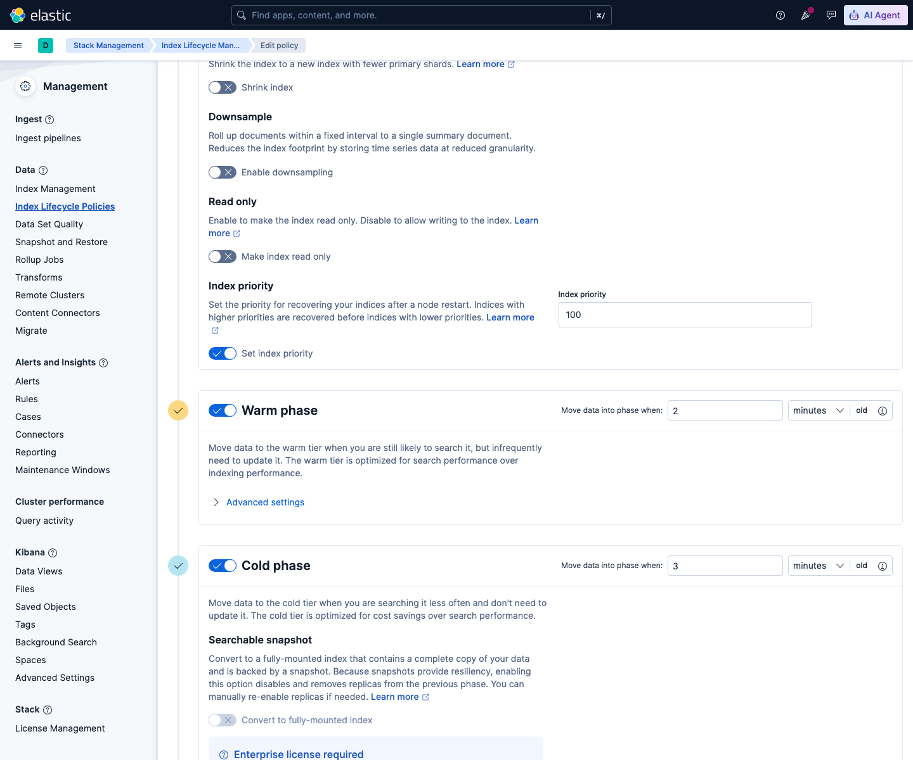

- **Warm** → *Move data into phase when* `2`, satuan **minutes** → buka
  **Advanced settings** → aktifkan **Shrink index** (Number of primary
  shards `1`) dan **Force merge data** (Number of segments `1`)
- **Cold** → *Move data into phase when* `3`, satuan **minutes**

  > **INFORMATION:** perhatikan section **"Searchable snapshot"** pada
  > Cold phase — ada badge **"Enterprise license required"** dan
  > toggle-nya nonaktif (abu-abu). Ini konfirmasi visual langsung dari
  > catatan di bagian c: `searchable_snapshot` butuh lisensi berbayar.
  > Buka **Advanced settings** Cold, aktifkan **"Make index read
  > only"** sebagai gantinya — perhatikan juga **Data allocation**
  > menunjukkan dropdown **"Use cold nodes (recommended)"**, konfirmasi
  > visual dari pembahasan atribut tier di bagian c.

**Delete phase** — klik ikon 🗑️ **"Delete data after this phase"** di
pojok kanan panel Cold untuk memunculkan panel Delete, lalu isi:

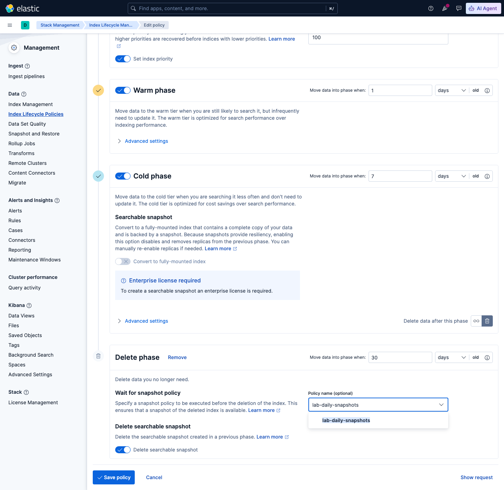

- *Move data into phase when* `4`, satuan **minutes**
- **Wait for snapshot policy**: ketik `lab-daily-snapshots` — perhatikan
  Kibana MENYARANKAN otomatis (autocomplete) karena policy SLM itu
  sudah ada dari Langkah 1
- Matikan toggle **"Delete searchable snapshot"**

  > **Jebakan nyata:** toggle ini AKTIF secara default, tapi kita tidak
  > pernah mengaktifkan `searchable_snapshot` (memang tidak bisa,
  > lisensi Basic). Kalau dibiarkan aktif, Kibana menolak simpan dengan
  > pesan generik **"This policy contains errors"** tanpa menunjuk field
  > mana yang salah — harus dicari manual toggle mana yang tidak
  > relevan. Matikan toggle ini karena tidak ada searchable snapshot
  > yang perlu dihapus.

Klik **Save policy**. Expected Output: toast *"Created lifecycle policy
'lab-ilm-full-policy'"*. Klik nama policy-nya untuk verifikasi seluruh
4 fase tersimpan benar:


> **INFORMATION:** perhatikan bagian **Delete phase** pada screenshot —
> ada tag **`lab-daily-snapshots`** di bawah "Wait for snapshot policy".
> Ini bukti visual langsung dari konsep `wait_for_snapshot` yang dibahas
> di bagian c: index TIDAK akan dihapus sebelum policy SLM itu berhasil
> jalan.

#### Langkah 3 — Terapkan ke index lewat Index Template + Create Index

Buka **Index Management → Index Templates → Create template**:

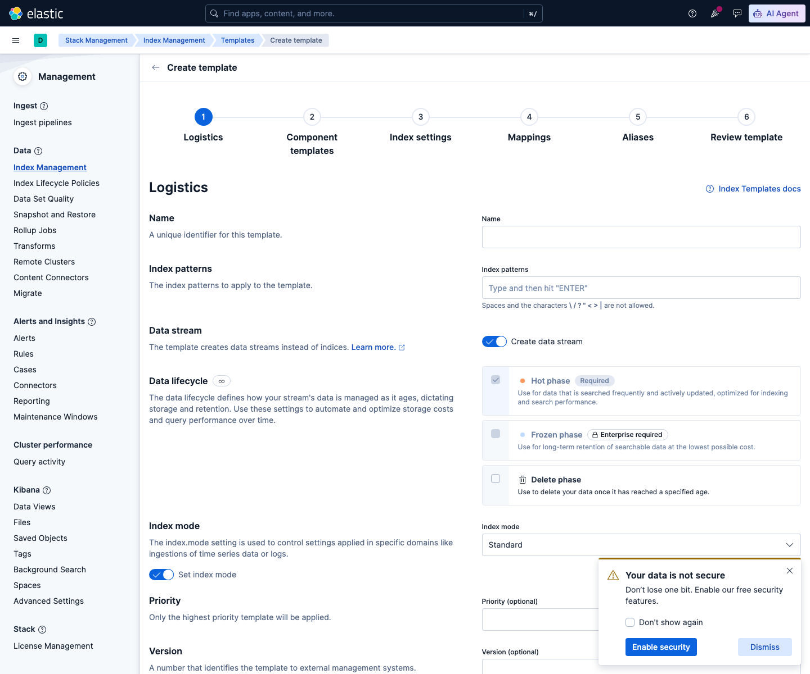

**Step 1 (Logistics)**: **Name** `lab-ilm-demo-template`, **Index
patterns** `lab-ilm-demo-*`, matikan toggle **"Create data stream"**
(lab ini pakai index+alias klasik, bukan data stream).

**Step 2 (Component templates)**: lewati (Next).

**Step 3 (Index settings)** — tempel JSON berikut ke editor:

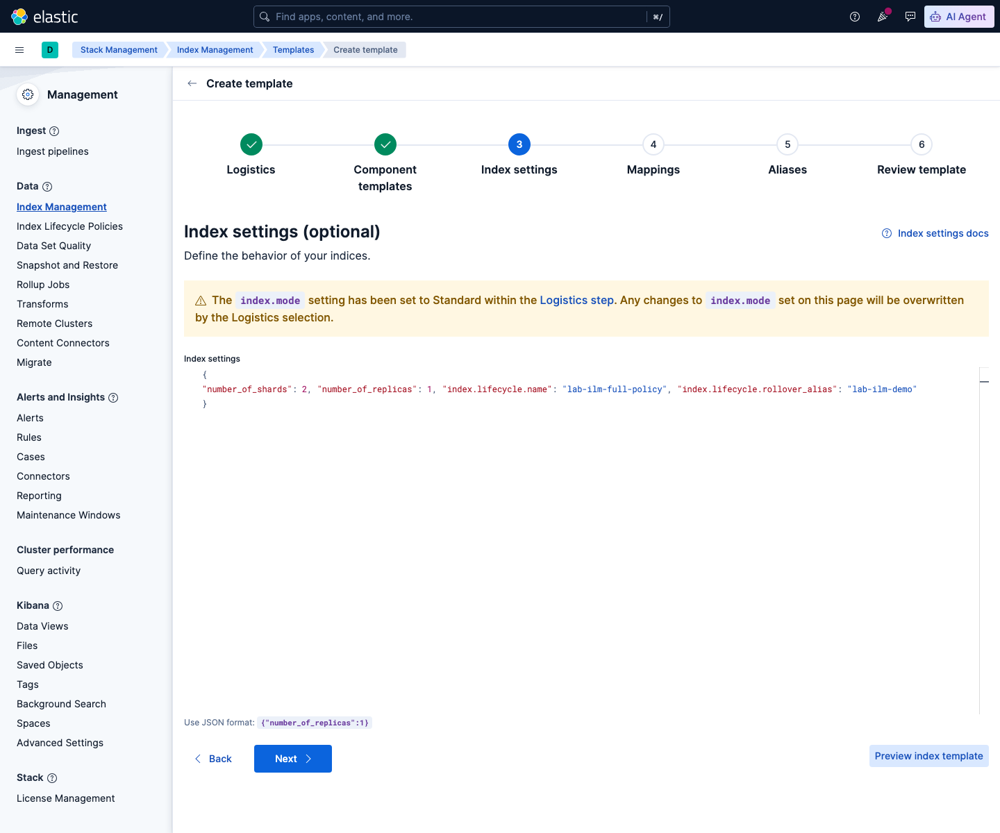

```json
{
  "number_of_shards": 2,
  "number_of_replicas": 1,
  "index.lifecycle.name": "lab-ilm-full-policy",
  "index.lifecycle.rollover_alias": "lab-ilm-demo"
}
```

**Step 4 (Mappings)**: lewati (Next).

**Step 5 (Aliases)** — **LEWATI, biarkan kosong** (Next tanpa mengisi
apa pun).

> **Jebakan nyata (bug yang benar-benar ditemukan saat lab ini
> dibangun):** godaan pertama adalah mengisi alias `lab-ilm-demo` DI
> SINI (di template), supaya index bootstrap otomatis dapat alias-nya.
> Ternyata ini **merusak rollover**: begitu ILM mencoba rollover
> membuat index kedua, index kedua itu JUGA otomatis dapat alias yang
> sama dari template (karena namanya sama-sama cocok pola
> `lab-ilm-demo-*`), sehingga alias menunjuk ke 2 index sekaligus dan
> ES menolak dengan error nyata:
> ```
> Rollover alias [lab-ilm-demo] can point to multiple indices, found
> duplicated alias [[lab-ilm-demo]] in index template [lab-ilm-demo-template]
> ```
> Solusinya: alias rollover HARUS diatur manual pada index BOOTSTRAP
> saja (lihat langkah Dev Tools di bawah), bukan lewat template.

**Step 6 (Review)** — klik **Save template** (kalau mengedit template
yang sudah ada) atau **Create template** (kalau baru).

Buka **Index Management → Indices → Create index**, isi **Index
name**: `lab-ilm-demo-000001`, klik **Create my index**:

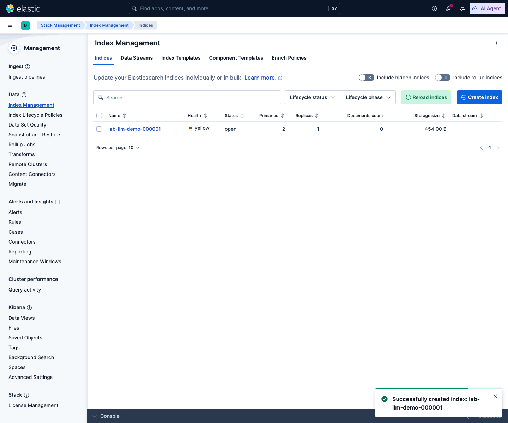

Index otomatis mewarisi `number_of_shards`, `number_of_replicas`, dan
policy ILM dari template (karena namanya cocok pola `lab-ilm-demo-*`) —
TAPI belum punya alias apa pun (memang sengaja dikosongkan di Step 5).

**Satu-satunya langkah lewat Dev Tools Console di seluruh topik ini.**
Ada 2 hal yang TIDAK PUNYA halaman UI di Kibana sama sekali (sudah
dicek langsung — tombol **"View all aliases"** pada index cuma
menampilkan daftar READ-ONLY, tidak ada tombol tambah; dan tidak ada
fitur UI mana pun untuk memasukkan 1 dokumen contoh ke index tertentu):
mengaitkan alias write ke SATU index bootstrap ini, dan mengisi 1
dokumen contoh (rollover mensyaratkan index punya ≥1 dokumen). Buka
**Dev Tools → Console**, lalu jalankan (blok per blok, klik ▷ di kanan
setiap blok):

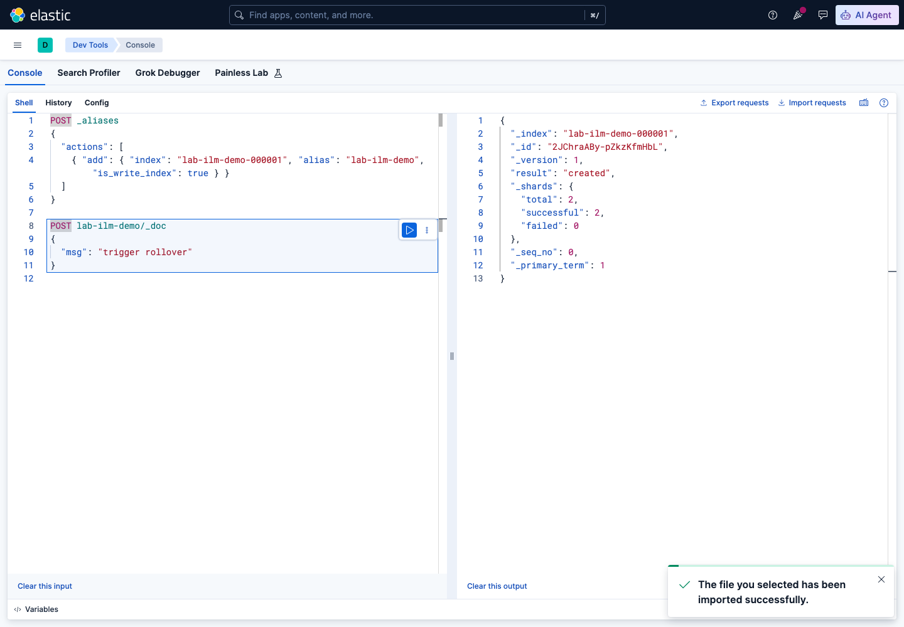

```
POST _aliases
{
  "actions": [
    { "add": { "index": "lab-ilm-demo-000001", "alias": "lab-ilm-demo", "is_write_index": true } }
  ]
}

POST lab-ilm-demo/_doc
{
  "msg": "trigger rollover"
}
```

Expected Output: blok pertama `{"acknowledged": true, "errors": false}`,
blok kedua `"result": "created"`.

> **Catatan troubleshooting (juga ditemukan nyata):** kalau Anda sempat
> menunggu lama (>10 menit, siklus cek ILM default) ANTARA "Create
> index" dan menjalankan blok di atas, index bisa sempat dicek ILM
> SEBELUM alias-nya siap, menghasilkan `"step": "ERROR"` dengan pesan
> `index.lifecycle.rollover_alias [lab-ilm-demo] does not point to
> index [...]`. Ini **otomatis pulih sendiri** pada siklus cek
> berikutnya (`is_auto_retryable_error: true`) — tapi kalau mau
> langsung tanpa menunggu, jalankan satu baris tambahan di Dev Tools
> yang sama: `POST lab-ilm-demo-000001/_ilm/retry`.

#### Langkah 4 — Pantau fase ILM lewat tab "Index lifecycle"

Klik index `lab-ilm-demo-000001`, lalu buka tab **"Index lifecycle"**
(pengganti visual dari `GET .../_ilm/explain`):

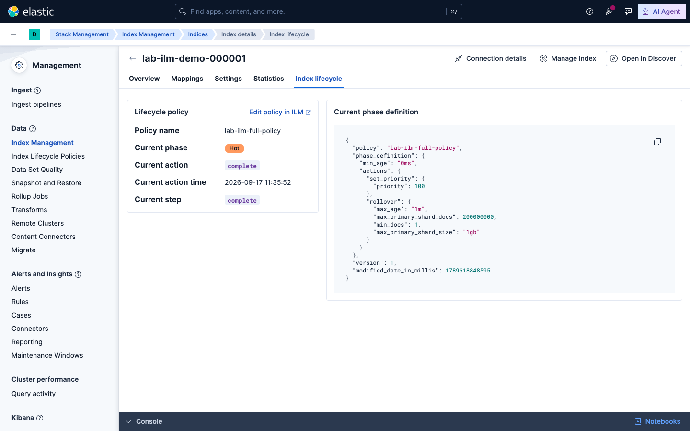

Tab ini menunjukkan **Policy name**, **Current phase** (`Hot`),
**Current action**, **Current step**, sampai **Current action time** —
dan JSON `phase_definition` lengkap di panel kanan.

> **INFORMATION:** index ini akan berpindah fase **otomatis** begitu
> kondisi rollover (`max_age: 1 menit` / `max_primary_shard_size: 1gb`)
> tercapai, lalu lanjut ke warm (2 menit), cold (3 menit), delete (4
> menit) — angka ini SENGAJA dikompres jadi menit (lihat catatan di
> Langkah 2) supaya Anda bisa lihat progresnya sendiri hari ini juga,
> tanpa campur tangan manual sama sekali (tidak ada `_ilm/move` atau
> trik lain — murni menunggu). Kibana SENGAJA tidak menyediakan tombol
> "paksa pindah fase" di UI-nya — di produksi (dengan angka hari/minggu
> yang realistis), Anda memang TIDAK ingin memindahkan data ke tier
> lain sebelum waktunya. Cukup buka kembali tab **Index lifecycle** ini
> setiap beberapa menit untuk memantau progresnya — index tua akan
> berganti nama jadi `shrink-xxxx-lab-ilm-demo-000001` setelah warm,
> lalu hilang dari daftar index setelah delete berhasil.

#### Ringkasan: Hot → Backup


| Fase / Aksi | Kapan (lab ini) | Kapan (produksi realistis) | Yang terjadi |
|---|---|---|---|
| **Hot** | sejak index dibuat | sejak index dibuat | Terima tulisan; rollover otomatis begitu ≥1 menit/hari ATAU ≥1GB |
| **Warm** | 2 menit setelah rollover | 1 hari setelah rollover | Shrink jadi 1 shard + forcemerge 1 segmen (hemat resource) |
| **Cold** | 3 menit setelah rollover | 7 hari setelah rollover | Jadi read-only, diprioritaskan pindah ke node cold-tier |
| **Delete** | 4 menit setelah rollover | 30 hari setelah rollover | Dihapus — TAPI ditahan `wait_for_snapshot` sampai backup ada |
| **Backup (SLM)** | tiap 15 menit (independen) | tiap 15 menit (independen) | Snapshot terjadwal ke `lab-fs-repo`, disimpan 1 hari |

Seluruhnya dibuat dan dipantau lewat 4 halaman Kibana yang sama: **Index
Lifecycle Policies** (hot/warm/cold/delete), **Snapshot and Restore →
Policies** (backup), **Index Management → Index Templates** (penghubung
policy ke index), dan tab **Index lifecycle** pada index (pemantauan) —
dengan HANYA satu pengecualian kecil lewat Dev Tools Console di Langkah
3 (menghubungkan alias + 1 dokumen contoh ke index bootstrap, karena
Kibana memang tidak punya UI untuk 2 hal spesifik itu).

**[Terminal] Sesi ini adalah sesi terakhir pelatihan.** Setelah
menyelesaikan sesi ini (termasuk exercise-nya), matikan cluster 3-node
untuk membebaskan resource:
```bash
cd lab/day-4-administration-ingestion/sesi-8-administration-scaling
docker compose down
```

## e. Referensi Exercise

Lanjutkan latihan mandiri pada [`exercise/sesi-8/README.md`](../../../exercise/sesi-8/README.md).
